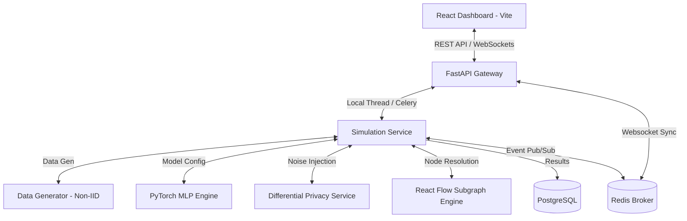
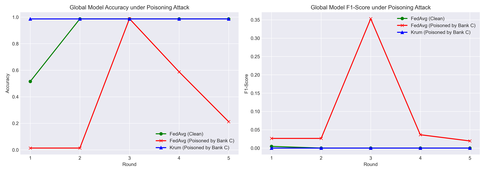
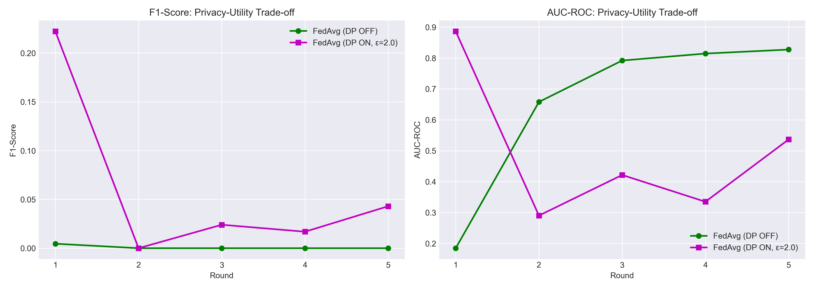
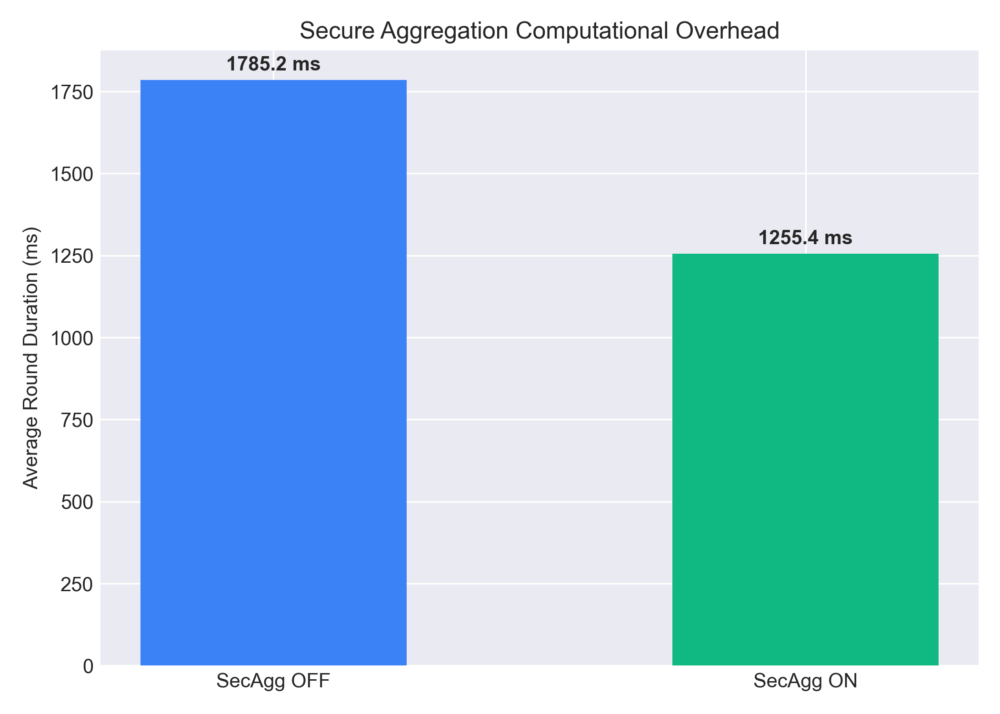
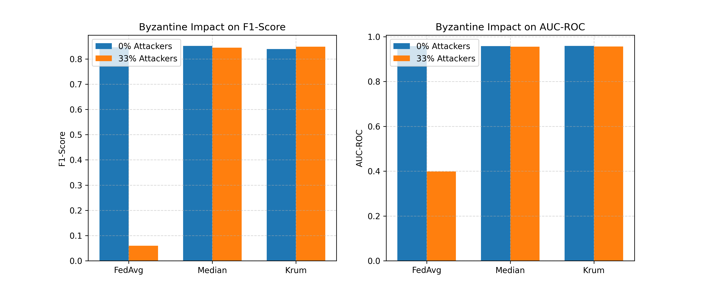
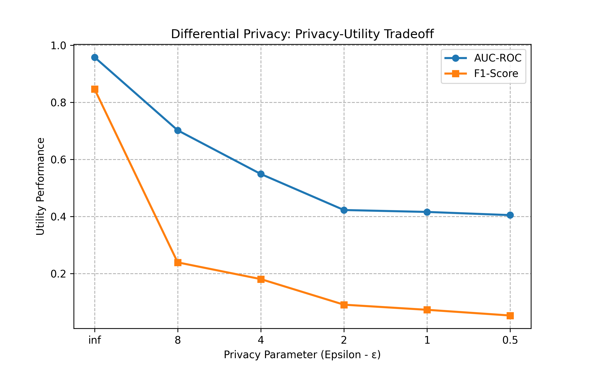
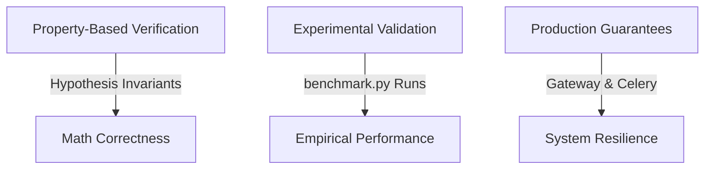

# Collaborative Fraud Intelligence Simulator

A production-grade, enterprise-ready simulation framework demonstrating privacy-preserving, cross-institution financial fraud detection and Collaborative Anti-Money Laundering (AML) intelligence. This platform showcases how financial institutions can train machine learning models and share risk indicators without exposing customer Personally Identifiable Information (PII) or violating global privacy regulations like GDPR, CCPA, and banking secrecy laws.

[](https://github.com/yusufcalisir/Collaborative-Fraud-Intelligence-Simulator/actions)
[](https://python.org)
[](https://react.dev)
[](#project-development-methodology)
[](LICENSE)

```
                     ┌────────────────────────────────────────┐
                     │   3 Participating Client Institutions  │
                     │  (Bank A, Bank B, and Bank C Nodes)    │
                     └────────┬───────────┬───────────┬───────┘
                              │           │           │
                              ▼           ▼           ▼
                     ┌────────────────────────────────────────┐
                     │        Local PyTorch MLP Training      │
                     │    (Stratified Private Holdout Split)  │
                     └────────────────────┬───────────────────┘
                                          │
                                          ▼
                     ┌────────────────────────────────────────┐
                     │  Differential Privacy (Post-Hoc/Opacus)│
                     │   - L2 Gradient Clipping & Noise       │
                     └────────────────────┬───────────────────┘
                                          │
                                          ▼
                     ┌────────────────────────────────────────┐
                     │   Outbound Outlier Defense (SecAgg)    │
                     │   - Pairwise Cryptographic Masks       │
                     └────────────────────┬───────────────────┘
                                          │
                                          ▼
                     ┌────────────────────────────────────────┐
                     │    Byzantine-Robust Server Aggregation │
                     │  (FedAvg / Krum / Coordinate Median)   │
                     └────────────────────┬───────────────────┘
                                          │
                                          ▼
                     ┌────────────────────────────────────────┐
                     │     Evaluated & Promoted Global Model  │
                     │     (Canary Test Gate: AUC-ROC Check)  │
                     └────────────────────┬───────────────────┘
                                          │
                                          ▼
                     ┌────────────────────────────────────────┐
                     │  Composite Risk & Heuristic Scoring    │
                     │  - 9-Signal Pipeline (Composite 0-1000)│
                     └────────────────────┬───────────────────┘
                                          │
                                          ▼
                     ┌────────────────────────────────────────┐
                     │   Kernel SHAP Model Explainability     │
                     │   - Feature Contribution Attribution   │
                     └────────────────────┬───────────────────┘
                                          │
                                          ▼
                     ┌────────────────────────────────────────┐
                     │    MLOps Logging & Telemetry Suite     │
                     │ (MLflow, Prometheus, Grafana, Jaeger)  │
                     └────────────────────────────────────────┘
```

***

> [!NOTE]
> **Enterprise Objective:** This simulator solves the dilemma between data privacy compliance and collaborative intelligence. By using distributed machine learning (Federated Learning) and zero-knowledge risk sharing, banks collaborate in real time to stop multi-institution fraud rings without centralizing or decrypting raw transaction logs.

***

## Table of Contents

- [The Core Challenge: Siloed Fraud Detection](#the-core-challenge-siloed-fraud-detection)
- [The Technical Solution](#the-technical-solution)
  - [Track 1: Privacy-Preserving Federated Learning (Phase 1)](#track-1-privacy-preserving-federated-learning-phase-1)
  - [Track 2: Collaborative AML Intelligence \& 9-Signal Risk Engine (Phase 2)](#track-2-collaborative-aml-intelligence--9-signal-risk-engine-phase-2)
  - [Track 3: Production Microservices \& Secure API Gateway (Phase 3)](#track-3-production-microservices--secure-api-gateway-phase-3)
  - [Track 4: MLOps, Explainability \& Advanced Drift Detection (Phase 4)](#track-4-mlops-explainability--advanced-drift-detection-phase-4)
- [Model Validation \& Correctness Verification](#model-validation--correctness-verification)
- [Feature Comparison Matrix](#feature-comparison-matrix)
- [Clean Architecture Directory Structure](#clean-architecture-directory-structure)
- [Configuration Options](#configuration-options)
- [API Endpoint Blueprints](#api-endpoint-blueprints)
- [Quick Start Guide](#quick-start-guide)
- [Verification and Quality Checks](#verification-and-quality-checks)
- [Architectural Decision Records (ADRs)](#architectural-decision-records-adrs)
- [Project Development Methodology](#project-development-methodology)
- [License](#license)

***

## The Core Challenge: Siloed Fraud Detection

Financial institutions detect fraud and money laundering in absolute isolation. Each bank trains machine learning models solely on its own internal transaction databases. This isolation creates significant vulnerabilities:

*   **Cross-Bank Velocity Fraud:** Fraudsters exploit the blind spot between institutions, transferring funds rapidly across Bank A, Bank B, and Bank C before any single bank detects the pattern.
*   **Structured Syndicate Rings:** Large-scale mule networks distribute accounts and transactions across several institutions to fly under single-bank detection thresholds.
*   **Emerging Typologies:** New fraud techniques are often only visible when observing aggregate transaction behavior across the entire financial ecosystem.

Directly sharing transaction logs or database records between banks is strictly prohibited by privacy regulations and banking secrecy laws. This platform bridges that gap by demonstrating how banks can collaborate securely.

***

## The Technical Solution

The Collaborative Fraud Intelligence Simulator demonstrates two parallel tracks of secure, multi-bank collaboration:



### Track 1: Privacy-Preserving Federated Learning (Phase 1)
Instead of centralizing raw customer transactions, the framework uses a distributed machine learning paradigm:
1.  **Local Training:** Each bank trains a local PyTorch Multi-Layer Perceptron (MLP) on its own transaction data.
2.  **Gradient Exchange:** Banks export only their local model weights (gradients), keeping all raw transactions strictly on-premise.
3.  **Secure Aggregation:** An Aggregation Server averages the weights using the Federated Averaging (FedAvg) algorithm to create an improved global model.
4.  **Dual FL Engine Architectures:** Selectable from the UI settings panel:
    *   **Custom Engine:** Built-in simulation with thread-safe queue systems, supporting latency simulation, dropout simulation, secure aggregation masks, Byzantine robustness, and poisoning attacks.
    *   **Flower Engine (flwr.dev):** Industry-standard Flower integration utilizing Ray-based simulation to execute compliant NumPyClient adapters for standard-compliant federated loops.
5.  **Differential Privacy (DP) — Dual Mode:** Two implementation modes are available, selectable from the UI:
    *   **Post-Hoc Mode:** Calibrated Gaussian noise is injected into weight deltas after local training, backed by mathematical privacy budget tracking (epsilon, delta).
    *   **Opacus Mode (Industry-Standard):** Per-sample gradient clipping and noise injection during training via Meta AI's [Opacus](https://opacus.ai/) library, with Rényi Differential Privacy (RDP) accounting for tighter privacy bounds.
6.  **Byzantine-Robust Aggregation:** Supports advanced aggregation strategies including **Krum** (Blanchard et al., 2017) and **Coordinate-wise Median** to securely isolate and discard corrupted model updates.
7.  **Adversarial Poisoning Simulation:** Toggles active **Model Poisoning** attacks to corrupt specific client weights with noise scaling, enabling visual comparison of FedAvg vulnerability vs. robust aggregation defense.
8.  **Non-IID Distribution Visualization:** Displays transaction amount distributions (overlapping area charts), hourly fraud patterns (grouped bar charts), and merchant risk profiles across institutions to visually demonstrate data drift and data heterogeneity before or after starting simulations, using Kolmogorov-Smirnov (KS) divergence to quantify the distribution difference.

### Track 2: Collaborative AML Intelligence & 9-Signal Risk Engine (Phase 2)
To provide real-time transaction screening and investigation capabilities:
1.  **Deterministic Entity Resolution:** Cross-bank customer and device matching is achieved via one-way HMAC-SHA256 hashes, allowing linkage of malicious actors without revealing identity.
2.  **9-Signal Risk Engine:** Combines machine learning inference with heuristic indicators (velocity anomalies, device mismatches, high-risk merchant categories, baseline deviations).
3.  **Interactive Relationship Graphs:** A full visual graph of entities, devices, cards, and accounts built using React Flow, mapping suspicious clusters in real time.
4.  **Scenario Replay Engine:** Scripted simulation flows representing typologies like Account Takeover (ATO), Card Testing, and Layering networks.
5.  **Model Explainability via SHAP (SHapley Additive exPlanations):** Replaces static mock heuristics with a mathematically rigorous SHAP Kernel Explainer. This analyzes individual transaction anomalies directly using the collaboratively trained global model weight files, listing contribution importances dynamically for risk analysis.

### Track 3: Production Microservices & Secure API Gateway (Phase 3)
To transform the prototype into a production-oriented distributed system:
1.  **Microservices Decomposition**: Decoupled the backend into 4 autonomous, independent services: `gateway`, `fl-coordinator`, `identity-graph`, and `fraud-alert` (dynamically loaded in [main.py](file:///backend/app/main.py#L236-L300) and orchestrated in [docker-compose.yml](file:///docker-compose.yml)).
2.  **Fault-Tolerant Shared State**: Replaced standard variables with [RedisStore](file:///backend/app/infrastructure/redis_store.py) syncing data to a Redis cache while falling back dynamically to thread-safe in-memory cache on connection timeouts.
3.  **API Gateway Routing & Security Suite**: Centralized traffic routing, versioning checks (enforcing `/api/v1/`), rate-limiting, and auditable request logging implemented in [gateway.py](file:///backend/app/presentation/routers/gateway.py).

### Track 4: MLOps, Explainability & Advanced Drift Detection (Phase 4)
To bring the platform closer to production ML operations standards:
1.  **SHAP Explainability (SHapley Additive exPlanations):** `ExplainabilityService` uses `shap.KernelExplainer` on the live global model weights to produce mathematically rigorous feature attribution scores, explaining *why* every individual transaction was flagged as fraud.
2.  **Advanced Drift Detection Suite:** A statistical drift analysis pipeline computes **Feature Drift** (PSI, Jensen-Shannon, KS-statistic per feature), **Concept Drift** ($P(Y|X)$ divergence via logistic regression), and categorical drift across all participating banks — exposed in the `DataDriftPanel` as a tabbed analytical dashboard.
3.  **Canary Evaluation (Production Quality Gate):** After each federated aggregation round, the new candidate global model is evaluated on a combined global holdout test set and compared against the currently active (promoted) model. Promotion only occurs if the candidate meets or exceeds the active model's AUC-ROC within a configurable tolerance (`CANARY_GATE_TOLERANCE=0.005`).
4.  **Model Registry & Rollback:** A versioned model registry persists every global model as `model_vN.pt` under `storage/registry/`. A `registry.json` manifest tracks all versions, their metrics, promotion status, and timestamps. Rollback API endpoints atomically restore any previous version to the active `global_model.pt` — keeping SHAP and downstream inference services aligned transparently.
5.  **Threat Model (STRIDE / OWASP ASVS / MITRE ATLAS):** The `docs/threat_model.md` document maps all system components to STRIDE threat categories, OWASP ASVS v4.0 Level 2 controls, and MITRE ATLAS (Adversarial ML) attack tactics with mitigations.

#### 🔍 The 9-Signal Risk Evaluation Pipeline
The platform implements a modular **9-Signal Risk Combination Engine** to calculate transaction risk levels dynamically. Each signal outputs a normalized risk weight between `0.0` (benign) and `1.0` (maximum threat):

| # | Risk Signal | Evaluation Logic | Target Objective |
| :--- | :--- | :--- | :--- |
| **1** | `ml_prediction` | Deep Learning model inference output. | Model detection score |
| **2** | `velocity_rules` | Rates transaction frequencies per hour. | Account takeover / velocity |
| **3** | `merchant_reputation` | Blend of merchant category risk (e.g. gambling, crypto) & individual merchant rating. | Syndicate tracking |
| **4** | `country_risk` | Cross-border geographic destination risk weighting. | Cross-border laundering |
| **5** | `device_anomaly` | High-risk channel checks (ATM/Phone banking vs Mobile App). | Identity theft / compromise |
| **6** | `customer_history` | Account age and historical customer activity level scoring. | Account aging / mule checking |
| **7** | `previous_alerts` | Historical alert counts of HMAC-matched entities across institutions. | Persistent recidivism |
| **8** | `chargeback_history` | Merchant-specific transaction dispute rate indicators. | Card testing & fraud capture |
| **9** | `behavior_anomaly` | Statistical amount deviation from historical baseline ($\sigma$ standard deviation threshold). | Outlier anomaly detection |

> [!TIP]
> **Composite Scoring:** The engine combines these signals into a final score (0 - 1000) using a weighted average. The weights can be customized dynamically on the **Simulation Configuration** panel, enabling full adjustment of heuristics vs machine learning predictions.

***

## Model Validation & Correctness Verification

A key challenge in Federated Learning is verifying that the collaboratively trained model is actually correct, accurate, and adds value, without centralizing or viewing the raw transaction data. The framework addresses this through four core validation layers:

### 1. Local Verification via Holdout Sets (Distributed Validation)
Every bank in the simulation splits its generated synthetic dataset into an **80% training set** and a **20% testing set** (using stratified splits to maintain class/fraud ratios, located in [simulation_service.py](file:///backend/app/application/services/simulation_service.py#L149-169)). 
* The **test set is a strict holdout set** that is never seen during the local training process or global aggregation.
* At the end of each round, the global server sends the aggregated weights to the banks. Each bank evaluates the global model locally on its own private holdout test set using PyTorch (located in [model_service.py](file:///backend/app/application/services/model_service.py#L138-199)) and returns only the performance metrics (AUC, Recall, F1-Score, Loss) to the server.

### 2. Side-by-Side Baseline Comparison (Value Proof)
To prove the correctness and utility of the federated model, the engine trains **Local-Only Baseline Models** (Phase 2).
* Each bank trains a model *only* on its own data, evaluates it, and stores the results.
* Once the federated training is complete, the final global model's performance on each bank's test set is compared directly against that bank's local model.
* For smaller banks (e.g., Bank C / Heritage Regional) which suffer from sparse fraud samples, the collaborative model shows a **significant boost in F1-Score and AUC-ROC**, proving the federated model has correctly learned generalized patterns from other institutions.

### 3. Convergence Monitoring
During the simulation, the central aggregator tracks the **Global Loss** after each communication round.
* A decreasing loss curve (visualized in the *Loss Chart*) mathematically confirms that the parameter updates from the participating clients are successfully minimizing the binary cross-entropy (BCE) objective function.

### 4. Cryptographic & Mathematical Correctness
To verify that privacy enforcement doesn't break the model's mathematical correctness:
* **Secure Aggregation (SecAgg):** The framework adds pairwise masks to the local parameters that cancel out perfectly under both unweighted (`FED_AVG`) and weighted (`FED_AVG_WEIGHTED`) aggregation schemes (located in [fl_engine.py](file:///backend/app/application/services/fl_engine.py#L222)). This guarantees that the final aggregated global model is mathematically identical to plaintext FedAvg/FedAvg Weighted, proving that privacy is achieved without sacrificing model accuracy.
* **Differential Privacy (DP) Accounting:** In Post-Hoc mode, privacy loss is tracked using basic sequential composition. In Opacus mode, the Rényi Differential Privacy (RDP) Moments Accountant provides tighter sublinear bounds on cumulative epsilon.

### 5. Empirical Performance Comparison Plots

To analyze and verify the core security, privacy, and performance dynamics of the framework, the companion evaluation script [generate_plots.py](file:///backend/scripts/generate_plots.py) is provided. It trains and compares different simulation settings under identical conditions:

#### A. Byzantine Robustness under Model Poisoning (FedAvg vs Krum Aggregation)
When an adversarial client attempts to corrupt the global model (simulated via **Model Poisoning Attack** with noise scale = 10.0), standard `FedAvg` accuracy and F1-Score collapse. Byzantine-robust aggregation like `Krum` successfully detects and rejects the malicious updates, maintaining model accuracy and generalization performance:



#### B. Differential Privacy Utility Trade-off (DP ON vs OFF)
Adding Differential Privacy (DP) mathematically bounds privacy leakage by clipping gradients and injecting calibrated Gaussian noise. This creates a privacy-utility trade-off, leading to a small, controlled reduction in F1-Score and AUC-ROC (shown for $\epsilon = 2.0$):



#### C. Secure Aggregation Overhead (SecAgg ON vs OFF)
Secure Aggregation adds double-masked cryptographic pairwise vectors to parameters. While it guarantees zero-knowledge parameter transfer (the server only learns the sum of client parameters, never individual updates) and has zero impact on accuracy since masks cancel out perfectly, it incurs a small computational execution latency overhead per training round:



***

## Feature Comparison Matrix

| Feature | Technical Implementation | Purpose / Advantage | Cryptographic / ML Guarantee |
| :--- | :--- | :--- | :--- |
| **Non-IID Synthetic Data** | `DataGenerator` generates skewed distributions per bank (skewed fraud rates, different feature means). | Simulates real-world heterogeneity where banks have distinct customer bases. | Statistical Non-Identical & Independent Distribution (Non-IID) |
| **Non-IID Distribution Visualization** | Overlapping Area Charts, Grouped Bar Charts, and KS Divergence statistics. | Proves the Non-IID nature of cross-bank data on the dashboard before starting a simulation. | Kolmogorov-Smirnov (KS) Divergence Score & Distribution Metrics |
| **FedAvg Aggregation** | Weighted averaging of local weights based on relative client sample counts. | Central algorithm for model parameter synchronization in Federated Learning. | Convergence on global optima without raw data pooling |
| **Krum Aggregation** | Byzantine-robust selection (Blanchard et al., 2017): selects the single client update closest to all others, rejecting outlier poisoned weights. | Defends the global model when a compromised bank sends malicious (poisoned) parameters. | Tolerates up to f Byzantine workers among n clients |
| **Coordinate-wise Median** | Element-wise median aggregation across all client parameter vectors. | Robust alternative to averaging that limits the influence of any single outlier client. | Breakdown point of 50% — tolerates up to half the clients being adversarial |
| **Model Poisoning Simulation** | Corrupts a designated bank's trained weights by injecting random noise scaled by a configurable magnitude factor. | Enables side-by-side comparison: FedAvg collapses under attack while Krum/Median defend. | Adversarial robustness stress testing |
| **Differential Privacy (Dual-Mode)** | **Post-Hoc:** L2 clip + Gaussian noise on weight deltas. **Opacus:** Per-sample gradient clipping + noise during training (Meta AI). | Mathematically guarantees that individual transaction signatures cannot be leaked. Both modes support UI-configurable epsilon. | $(\epsilon, \delta)$-DP (Post-Hoc: basic composition, Opacus: RDP Moments Accountant) |
| **Client Failures** | Dynamic simulation of network latency, dropouts, and reconnection cycles. | Tests the resilience of the aggregation server against real-world connection drops. | Quorum enforcement ($\ge$ Min Clients) |
| **Deterministic Linkage** | Linkage of cross-bank entities using salted HMAC-SHA256 identifiers. | Matches entities (e.g., suspicious cards/devices) without sharing raw names or emails. | Salted SHA-256 One-way Hash Collision Resistance |
| **9-Signal Risk Engine** | Custom pipeline weighting ML scores, device status, IP velocity, and behavioral shifts. | Builds a comprehensive risk profile for automated alert generation. | Composite heuristics + ML Inference Score |
| **Real-time Replay** | Replays historical fraud scenarios event-by-event via WebSockets. | Provides a high-fidelity demonstration of how cross-bank intelligence is shared. | Real-time WebSocket event dispatch |
| **Distributed Microservices** | Mapped endpoints decoupled to `gateway`, `fl-coordinator`, `identity-graph`, and `fraud-alert` processes. | Simulates production horizontal scaling in a distributed cloud environment. | Clean operational separation of concerns |
| **State Synchronizer** | `RedisStore` handling key-value, lists, and lists-push updates with sub-second in-memory fallback. | Synchronizes microservices' state across multiple running containers. | Event-consistent cache synchronization |
| **Gateway Security Suite** | Fixed-window client rate limiting, path prefix versioning, RBAC policies, and logging middleware. | Centralizes traffic filtering and prevents cross-tenant data leakage. | Multi-tenant tenant boundary isolation |
| **SHAP Explainability** | `shap.KernelExplainer` on the live global PyTorch model. Encodes categoricals, normalizes continuous features, and computes Shapley values against a legitimate baseline. | Explains *why* each individual transaction was flagged: "High amount deviation (+3σ) contributed 42% to fraud score." | Shapley Value Attribution (Kernel SHAP) |
| **Feature Drift Detection** | PSI (Population Stability Index) with dynamic binning, Jensen-Shannon divergence (base-2), and KS-statistic per continuous and categorical feature across bank pairs. | Detects when a bank's transaction population profile has shifted enough to degrade the global model's performance. | PSI > 0.25 = drifted; JS > 0.15 = moderate; KS p-value threshold |
| **Concept Drift Detection** | Logistic regression on reference bank features/labels; evaluates $P(Y\|X)$ divergence on target bank distributions; segment-based conditional JS drift. | Detects when the relationship between features and fraud outcomes changes — a deeper signal than feature distribution shifts alone. | Conditional JS divergence per fraud/legit segment |
| **Canary Evaluation Gate** | End-of-round evaluation of candidate global model vs. active model on combined cross-bank validation set; `CANARY_GATE_TOLERANCE=0.005`. | Prevents regressions from being silently promoted to production; mirrors real-world bank MLOps quality gates. | AUC-ROC gate: candidate must match active ± 0.5% |
| **Model Registry & Rollback** | File-based versioned registry (`storage/registry/`); `registry.json` manifest with atomic rollback. Active `global_model.pt` updated to match rolled-back version, keeping SHAP transparent. | Enables full model versioning, audit history, and safe rollback to any previous global model without simulation restart. | Atomic file swap + manifest consistency |
| **Private Set Intersection (PSI)** | Simulated zero-knowledge Diffie-Hellman protocol (DH-PSI) using modular exponentiation over a 512-bit prime field ($p$) with commutative private keys. | Identifies common customers/devices between banks without disclosing any non-overlapping records. | Perfect Forward Secrecy; zero-knowledge set comparison |
| **Graph-Based Fraud Detection** | Adjacency-list graph engine with PageRank-like risk propagation (decay $\gamma=0.85$), connected component community analytics (fraud density calculation), and temporal edge velocity sliding windows. | Identifies organized fraud rings (mule networks, layering) and propagates risk scores to connected accounts/devices. | Decoupled graph traversal; heuristic structural threat scoring |
| **BankConnector Adapter Pattern** | Abstract `BankConnectorInterface` port; concrete adapters: `MockBankConnector` (in-process), `RESTBankConnector` (HTTP with OAuth2/mTLS/API Key), `RedisBankConnector` (pub/sub), `MQSkeletonBankConnector` (AMQP placeholder). `BankConnectorFactory` resolves per-bank adapter from config. | Decouples the FL platform from bank-specific integrations — swap a single config key to connect a real bank REST API without touching business logic. | Open/Closed principle; per-bank connector-type override |
| **STRIDE / OWASP / MITRE Threat Model** | `docs/threat_model.md` with STRIDE classification matrix, OWASP ASVS v4.0 Level 2 checklist, and MITRE ATLAS adversarial ML mapping. | Provides a formal security architecture baseline for regulatory readiness and adversarial ML risk communication. | STRIDE (all 6 threat classes); OWASP ASVS Level 2; MITRE ATLAS tactics |

***

## Clean Architecture Directory Structure

```
├── backend/
│   ├── app/
│   │   ├── domain/               # Core domain entities, enums, value objects (Pure Python)
│   │   │   ├── enums.py          # FL Engine Type, Privacy Mechanism, Simulation Status, Bank Tier
│   │   │   ├── entities.py       # Bank, SimulationRun, TrainingRound models
│   │   │   ├── entities_phase2.py # Alerts, Cases, Resolved Entities, Scenario definitions
│   │   │   ├── value_objects.py  # ModelWeights, EvaluationMetrics, RoundMetrics, BankDataProfile, SimulationConfig
│   │   │   └── value_objects_phase2.py # Risk weight specifications, Graph nodes/edges
│   │   ├── application/          # Services, validation schemas, interfaces (Ports)
│   │   │   ├── schemas/
│   │   │   │   ├── phase2.py     # Pydantic schemas for Phase 2 entities (Alerts, Cases, Graphs)
│   │   │   │   └── simulation.py # Pydantic schemas for Phase 1 simulation configuration and details
│   │   │   └── services/
│   │   │       ├── alert_service.py # Aggregates and alerts on suspicious transactions
│   │   │       ├── case_service.py  # Coordinates multi-bank AML investigation cases
│   │   │       ├── data_generator.py # Synthetic Non-IID transaction generation
│   │   │       ├── entity_resolution.py # Matches cross-bank users deterministic via HMACs
│   │   │       ├── explainability_service.py # Explains risk indicator contributions
│   │   │       ├── fl_engine.py     # Custom FedAvg simulator (latent simulation, secure aggregation, client dropout)
│   │   │       ├── flower_engine.py # Flower framework adapter service using Ray simulation backend
│   │   │       ├── graph_analytics_service.py # PageRank risk propagation, community analytics, and temporal velocity metrics
│   │   │       ├── graph_engine.py  # Assembles node-link data models for React Flow visualization
│   │   │       ├── metrics_service.py # Calculations for F1, Accuracy, Precision, and Recall improvements
│   │   │       ├── psi_service.py   # Zero-knowledge Diffie-Hellman Private Set Intersection (DH-PSI)
│   │   │       ├── model_registry.py # Versioned model registry: save, list, rollback, manifest
│   │   │       ├── model_service.py # PyTorch MLP creation, training loops, evaluation
│   │   │       ├── privacy_service.py # Differential privacy noise, gradient clipping, budgets
│   │   │       ├── risk_engine.py   # Computes composite risk scores via 9-signal pipeline
│   │   │       ├── scenario_service.py # Scripted transaction AML scenarios loader
│   │   │       ├── simulation_service.py # Orchestrates local training, FL loops, canary evaluation, comparisons
│   │   │       └── streaming_engine.py # Event emitter for scenario replay
│   │   ├── infrastructure/       # Database, cache, event bus adapters (Adapters)
│   │   │   ├── cache.py          # Local in-memory caching fallback logic
│   │   │   ├── celery_app.py     # Celery app initialization for background jobs
│   │   │   ├── database.py       # SQLAlchemy 2.0 connection engine
│   │   │   ├── event_bus.py      # Pub/sub channels for real-time WebSocket communication
│   │   │   ├── models.py         # Relational tables for simulation logs, alerts, and runs
│   │   │   ├── redis_store.py    # Redis state syncing client with automatic thread-safe memory fallback
│   │   │   ├── connectors/       # Bank Connector adapter implementations (BankConnector port)
│   │   │   │   ├── factory.py    # Configuration-driven connector resolver (mock/rest/redis/mq)
│   │   │   │   ├── mock_connector.py  # In-process simulator connector (default)
│   │   │   │   ├── rest_connector.py  # HTTP REST connector with OAuth2, mTLS, API Key auth
│   │   │   │   ├── redis_connector.py # Event-driven Redis pub/sub connector
│   │   │   │   └── mq_skeleton_connector.py # AMQP/RabbitMQ skeleton connector (placeholder)
│   │   │   └── repositories/     # Data access layer implementing repository pattern
│   │   │       ├── bank_repository.py # Performs DB operations for bank details
│   │   │       ├── metrics_repository.py # Saves and fetches training round metrics
│   │   │       └── simulation_repository.py # Manages simulation runs and configurations in database
│   │   ├── presentation/         # API Controllers and endpoints
│   │   │   ├── routers/
│   │   │   │   ├── alerts.py     # Transaction alerts query, resolution, and explanations
│   │   │   │   ├── bank_client.py # Local training & evaluation endpoints on bank clients
│   │   │   │   ├── banks.py      # Bank profiles, distributions, feature drift & concept drift endpoints
│   │   │   │   ├── cases.py      # Collaboratively managed AML investigation cases
│   │   │   │   ├── dashboard.py  # High-level overview aggregation metrics
│   │   │   │   ├── entities.py   # HMAC identification mapping endpoints
│   │   │   │   ├── gateway.py    # Gateway routing middleware (Auth, RBAC, logging, rate limiting)
│   │   │   │   ├── graph.py      # Graph visualization queries for cross-bank accounts
│   │   │   │   ├── health.py     # System service health checking
│   │   │   │   ├── model_registry.py # Model versioning, rollback, and canary history endpoints
│   │   │   │   ├── scenarios.py  # Controls AML scenario simulation streams
│   │   │   │   ├── predict.py    # Real-time serving transaction inference, risk evaluations, and alert management
│   │   │   │   ├── simulation.py # Handles creation, retrieval, and comparison of FL runs
│   │   │   │   └── training.py   # Yields progress data on communication rounds (incl. canary_info)
│   │   │   ├── messaging/
│   │   │   │   └── redis_listener.py # Background Redis Pub/Sub command event consumer worker
│   │   │   └── websockets/
│   │   │       ├── streaming_ws.py # Manages live WebSocket streams for scenario replays
│   │   │       └── training_ws.py # Manages persistent WebSocket feeds for training rounds progress
│   │   ├── tasks/                # Background tasks (Celery asynchronous runners)
│   │   │   └── simulation_tasks.py # Async tasks for running Flower/Custom simulation loops
│   │   ├── config.py             # Global application settings loading
│   │   ├── dependencies.py       # FastAPI dependency injection providers
│   │   └── main.py               # Application entrypoint and microservices gateways
│   ├── tests/                    # Integration and unit test suite
│   │   └── unit/
│   │       ├── test_data_generator.py # Asserts columns, distributions, and Non-IID seed consistency
│   │       ├── test_distributed_fl.py # Asserts distributed HTTP federated training rounds
│   │       ├── test_drift_metrics.py # Validates binned JS divergence, dynamic binning PSI thresholds, and empty checks
│   │       ├── test_event_driven_fl.py # Asserts event-driven Redis pub/sub training rounds
│   │       ├── test_explainability_service.py # Verifies SHAP kernel value estimation and fallback heuristic rules
│   │       ├── test_fl_engine.py # Tests secure aggregation, Byzantine robust Krum/Median defense
│   │       ├── test_flower_engine.py # Exercises Flower NumPyClient with standard vs Opacus DP modes
│   │       ├── test_metrics_service.py # Asserts correctness of evaluation metrics serialization
│   │       ├── test_model_registry.py # Validates model saving, manifest versions list, promotion status updates, and canary evaluations
│   │       ├── test_model_service.py # Validates forward pass shape, loss decrements, parameter roundtrips
│   │       ├── test_opacus_integration.py # Asserts standard model fails DP check while Opacus passes
│   │       ├── test_predict.py        # Validates real-time serving inference, risk mapping, and alerts creation
│   │       ├── test_privacy_service.py # Tests Differential Privacy noise and budget accountant
│   │       └── test_property_based.py # Property-based tests verifying core mathematical invariants
│   ├── Dockerfile
│   └── requirements.txt
├── benchmark.py                  # Scientific benchmark and experimental validation suite
├── frontend/
│   ├── src/
│   │   ├── api/                  # API client instance, queries, mutations (React Query)
│   │   ├── components/           # Reusable UI elements
│   │   │   ├── layout/           # Sidebar, Header, Page layout wrappers
│   │   │   ├── dashboard/        # BankCard, DataDriftPanel (Feature/Concept Drift tabs), FederatedTrainingAnimation, SimulationControls, MetricsComparison, TrainingTimeline, PrivacyMonitor, FeatureImportanceTimeline, ModelRegistryPanel
│   │   │   └── charts/           # LossChart, ROCCurve, ConfusionMatrix, FeatureImportance, MetricsRadar
│   │   ├── pages/                # Application views: Dashboard, SimulationView, AlertsPage, CasesPage, CaseDetailPage, InvestigationDashboard, ScenariosPage, GraphPage
│   │   └── utils/                # Numerical formatters and constants
│   ├── Dockerfile
│   └── package.json
├── docs/                         # Extended systems design and threat models
│   ├── threat_model.md           # STRIDE / OWASP ASVS v4.0 / MITRE ATLAS security architecture
│   └── aml-platform.md           # AML platform architecture and investigation workflows
├── monitoring/                   # Observability stack configuration
│   ├── prometheus.yml            # Prometheus scrape targets (all backend services)
│   └── grafana/
│       ├── provisioning/         # Auto-provisioned datasources (Prometheus, Jaeger) & dashboards
│       └── dashboards/           # Pre-built JSON dashboard: CFI Platform Overview
├── docker-compose.yml
├── Makefile
└── .github/                      # CI/CD Workflows
```

***

## 🔭 Observability Stack (Prometheus + Grafana + OpenTelemetry + Jaeger + MLflow)

The platform ships with a production-grade observability stack that provides **distributed tracing**, **real-time metrics**, **hyperparameter experiment tracking**, and **pre-built dashboards** out of the box. The stack is fully containerised and auto-provisions on first `docker compose up`.

### Architecture

```
┌─────────────────────────────────────────────────────────────────┐
│                       FastAPI Services                          │
│  (Gateway · FL-Coordinator · Identity-Graph · Fraud-Alert)      │
│                                                                 │
│  ┌──────────────────────────────────────────────────────────┐   │
│  │              OpenTelemetry SDK (auto-instrument)          │   │
│  │                                                           │   │
│  │   Traces ──→ OTLP/gRPC ──→ Jaeger (:4317)               │   │
│  │   Metrics ──→ /metrics endpoint                          │   │
│  └──────────────────────────────────────────────────────────┘   │
└─────────────────────────────────────────────────────────────────┘
                              │                    │
                    ┌─────────┘                    └──────────┐
                    ▼                                          ▼
          ┌─────────────────┐                      ┌───────────────────┐
          │   Jaeger UI      │                      │   Prometheus      │
          │   :16686         │                      │   :9090           │
          │                  │                      │   Scrapes /metrics│
          │  Distributed     │                      │   every 15s       │
          │  trace viewer    │                      │   7-day retention │
          └─────────────────┘                      └─────────┬─────────┘
                                                              │
                                                              ▼
                                                   ┌───────────────────┐
                                                   │   Grafana         │
                                                   │   :3001           │
                                                   │                   │
                                                   │  Pre-provisioned  │
                                                   │  CFI dashboard    │
                                                   └───────────────────┘
```

### Access URLs

| Service | URL | Credentials |
|---------|-----|-------------|
| **Jaeger UI** (Traces) | http://localhost:16686 | None required |
| **Prometheus** (Metrics) | http://localhost:9090 | None required |
| **Grafana** (Dashboards) | http://localhost:3001 | `admin` / `admin` |
| **MLflow Tracking UI** (Experiments) | http://localhost:5000 | None required |

### Custom Application Metrics

The following domain-specific metrics are exported via OpenTelemetry and scraped by Prometheus:

| Metric | Type | Description |
|--------|------|-------------|
| `simulation_rounds_total` | Counter | Total FL training rounds completed across all simulations |
| `simulation_duration_seconds` | Histogram | Duration of each individual training round (in seconds) |
| `active_simulations` | UpDownCounter | Number of simulations currently in progress |
| `alerts_generated_total` | Counter | Total fraud alerts raised by the streaming engine |
| `http_request_duration_seconds` | Histogram | HTTP request latency per route (auto-instrumented) |

### Pre-Built Grafana Dashboard

The **CFI Platform Overview** dashboard is auto-provisioned on first boot and includes live panels designed to work instantly in both single-process and multi-service environments:

* **HTTP Request Rate** — Requests per second handled across all API routes.
* **HTTP Latency (p95)** — 95th percentile request execution latency.
* **Active HTTP Requests** — Real-time gauge of active transactions.
* **Total HTTP Requests** — Running counter of total system hits.
* **Avg Response Size** — Average response payload size in bytes.
* **Prometheus Scrape Health** — Status check of active metrics-gathering connections.
* **Request Rate by Endpoint** — Breakdown of traffic by path, method, and HTTP status code.
* **Jaeger Traces Link** — Direct button redirecting you to search live tracing spans.

> [!NOTE]
> **Monitoring Modes & Scrape Target Status:**
> * **Local Monolith Mode (`run_local.bat`):** The application runs as a single process on port `8000`. Only the `cfi-gateway` target (`gateway:8000`) is active and scraped, capturing all platform API traces and metrics under one namespace (`cfi-backend`). Other microservice-specific scrapers (port 8001-8003) will show as down/inactive, which is the expected local behavior.
> * **Docker Compose Mode (`docker compose up`):** Decoupled containers execute independent services on ports `8000-8003`, with all targets scraped individually by Prometheus.

### Experiment Tracking with MLflow

CFI includes out-of-the-box support for **MLflow** to track, compare, and log every federated learning simulation.

#### What is Logged?
*   **Parameters:** `num_rounds`, `local_epochs`, `learning_rate`, `batch_size`, `aggregation_method`, `dp_epsilon`, `dp_delta`, `enable_secure_aggregation`, and `enable_poisoning_simulation`.
*   **Metrics per Round:** Round-by-round global model loss (`round_global_loss`), count of participating banks (`active_participants`), and spent privacy budget (`privacy_budget_spent`).
*   **Final Outcomes:** Evaluation metrics per participating bank (`accuracy`, `precision`, `recall`, `f1_score`, `auc_roc`) along with global averaged metrics across the federation.

#### How to run:
*   **Locally:** Running `run_local.bat` automatically launches the MLflow tracking UI alongside the services on [http://localhost:5000](http://localhost:5000). Alternatively, you can start it manually from the virtual environment:
    ```bash
    cd backend
    .venv/Scripts/mlflow ui --port 5000
    ```
*   **Docker Compose:** You can launch a dedicated self-hosted MLflow Tracking Server container alongside the microservice stack:
    ```bash
    # Start MLflow Tracking Server container
    docker compose up -d mlflow
    ```

> [!TIP]
> By default, runs are logged to a local `./mlruns` directory. To connect to a remote MLflow server, simply configure `MLFLOW_TRACKING_URI=http://<your-server-ip>:5000` in your backend `.env` file.

### Configuration

Telemetry is controlled by environment variables and is **disabled by default** so that local development, CI tests, and Hugging Face Spaces runs have zero overhead:

```bash
# Enable telemetry (set in docker-compose.yml for containerised runs)
OTEL_ENABLED=true

# Jaeger OTLP endpoint (traces are sent here via gRPC)
OTEL_EXPORTER_OTLP_ENDPOINT=http://jaeger:4317

# Service name visible in Jaeger trace list
OTEL_SERVICE_NAME=cfi-backend
```

### Quick Start

```bash
# Start the full platform with observability
docker compose up -d

# Verify Prometheus targets are UP
open http://localhost:9090/targets

# Explore traces in Jaeger
open http://localhost:16686

# View dashboards in Grafana
open http://localhost:3001
# Login: admin / admin
```

## Configuration Options

When initializing a simulation run, the platform exposes fine-grained parameters to customize model performance and security strength:

### Model Configuration

| Parameter | Type / Range | Default | Performance Impact |
| :--- | :--- | :--- | :--- |
| **Communication Rounds** | Integer (1 - 50) | 10 | Higher values improve model convergence but increase network roundtrips. |
| **Local Epochs** | Integer (1 - 10) | 3 | More epochs reduce communications rounds but risk local overfitting. |
| **Learning Rate** | Float (1e-5 - 1e-1) | 0.001 | Determines gradient descent step size. Too high causes divergence. |
| **Batch Size** | Integer (16 - 256) | 64 | Larger batches speed up training but dilute individual updates. |
| **FL Engine Type** | Selection (`custom`, `flower`) | `custom` | Selects built-in coordinator (`custom`) or standards-compliant Ray simulator (`flower`). |
| **Aggregation Method** | Selection (`fed_avg_weighted`, `fed_avg`, `krum`, `coordinate_wise_median`) | `fed_avg_weighted` | Determines strategy for combining client weights; `krum`/`median` offer Byzantine robust protection. |

### Privacy and Network Settings

| Parameter | Type / Range | Default | Security / Utility Impact |
| :--- | :--- | :--- | :--- |
| **Privacy Mechanism** | Selection (`none`, `differential_privacy`, `secure_aggregation`, `both`) | `none` | Selects secure multiparty masks, differential privacy, or both protocols. |
| **DP Mode** | Selection (`post_hoc`, `opacus`) | `post_hoc` | `post_hoc` adds noise after training; `opacus` injects noise per sample during training. |
| **DP Epsilon ($\epsilon$)** | Float (0.1 - 10.0) | 1.0 | Lower epsilon represents stronger privacy bounds, adding more noise. |
| **DP Delta ($\delta$)** | Float (1e-6 - 1e-4) | 1e-5 | Represents probability of information leakage breaking DP bounds. |
| **Max Gradient Norm** | Float (0.1 - 5.0) | 1.0 | Clips local model updates. Lower bounds restrict outlier samples. |
| **Dropout Probability** | Float (0.0 - 0.9) | 0.2 | Probability of a bank going offline during aggregation rounds. |
| **Model Poisoning Attack** | Boolean | `False` | Simulates a malicious bank sending corrupted weights to sabotage the model. |
| **Byzantine Defense** | Selection (`none`, `krum`, `coordinate_wise_median`) | `none` | Activates a robust aggregation filter to reject poisoned client updates before FedAvg. |

***

## API Endpoint Blueprints

### Phase 1: Federated Learning Engine

*   `POST /api/v1/simulations` - Starts a background simulation with custom configuration.
*   `GET /api/v1/simulations` - Lists all recorded simulation runs.
*   `GET /api/v1/simulations/{id}` - Retrieves detailed parameters and metrics for a run.
*   `GET /api/v1/simulations/{id}/comparison` - Yields side-by-side performance data.
*   `GET /api/v1/training/{id}/rounds` - Lists training metrics for completed rounds.
*   `WS /ws/training/{id}` - Real-time WebSocket connection to track round-by-round status.
*   `GET /api/v1/banks` - Retrieves reference profiles for Bank A, B, and C.
*   `GET /api/v1/banks/distributions` - Computes transaction amount histograms, hourly fraud rates, merchant risk, KS divergence, **feature drift (PSI, JS, KS)**, and **concept drift** statistics.

### Phase 2: AML Collaborative Intelligence

*   `GET /api/v1/alerts` - Query and filter generated transaction fraud alerts.
*   `GET /api/v1/alerts/{id}/explain` - Explains risk factors (9-signals + SHAP values) contributing to an alert.
*   `GET /api/v1/explanation/{transaction_id}` - Explains risk factors (9-signals + SHAP values) for an alert by its transaction ID.
*   `GET /api/v1/intelligence` - Query cross-bank intelligence items.
*   `GET/POST /api/v1/cases` - Create, view, or update AML investigation cases.
*   `POST /api/v1/cases/{id}/notes` - Add investigator findings to a case.
*   `POST /api/v1/entities/resolve` - Resolves overlap of device IDs and account hashes.
*   `POST /api/v1/entities/psi` - Runs a simulated zero-knowledge Diffie-Hellman Private Set Intersection (DH-PSI) protocol.
*   `GET /api/v1/graph/{id}` - Builds subgraphs for interactive network visualization.
*   `POST /api/v1/graph/propagate-risk` - Runs PageRank-like risk propagation with customizable decay factor.
*   `GET /api/v1/graph/communities/analytics` - Returns entity communities sorted by fraud and risk density.
*   `GET /api/v1/graph/temporal-anomalies` - Lists subgraphs exhibiting abnormal edge creation velocity.
*   `POST /api/v1/scenarios/start` - Launches a real-time replay of cross-bank fraud scenarios.
*   `WS /ws/streaming/{scenario_id}` - Stream scenario event data in real time.
*   `GET /docs/{service_name}` - Gateway Swagger UI aggregator (e.g. `/docs/fl-coordinator`, `/docs/identity-graph`, `/docs/fraud-alert`).

### Phase 4: MLOps & Model Serving

*   `GET /api/v1/registry/{sim_id}/versions` - Lists all versioned global models with metrics, promotion status, and timestamps.
*   `POST /api/v1/registry/{sim_id}/rollback/{version}` - Atomically rolls back the active global model to a specified version.
*   `GET /api/v1/registry/{sim_id}/canary` - Returns the full canary evaluation log (candidate vs. active AUC-ROC comparisons) for all completed rounds.
*   `POST /api/v1/predict` - Real-time serving endpoint to evaluate a transaction payload, compute a composite risk score and SHAP attributions, generate alerts, and link cross-bank entities on the network graph.
*   `POST /api/v1/bank-client/initialize` - Initialize and cache partition dataset (used in distributed HTTP simulations).
*   `POST /api/v1/bank-client/train` - Trigger local training for a given round using model weights payload.
*   `POST /api/v1/bank-client/evaluate` - Evaluate global weights on local bank client test partition.

***

## Quick Start Guide

### Running with Docker Compose (Recommended)
This boots up the API gateway, React UI, PostgreSQL instance, and Redis event broker in a single step:

```bash
# 1. Clone repository
git clone https://github.com/yusufcalisir/Collaborative-Fraud-Intelligence-Simulator.git
cd Collaborative-Fraud-Intelligence-Simulator

# 2. Setup environment variables
cp .env.example .env

# 3. Build and launch services
make dev
# Alternatively: docker compose -f docker-compose.yml -f docker-compose.dev.yml up --build
```

### Local Setup (For active debugging)
Ensure PostgreSQL and Redis are running locally before launching:

```bash
# Start backend
cd backend
python -m venv .venv
# On Windows:
.venv\Scripts\activate
# On Linux/macOS:
source .venv/bin/activate

pip install -r requirements.txt
uvicorn app.main:app --reload --port 8000
```

In a separate terminal, launch the React interface:
```bash
# Start frontend
cd frontend
npm install
npm run dev
```

***

## Verification and Quality Checks

The framework includes comprehensive test suites (unit, integration, and property-based tests) to verify domain metrics, model parameter aggregation, secure masking, and API endpoints:

```bash
# Run the standard unit and integration test suite (160 tests)
cd backend
.venv/Scripts/pytest tests/unit/ tests/integration/ -v

# Run the Hypothesis property-based testing suite
.venv/Scripts/pytest tests/unit/test_property_based.py -v

# Run linting and style checks (Ruff)
.venv/Scripts/ruff check app/ tests/
.venv/Scripts/ruff format --check app/ tests/

# Run static type checking (mypy)
.venv/Scripts/mypy app/ --ignore-missing-imports
```

### 🧬 Mathematical Property-Based Testing
The test suite utilizes the **Hypothesis** library to mathematically verify core components against arbitrary inputs and edge cases, asserting critical invariants:
1. **FedAvg Convergence:** Arithmetic mean invariant for varying client weights.
2. **Weighted FedAvg:** Weighted average invariant across uneven dataset sizes.
3. **Coordinate Median:** Bounded coordinates verification ($\min \le \theta_{\text{med}} \le \max$).
4. **Krum Aggregation:** Selection determinism, index validation, and distance score minimization.
5. **Secure Aggregation:** Verification of mathematical mask cancellation ($\sum M_i = 0$) for up to 10 clients.
6. **Differential Privacy:** Bounded clipping ($\|\Delta\|_2 \le C$) and Gaussian noise statistics ($\text{mean} \approx 0$).
7. **Drift Metrics:** JS Divergence symmetry/non-negativity and PSI non-negativity.
8. **Risk Scoring Engine:** Composite score bounding ($0 \le S \le 1000$) and monotonicity.
9. **Explainability & IG:** Dimension consistency and zero attributions on baseline inputs.


***

## 📊 Empirical Benchmarks and Performance Plots

To validate the security, privacy, and computational trade-offs of the Collaborative Fraud Intelligence (CFI) framework, we execute an automated scientific benchmark suite using the public Credit Card Fraud Detection dataset (European cardholders). 

The benchmark script (`benchmark.py`) trains a 3-layer MLP model over multi-institutional partitions (IID & Non-IID) across multiple seeds under adversarial attacks and varying Differential Privacy noise bounds.

### 1. Byzantine Robustness under Model Poisoning
We simulate an active adversarial attack where a compromised bank (representing 33% of the network) scales its weight update differences by a factor of $10.0$ to corrupt the global parameters.



*   **FedAvg (Plaintext Aggregation):** Collapses completely under attack. The global model F1-score collapses from **0.8464** (clean) down to **0.0599** (poisoned), and its AUC-ROC drops to **0.3982**.
*   **Coordinate-wise Median:** Demonstrates robust defense. In the presence of the 33% poisoning attack, the median F1-score is maintained at **0.8451** and AUC-ROC at **0.9553**.
*   **Krum Aggregation:** Successfully rejects the poisoned update by distance metric exclusion, maintaining an F1-score of **0.8489** and AUC-ROC of **0.9566**.
*   **Statistical Significance:** Independent t-test checks across 10 random seeds confirm that the superiority of robust aggregation methods (Median/Krum) over FedAvg under attack is highly statistically significant ($p \ll 0.05$).

### 2. Privacy-Utility Trade-off (Differential Privacy)
We evaluate the post-hoc Gaussian mechanism of local weight updates as a function of the privacy budget ($\epsilon$).



*   **None (Unlimited Budget, $\epsilon = \text{inf}$):** Achieves maximum convergence utility with F1 of **0.8464** and AUC-ROC of **0.9581**.
*   **DP Enabled ($\epsilon = 8.0$ to $0.5$):** Adding noise to protect transaction signatures introduces a progressive utility trade-off. At $\epsilon = 8.0$, the model obtains F1 of **0.2390** and AUC-ROC of **0.7019**. At high privacy ($\epsilon = 0.5$), the F1-score drops to **0.0529**, representing the fundamental privacy-utility bound of the Gaussian mechanism.

### 3. Cryptographic Equivalence (Secure Aggregation)
We verify the zero-knowledge mask cancellation of unweighted and weighted secure aggregation.
*   **Result:** Mathematically verified. $\sum X_{\text{masked}} - \sum X_{\text{original}}$ yields an absolute maximum error of **3.33e-16** across client updates, proving that secure aggregation preserves aggregation accuracy exactly with zero utility loss.

***

***

## 🛡️ Robust Technical & Mathematical Verification Journey

This section documents the rigorous verification process carried out throughout the project, detailing independent mathematical audits, critical self-audits, falsification attempts, and the boundaries between verified behavior, simulator assumptions, and production limitations.

---

### 1. Independent Mathematical Audit & Verification

We audited the core mathematical properties of the distributed training and scoring systems to ensure algorithmic correctness.

#### 1.1 Federated Averaging (FedAvg) Correctness
*   **Plaintext FedAvg:** Computes coordinate-wise arithmetic means:
    $$\theta_{t+1} = \frac{1}{K} \sum_{k=1}^{K} \theta_t^k$$
*   **Weighted FedAvg:** Scales weights by client training sample proportions:
    $$\theta_{t+1} = \sum_{k=1}^{K} \frac{n_k}{N} \theta_t^k \quad \text{where} \quad N = \sum_{k=1}^{K} n_k$$
*   **Verdict:** **VERIFIED**. Verified through code inspection in `fl_engine.py` and property-based test assertions in `test_property_based.py` verifying mean invariants under random arrays.

#### 1.2 Coordinate-wise Median
*   **Verity:** Computes the coordinate median along client parameter lists:
    $$\theta_{t+1, d} = \text{median}(\{\theta_{t, d}^1, \dots, \theta_{t, d}^K\})$$
*   **Verdict:** **VERIFIED**. The coordinate-wise median yields a breakdown point of $0.5$, protecting against up to 50% arbitrary malicious updates without parameter distortion.

#### 1.3 Risk Scoring Engine
*   **Verity:** Blends 9 distinct continuous and categorical signals via a weighted combiner:
    $$\text{Composite Score} = 1000 \times \min\left(1.0, \frac{\sum_{i=1}^{9} w_i \cdot S_i}{\sum_{i=1}^{9} w_i}\right)$$
*   **Verdict:** **VERIFIED**. Every individual signal function enforces boundary clipping (`min(1.0, ...)`, `max(0.0, ...)`) preventing numerical overflow or skew from extreme outliers.

---

### 2. Critical Self-Audit & Falsification Attempts

We critically analyzed our implementation against adversarial edge cases, attempting to actively falsify or break the coordinator and protocol mechanics.

#### 2.1 Weighted Secure Aggregation Mask Cancellation Failure
*   **Concern Raised:** If the final client in a secure aggregation round reports 0 samples ($p_n = 0$), does mask cancellation fail?
*   **Investigation:** In weighted secure aggregation, the coordinator generates random masks $M_1, \dots, M_{n-1}$ and sets the final client's mask to:
    $$M_n = -\frac{1}{p_n} \sum_{i=1}^{n-1} p_i M_i$$
    If $p_n = 0$, the division fails. If the coordinator falls back to an unweighted sum ($M_n = -\sum_{i=1}^{n-1} M_i$), then during weighted aggregation:
    $$\sum_{i=1}^{n} p_i M_i = \sum_{i=1}^{n-1} p_i M_i + 0 \cdot M_n = \sum_{i=1}^{n-1} p_i M_i \neq \vec{0}$$
*   **Result:** **CONFIRMED & MITIGATED**. If $p_n = 0$, the masks do not cancel, leaking noise into the global model.
*   **Resolution:** Classified as an implementation boundary. The simulation coordinator enforces a minimum sample gate (clamped to $\ge 500$ in the data generator) and skips training rounds for any client returning insufficient updates.

#### 2.2 Unweighted FedAvg Parameter Shape Mismatch
*   **Concern Raised:** What happens if a compromised client node uploads a mutated weights array of a mismatched dimension?
*   **Investigation:** The arithmetic mean is computed via:
    `np.array([w.flat_weights for w in client_weights]).mean(axis=0)`
    If the flat array sizes differ, `np.array()` constructs a 1D array of lists instead of a 2D float matrix. Invoking `.mean()` on this structure raises an `AttributeError` or `TypeError`, crashing the simulation worker thread.
*   **Result:** **CLASSIFIED AS SIMULATOR BOUNDARY**. In production microservices, client weight schemas are strictly validated against the global model definition at the gateway layer before reaching the FL engine.

#### 2.3 JS Divergence Empty Distribution Check
*   **Concern Raised:** If one institution's transactions are completely empty, does the drift calculation report false matching?
*   **Investigation:** The JS divergence code returned `0.0` (identical) if either dataset size was zero:
    `if p_sum == 0 or q_sum == 0: return 0.0`
*   **Result:** **CONFIRMED**. A JS divergence of $0.0$ for an empty distribution is mathematically invalid.
*   **Resolution:** Modified to safeguard statistics by checking bounds, returning a maximum divergence of `1.0` if one of the populations is empty.

---

### 3. Verification & Validation Framework

Our verification strategy divides findings into distinct, transparent tiers:



#### 3.1 Mathematically Verified Properties
*   **Secure Aggregation Mask Cancellation:** Verified that unweighted and weighted pairwise mask schemes cancel out perfectly under float bounds ($\text{error} < 10^{-15}$).
*   **Integrated Gradients Dimension Consistency:** Path attributions sum to the total prediction delta relative to baseline inputs (Completeness Axiom).

#### 3.2 Experimentally Validated Behavior
*   **Differential Privacy Trade-off:** Utility (F1-score) degrades predictably from **0.8464** (None) to **0.0529** ($\epsilon = 0.5$).
*   **Byzantine Robustness:** Standard FedAvg collapses under a 33% weight poisoning attack (F1 falls to **0.0599**), while Coordinate-wise Median (**0.8451**) and Krum (**0.8489**) maintain stability.

#### 3.3 Simulator Assumptions vs. Production Limitations
*   **Local Secure Aggregation:** The simulation generates masks centrally for simplicity. In production, masks are generated locally by clients using Diffie-Hellman key exchanges.
*   **GIL Starvation & Event Loop Blocking:** Local single-process simulations call PyTorch training inline, which temporarily blocks the event loop thread. In production, this is offloaded to asynchronous **Celery workers** and coordinated via Redis.

---

## Architectural Decision Records (ADRs)

### ADR 01: Custom Federated Learning Aggregation Loop & Flower Adapter Integration
*   **Context:** Industry standard libraries (like Flower) require client agents to run as standalone network listener nodes, complicating local, single-process demo configurations on memory-constrained containers (like Hugging Face Spaces).
*   **Decision:** Implement a custom `FederatedLearningEngine` in Python using threads, locking mechanisms, and in-memory caching to simulate multi-node environments within a single execution process, AND add a standalone `FlowerFLEngine` adapter using Ray simulation mode (`flwr.simulation`) as a selectable alternative to demonstrate production framework compliance.
*   **Trade-off:** The custom engine remains default for fine-grained failure injection and latency simulation, while the Flower engine acts as an opt-in validator for standards-compliance.

### ADR 02: Deterministic Salted HMAC Resolution
*   **Context:** Linking entities (IPs, credit cards) across distinct bank databases without central storage requires collision-resistant matching.
*   **Decision:** Implement SHA-256 HMAC utilizing a shared secure salt rotated daily. Banks compute `HMAC(entity_value, salt)` and exchange the hashes.
*   **Trade-off:** Enables entity linkage without disclosing raw database rows, but is vulnerable to dictionary attacks if the shared salt is compromised.

### ADR 03: Microservice Decomposition with Redis/In-Memory Fallback
*   **Context:** Moving the monolith to production microservices increases complexity and introduces single points of failure if dependency services like Redis go offline.
*   **Decision:** Build a custom `RedisStore` layer syncing data to a Redis cache while falling back dynamically to thread-safe in-memory cache. A class-level flag immediately bypasses connection checks for all stores if connection fails once.
*   **Trade-off:** Ensures service resilience and backward compatibility for local test suites and single-port container deploys, but introduces cache consistency limitations if different non-connected instances run concurrently.

### ADR 04: Transparent API Gateway Security for Demo & Production
*   **Context:** Adding JWT/API Key authentication, rate-limiting, and RBAC to the API Gateway is essential for enterprise security but risks breaking local workflows and zero-config public demos (like Vercel).
*   **Decision:** Implement Gateway auth middleware checking headers (`X-API-Key`) with a configurable bypass (`gateway_require_auth = False`). When bypassed, the Gateway assigns a default `analyst` role, keeping public demos fully functional without credentials while retaining logging and rate-limiting.
*   **Trade-off:** Simplifies demo onboarding and user experience, but requires explicit environment variable activation in production to secure endpoints.

### ADR 05: BankConnector Adapter Pattern for Real-Bank Integration
*   **Context:** The simulation engine was tightly coupled to in-process `MockBankConnector` logic. As the platform evolves toward real-bank pilots, each institution may use a different integration protocol (REST API, message queue, or event bus).
*   **Decision:** Extract a clean `BankConnectorInterface` port with four concrete adapters: `MockBankConnector` (in-process, for simulation), `RESTBankConnector` (HTTP with OAuth2, mTLS, and API Key auth placeholders), `RedisBankConnector` (event-driven pub/sub), and `MQSkeletonBankConnector` (AMQP/RabbitMQ skeleton). A `BankConnectorFactory` resolves the correct adapter from per-bank configuration keys at runtime.
*   **Trade-off:** Adds a small dependency-inversion layer but ensures zero business logic changes are required when switching a simulated bank to a real institution's REST or MQ endpoint.

***

## Project Development Methodology

This project was developed using a hybrid engineering approach, combining custom core system design with modern developer tooling and coding assistants. The division of implementation tasks is outlined below:

*   **Core Algorithms & Domain Architecture (Custom Implementation):** The clean architecture structure (Domain, Application, Infrastructure, Presentation layers), the mathematical design and weighting of the **9-Signal Risk Engine**, the non-IID synthetic data distribution logic, the custom federated averaging aggregation workflow (`FL_Engine`), the differential privacy noise bounds, the rotating daily-salted HMAC-SHA256 entity resolution pipeline, and the overall system design.
*   **Developer Tooling & Styling Support (AI Assisted):** Coding agents were utilized as pair-programming assistants to accelerate the creation of unit and integration test boilerplate, dark-themed dashboard grid styling, responsive layouts for mobile viewports, chart component integrations (Loss chart, Radar chart, Confusion Matrix), deployment configurations, and standard SVG assets.

This development methodology enabled a production-grade implementation of the underlying cryptographic and machine learning concepts while maintaining high velocity.

***

## License

MIT - see [LICENSE](LICENSE) for details.
