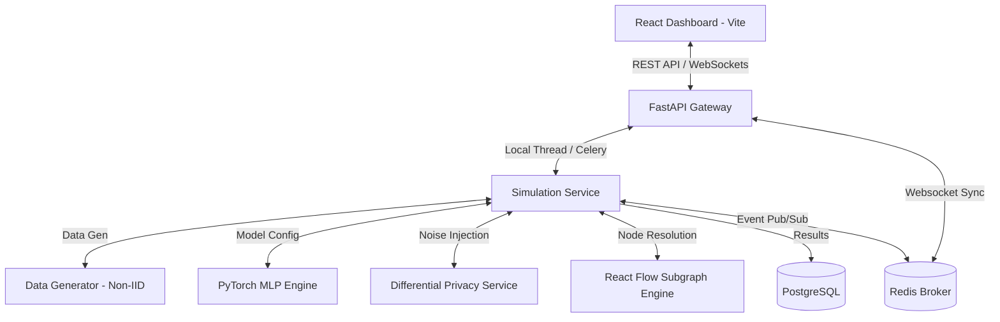

# Collaborative Fraud Intelligence Simulator

A production-grade, enterprise-ready simulation framework demonstrating privacy-preserving, cross-institution financial fraud detection and Collaborative Anti-Money Laundering (AML) intelligence. This platform showcases how financial institutions can train machine learning models and share risk indicators without exposing customer Personally Identifiable Information (PII) or violating global privacy regulations like GDPR, CCPA, and banking secrecy laws.

[](https://github.com/yusufcalisir/Collaborative-Fraud-Intelligence-Simulator/actions)
[](https://python.org)
[](https://react.dev)
[](#project-development-methodology)
[](LICENSE)

  
***

> [!NOTE]
> **Enterprise Objective:** This simulator solves the dilemma between data privacy compliance and collaborative intelligence. By using distributed machine learning (Federated Learning) and zero-knowledge risk sharing, banks collaborate in real time to stop multi-institution fraud rings without centralizing or decrypting raw transaction logs.

***

## The Core Challenge: Siloed Fraud Detection

Financial institutions detect fraud and money laundering in absolute isolation. Each bank trains machine learning models solely on its own internal transaction databases. This isolation creates significant vulnerabilities:

*   **Cross-Bank Velocity Fraud:** Fraudsters exploit the blind spot between institutions, transferring funds rapidly across Bank A, Bank B, and Bank C before any single bank detects the pattern.
*   **Structured Syndicate Rings:** Large-scale mule networks distribute accounts and transactions across several institutions to fly under single-bank detection thresholds.
*   **Emerging Typologies:** New fraud techniques are often only visible when observing aggregate transaction behavior across the entire financial ecosystem.

Directly sharing transaction logs or database records between banks is strictly prohibited by privacy regulations and banking secrecy laws. This platform bridges that gap by demonstrating how banks can collaborate securely.

***

## The Technical Solution

The Collaborative Fraud Intelligence Simulator demonstrates two parallel tracks of secure, multi-bank collaboration:



### Track 1: Privacy-Preserving Federated Learning (Phase 1)
Instead of centralizing raw customer transactions, the framework uses a distributed machine learning paradigm:
1.  **Local Training:** Each bank trains a local PyTorch Multi-Layer Perceptron (MLP) on its own transaction data.
2.  **Gradient Exchange:** Banks export only their local model weights (gradients), keeping all raw transactions strictly on-premise.
3.  **Secure Aggregation:** An Aggregation Server averages the weights using the Federated Averaging (FedAvg) algorithm to create an improved global model.
4.  **Dual FL Engine Architectures:** Selectable from the UI settings panel:
    *   **Custom Engine:** Built-in simulation with thread-safe queue systems, supporting latency simulation, dropout simulation, secure aggregation masks, Byzantine robustness, and poisoning attacks.
    *   **Flower Engine (flwr.dev):** Industry-standard Flower integration utilizing Ray-based simulation to execute compliant NumPyClient adapters for standard-compliant federated loops.
5.  **Differential Privacy (DP) — Dual Mode:** Two implementation modes are available, selectable from the UI:
    * **Post-Hoc Mode:** Calibrated Gaussian noise is injected into weight deltas after local training, backed by mathematical privacy budget tracking (epsilon, delta).
    * **Opacus Mode (Industry-Standard):** Per-sample gradient clipping and noise injection during training via Meta AI's [Opacus](https://opacus.ai/) library, with Rényi Differential Privacy (RDP) accounting for tighter privacy bounds.
5.  **Byzantine-Robust Aggregation:** Supports advanced aggregation strategies including **Krum** (Blanchard et al., 2017) and **Coordinate-wise Median** to securely isolate and discard corrupted model updates.
6.  **Adversarial Poisoning Simulation:** Toggles active **Model Poisoning** attacks to corrupt specific client weights with noise scaling, enabling visual comparison of FedAvg vulnerability vs. robust aggregation defense.

### Track 2: Collaborative AML Intelligence & 9-Signal Risk Engine (Phase 2)
To provide real-time transaction screening and investigation capabilities:
1.  **Deterministic Entity Resolution:** Cross-bank customer and device matching is achieved via one-way HMAC-SHA256 hashes, allowing linkage of malicious actors without revealing identity.
2.  **9-Signal Risk Engine:** Combines machine learning inference with heuristic indicators (velocity anomalies, device mismatches, high-risk merchant categories, baseline deviations).
3.  **Interactive Relationship Graphs:** A full visual graph of entities, devices, cards, and accounts built using React Flow, mapping suspicious clusters in real time.
4.  **Scenario Replay Engine:** Scripted simulation flows representing typologies like Account Takeover (ATO), Card Testing, and Layering networks.

### Track 3: Production Microservices & Secure API Gateway (Phase 3)
To transform the prototype into a production-oriented distributed system:
1.  **Microservices Decomposition**: Decoupled the backend into 4 autonomous, independent services: `gateway`, `fl-coordinator`, `identity-graph`, and `fraud-alert` (dynamically loaded in [main.py](file:///backend/app/main.py#L236-L300) and orchestrated in [docker-compose.yml](file:///docker-compose.yml)).
2.  **Fault-Tolerant Shared State**: Replaced standard variables with [RedisStore](file:///backend/app/infrastructure/redis_store.py) syncing data to a Redis cache while falling back dynamically to thread-safe in-memory cache on connection timeouts.
3.  **API Gateway Routing & Security Suite**: Centralized traffic routing, versioning checks (enforcing `/api/v1/`), rate-limiting, and auditable request logging implemented in [gateway.py](file:///backend/app/presentation/routers/gateway.py).

#### 🔍 The 9-Signal Risk Evaluation Pipeline
The platform implements a modular **9-Signal Risk Combination Engine** to calculate transaction risk levels dynamically. Each signal outputs a normalized risk weight between `0.0` (benign) and `1.0` (maximum threat):

| # | Risk Signal | Evaluation Logic | Target Objective |
| :--- | :--- | :--- | :--- |
| **1** | `ml_prediction` | Deep Learning model inference output. | Model detection score |
| **2** | `velocity_rules` | Rates transaction frequencies per hour. | Account takeover / velocity |
| **3** | `merchant_reputation` | Blend of merchant category risk (e.g. gambling, crypto) & individual merchant rating. | Syndicate tracking |
| **4** | `country_risk` | Cross-border geographic destination risk weighting. | Cross-border laundering |
| **5** | `device_anomaly` | High-risk channel checks (ATM/Phone banking vs Mobile App). | Identity theft / compromise |
| **6** | `customer_history` | Account age and historical customer activity level scoring. | Account aging / mule checking |
| **7** | `previous_alerts` | Historical alert counts of HMAC-matched entities across institutions. | Persistent recidivism |
| **8** | `chargeback_history` | Merchant-specific transaction dispute rate indicators. | Card testing & fraud capture |
| **9** | `behavior_anomaly` | Statistical amount deviation from historical baseline ($\sigma$ standard deviation threshold). | Outlier anomaly detection |

> [!TIP]
> **Composite Scoring:** The engine combines these signals into a final score (0 - 1000) using a weighted average. The weights can be customized dynamically on the **Simulation Configuration** panel, enabling full adjustment of heuristics vs machine learning predictions.

***

## Model Validation & Correctness Verification

A key challenge in Federated Learning is verifying that the collaboratively trained model is actually correct, accurate, and adds value, without centralizing or viewing the raw transaction data. The framework addresses this through four core validation layers:

### 1. Local Verification via Holdout Sets (Distributed Validation)
Every bank in the simulation splits its generated synthetic dataset into an **80% training set** and a **20% testing set** (using stratified splits to maintain class/fraud ratios, located in [simulation_service.py](file:///backend/app/application/services/simulation_service.py#L149-169)). 
* The **test set is a strict holdout set** that is never seen during the local training process or global aggregation.
* At the end of each round, the global server sends the aggregated weights to the banks. Each bank evaluates the global model locally on its own private holdout test set using PyTorch (located in [model_service.py](file:///backend/app/application/services/model_service.py#L138-199)) and returns only the performance metrics (AUC, Recall, F1-Score, Loss) to the server.

### 2. Side-by-Side Baseline Comparison (Value Proof)
To prove the correctness and utility of the federated model, the engine trains **Local-Only Baseline Models** (Phase 2).
* Each bank trains a model *only* on its own data, evaluates it, and stores the results.
* Once the federated training is complete, the final global model's performance on each bank's test set is compared directly against that bank's local model.
* For smaller banks (e.g., Bank C / Heritage Regional) which suffer from sparse fraud samples, the collaborative model shows a **significant boost in F1-Score and AUC-ROC**, proving the federated model has correctly learned generalized patterns from other institutions.

### 3. Convergence Monitoring
During the simulation, the central aggregator tracks the **Global Loss** after each communication round.
* A decreasing loss curve (visualized in the *Loss Chart*) mathematically confirms that the parameter updates from the participating clients are successfully minimizing the binary cross-entropy (BCE) objective function.

### 4. Cryptographic & Mathematical Correctness
To verify that privacy enforcement doesn't break the model's mathematical correctness:
* **Secure Aggregation (SecAgg):** The framework adds pairwise masks to the local parameters that perfectly sum to zero across all clients (located in [fl_engine.py](file:///backend/app/application/services/fl_engine.py#L185)). This guarantees that the final aggregated global model is mathematically identical to plaintext FedAvg, proving that privacy is achieved without sacrificing model accuracy.
* **Differential Privacy (DP) Accounting:** In Post-Hoc mode, privacy loss is tracked using basic sequential composition. In Opacus mode, the Rényi Differential Privacy (RDP) Moments Accountant provides tighter sublinear bounds on cumulative epsilon.

***

## Feature Comparison Matrix

| Feature | Technical Implementation | Purpose / Advantage | Cryptographic / ML Guarantee |
| :--- | :--- | :--- | :--- |
| **Non-IID Synthetic Data** | `DataGenerator` generates skewed distributions per bank (skewed fraud rates, different feature means). | Simulates real-world heterogeneity where banks have distinct customer bases. | Statistical Non-Identical & Independent Distribution (Non-IID) |
| **FedAvg Aggregation** | Weighted averaging of local weights based on relative client sample counts. | Central algorithm for model parameter synchronization in Federated Learning. | Convergence on global optima without raw data pooling |
| **Krum Aggregation** | Byzantine-robust selection (Blanchard et al., 2017): selects the single client update closest to all others, rejecting outlier poisoned weights. | Defends the global model when a compromised bank sends malicious (poisoned) parameters. | Tolerates up to f Byzantine workers among n clients |
| **Coordinate-wise Median** | Element-wise median aggregation across all client parameter vectors. | Robust alternative to averaging that limits the influence of any single outlier client. | Breakdown point of 50% — tolerates up to half the clients being adversarial |
| **Model Poisoning Simulation** | Corrupts a designated bank's trained weights by injecting random noise scaled by a configurable magnitude factor. | Enables side-by-side comparison: FedAvg collapses under attack while Krum/Median defend. | Adversarial robustness stress testing |
| **Differential Privacy (Dual-Mode)** | **Post-Hoc:** L2 clip + Gaussian noise on weight deltas. **Opacus:** Per-sample gradient clipping + noise during training (Meta AI). | Mathematically guarantees that individual transaction signatures cannot be leaked. Both modes support UI-configurable epsilon. | $(\epsilon, \delta)$-DP (Post-Hoc: basic composition, Opacus: RDP Moments Accountant) |
| **Client Failures** | Dynamic simulation of network latency, dropouts, and reconnection cycles. | Tests the resilience of the aggregation server against real-world connection drops. | Quorum enforcement ($\ge$ Min Clients) |
| **Deterministic Linkage** | Linkage of cross-bank entities using salted HMAC-SHA256 identifiers. | Matches entities (e.g., suspicious cards/devices) without sharing raw names or emails. | Salted SHA-256 One-way Hash Collision Resistance |
| **9-Signal Risk Engine** | Custom pipeline weighting ML scores, device status, IP velocity, and behavioral shifts. | Builds a comprehensive risk profile for automated alert generation. | Composite heuristics + ML Inference Score |
| **Real-time Replay** | Replays historical fraud scenarios event-by-event via WebSockets. | Provides a high-fidelity demonstration of how cross-bank intelligence is shared. | Real-time WebSocket event dispatch |
| **Distributed Microservices** | Mapped endpoints decoupled to `gateway`, `fl-coordinator`, `identity-graph`, and `fraud-alert` processes. | Simulates production horizontal scaling in a distributed cloud environment. | Clean operational separation of concerns |
| **State Synchronizer** | `RedisStore` handling key-value, lists, and lists-push updates with sub-second in-memory fallback. | Synchronizes microservices' state across multiple running containers. | Event-consistent cache synchronization |
| **Gateway Security Suite** | Fixed-window client rate limiting, path prefix versioning, RBAC policies, and logging middleware. | Centralizes traffic filtering and prevents cross-tenant data leakage. | Multi-tenant tenant boundary isolation |

***

## Clean Architecture Directory Structure

```
├── backend/
│   ├── app/
│   │   ├── domain/               # Core domain entities, enums, value objects (Pure Python)
│   │   │   ├── enums.py          # Aggregation Method, Privacy Mechanism, Simulation Status
│   │   │   ├── entities.py       # Bank, SimulationRun, TrainingRound models
│   │   │   ├── entities_phase2.py # Alerts, Cases, Resolved Entities, Scenario definitions
│   │   │   └── value_objects_phase2.py # Risk weight specifications, Graph nodes/edges
│   │   ├── application/          # Services, validation schemas, interfaces (Ports)
│   │   │   ├── schemas/
│   │   │   │   └── simulation.py # Pydantic v2 schemas for client-server communication
│   │   │   └── services/
│   │   │       ├── data_generator.py # Synthetic Non-IID transaction generation
│   │   │       ├── model_service.py # PyTorch MLP creation, training loops, evaluation
│   │   │       ├── fl_engine.py     # FedAvg mechanics, secure aggregation, client dropouts
│   │   │       ├── privacy_service.py # Differential privacy noise, gradient clipping, budgets
│   │   │       ├── alert_service.py # Aggregates and alerts on suspicious transactions
│   │   │       ├── risk_engine.py   # Computes composite scores via 9-signal pipeline
│   │   │       ├── case_service.py  # Coordinates multi-bank AML investigation cases
│   │   │       ├── entity_resolution.py # Matches cross-bank users deterministic via HMACs
│   │   │       ├── graph_engine.py  # Assembles node-link data models for React Flow
│   │   │       ├── explainability_service.py # Explains risk indicator contributions
│   │   │       └── streaming_engine.py # Event emitter for scenario replay
│   │   ├── infrastructure/       # Database, cache, event bus adapters (Adapters)
│   │   │   ├── database.py       # SQLAlchemy 2.0 connection engine
│   │   │   ├── models.py         # Relational tables for simulation logs, alerts, and runs
│   │   │   ├── redis_store.py    # Redis state syncing client with automatic thread-safe memory fallback
│   │   │   └── event_bus.py      # Pub/sub channels for real-time WebSocket communication
│   │   ├── presentation/         # API Controllers and endpoints
│   │   │   ├── routers/
│   │   │   │   ├── gateway.py    # Gateway routing middleware (Auth, RBAC, logging, rate limiting)
│   │   │   │   ├── simulation.py # Handles creation, detail retrieval, and comparison
│   │   │   │   ├── banks.py      # References profiles of Bank A, B, and C
│   │   │   │   ├── training.py   # Yields progress data on communication rounds
│   │   │   │   └── aml.py        # Serves Alerts, Cases, Entity Graphs, and Scenarios
│   │   │   └── websockets/
│   │   │       └── training_ws.py # Manages persistent WebSocket feeds to the dashboard
│   │   └── tasks/                # Background tasks (Celery asynchronous runners)
│   ├── tests/                    # Integration and unit test suite
│   ├── Dockerfile
│   └── requirements.txt
├── frontend/
│   ├── src/
│   │   ├── api/                  # API client instance, queries, mutations (React Query)
│   │   ├── components/           # Reusable UI elements
│   │   │   ├── layout/           # Sidebar, Header, Page layout wrappers
│   │   │   ├── dashboard/        # Stepper, FederatedTrainingAnimation, Bank cards
│   │   │   └── charts/           # PyTorch Loss, ROC Curve, Confusion Matrix, Radar charts
│   │   ├── pages/                # Application views (Dashboard, Simulation details)
│   │   └── utils/                # Numerical formatters and constants
│   ├── Dockerfile
│   └── package.json
├── docs/                         # Extended systems design and threat models
├── docker-compose.yml
├── Makefile
└── .github/                      # CI/CD Workflows
```

***

## Configuration Options

When initializing a simulation run, the platform exposes fine-grained parameters to customize model performance and security strength:

### Model Configuration

| Parameter | Type / Range | Default | Performance Impact |
| :--- | :--- | :--- | :--- |
| **Communication Rounds** | Integer (1 - 50) | 10 | Higher values improve model convergence but increase network roundtrips. |
| **Local Epochs** | Integer (1 - 10) | 3 | More epochs reduce communications rounds but risk local overfitting. |
| **Learning Rate** | Float (1e-5 - 1e-1) | 0.001 | Determines gradient descent step size. Too high causes divergence. |
| **Batch Size** | Integer (16 - 256) | 64 | Larger batches speed up training but dilute individual updates. |

### Privacy and Network Settings

| Parameter | Type / Range | Default | Security / Utility Impact |
| :--- | :--- | :--- | :--- |
| **Privacy Mechanism** | Selection | *None* | Selects DP, Secure Aggregation, or both protocols. |
| **DP Epsilon ($\epsilon$)** | Float (0.1 - 10.0) | 1.0 | Lower epsilon represents stronger privacy bounds, adding more noise. |
| **DP Delta ($\delta$)** | Float (1e-6 - 1e-4) | 1e-5 | Represents probability of information leakage breaking DP bounds. |
| **Max Gradient Norm** | Float (0.1 - 5.0) | 1.0 | Clips local model updates. Lower bounds restrict outlier samples. |
| **Dropout Probability** | Float (0.0 - 0.9) | 0.2 | Probability of a bank going offline during aggregation rounds. |

***

## API Endpoint Blueprints

### Phase 1: Federated Learning Engine

*   `POST /api/v1/simulations` - Starts a background simulation with custom configuration.
*   `GET /api/v1/simulations` - Lists all recorded simulation runs.
*   `GET /api/v1/simulations/{id}` - Retrieves detailed parameters and metrics for a run.
*   `GET /api/v1/simulations/{id}/comparison` - Yields side-by-side performance data.
*   `GET /api/v1/training/{id}/rounds` - Lists training metrics for completed rounds.
*   `WS /ws/training/{id}` - Real-time WebSocket connection to track round-by-round status.
*   `GET /api/v1/banks` - Retrieves reference profiles for Bank A, B, and C.

### Phase 2: AML Collaborative Intelligence

*   `GET /api/v1/alerts` - Query and filter generated transaction fraud alerts.
*   `GET /api/v1/alerts/{id}/explain` - Explains risk factors (9-signals) contributing to an alert.
*   `GET /api/v1/intelligence` - Query cross-bank intelligence items.
*   `GET/POST /api/v1/cases` - Create, view, or update AML investigation cases.
*   `POST /api/v1/cases/{id}/notes` - Add investigator findings to a case.
*   `POST /api/v1/entities/resolve` - Resolves overlap of device IDs and account hashes.
*   `GET /api/v1/graph/{id}` - Builds subgraphs for interactive network visualization.
*   `POST /api/v1/scenarios/start` - Launches a real-time replay of cross-bank fraud scenarios.
*   `WS /ws/streaming/{scenario_id}` - Stream scenario event data in real time.
*   `GET /docs/{service_name}` - Gateway Swagger UI aggregator (e.g. `/docs/fl-coordinator`, `/docs/identity-graph`, `/docs/fraud-alert`).

***

## Quick Start Guide

### Running with Docker Compose (Recommended)
This boots up the API gateway, React UI, PostgreSQL instance, and Redis event broker in a single step:

```bash
# 1. Clone repository
git clone https://github.com/yusufcalisir/Collaborative-Fraud-Intelligence-Simulator.git
cd Collaborative-Fraud-Intelligence-Simulator

# 2. Setup environment variables
cp .env.example .env

# 3. Build and launch services
make dev
# Alternatively: docker compose -f docker-compose.yml -f docker-compose.dev.yml up --build
```

### Local Setup (For active debugging)
Ensure PostgreSQL and Redis are running locally before launching:

```bash
# Start backend
cd backend
python -m venv .venv
# On Windows:
.venv\Scripts\activate
# On Linux/macOS:
source .venv/bin/activate

pip install -r requirements.txt
uvicorn app.main:app --reload --port 8000
```

In a separate terminal, launch the React interface:
```bash
# Start frontend
cd frontend
npm install
npm run dev
```

***

## Verification and Quality Checks

The framework includes automated test suites to verify data generation distributions, model parameter aggregation, secure masking mechanics, and API router routing:

```bash
# Run all tests using pytest
cd backend
.venv/Scripts/pytest -v

# Run formatting checks (Ruff)
.venv/Scripts/ruff check app/ tests/
.venv/Scripts/ruff format --check app/ tests/
```

***

## Architectural Decision Records (ADRs)

### ADR 01: Custom Federated Learning Aggregation Loop & Flower Adapter Integration
*   **Context:** Industry standard libraries (like Flower) require client agents to run as standalone network listener nodes, complicating local, single-process demo configurations on memory-constrained containers (like Hugging Face Spaces).
*   **Decision:** Implement a custom `FederatedLearningEngine` in Python using threads, locking mechanisms, and in-memory caching to simulate multi-node environments within a single execution process, AND add a standalone `FlowerFLEngine` adapter using Ray simulation mode (`flwr.simulation`) as a selectable alternative to demonstrate production framework compliance.
*   **Trade-off:** The custom engine remains default for fine-grained failure injection and latency simulation, while the Flower engine acts as an opt-in validator for standards-compliance.

### ADR 02: Deterministic Salted HMAC Resolution
*   **Context:** Linking entities (IPs, credit cards) across distinct bank databases without central storage requires collision-resistant matching.
*   **Decision:** Implement SHA-256 HMAC utilizing a shared secure salt rotated daily. Banks compute `HMAC(entity_value, salt)` and exchange the hashes.
*   **Trade-off:** Enables entity linkage without disclosing raw database rows, but is vulnerable to dictionary attacks if the shared salt is compromised.

### ADR 03: Microservice Decomposition with Redis/In-Memory Fallback
*   **Context:** Moving the monolith to production microservices increases complexity and introduces single points of failure if dependency services like Redis go offline.
*   **Decision:** Build a custom `RedisStore` layer syncing data to a Redis cache while falling back dynamically to thread-safe in-memory cache. A class-level flag immediately bypasses connection checks for all stores if connection fails once.
*   **Trade-off:** Ensures service resilience and backward compatibility for local test suites and single-port container deploys, but introduces cache consistency limitations if different non-connected instances run concurrently.

### ADR 04: Transparent API Gateway Security for Demo & Production
*   **Context:** Adding JWT/API Key authentication, rate-limiting, and RBAC to the API Gateway is essential for enterprise security but risks breaking local workflows and zero-config public demos (like Vercel).
*   **Decision:** Implement Gateway auth middleware checking headers (`X-API-Key`) with a configurable bypass (`gateway_require_auth = False`). When bypassed, the Gateway assigns a default `analyst` role, keeping public demos fully functional without credentials while retaining logging and rate-limiting.
*   **Trade-off:** Simplifies demo onboarding and user experience, but requires explicit environment variable activation in production to secure endpoints.

***

## Project Development Methodology

This project was developed using a hybrid engineering approach, combining custom core system design with modern developer tooling and coding assistants. The division of implementation tasks is outlined below:

*   **Core Algorithms & Domain Architecture (Custom Implementation):** The clean architecture structure (Domain, Application, Infrastructure, Presentation layers), the mathematical design and weighting of the **9-Signal Risk Engine**, the non-IID synthetic data distribution logic, the custom federated averaging aggregation workflow (`FL_Engine`), the differential privacy noise bounds, the rotating daily-salted HMAC-SHA256 entity resolution pipeline, and the overall system design.
*   **Developer Tooling & Styling Support (AI Assisted):** Coding agents were utilized as pair-programming assistants to accelerate the creation of unit and integration test boilerplate, dark-themed dashboard grid styling, responsive layouts for mobile viewports, chart component integrations (Loss chart, Radar chart, Confusion Matrix), deployment configurations, and standard SVG assets.

This development methodology enabled a production-grade implementation of the underlying cryptographic and machine learning concepts while maintaining high velocity.

***

## License

MIT - see [LICENSE](LICENSE) for details.
