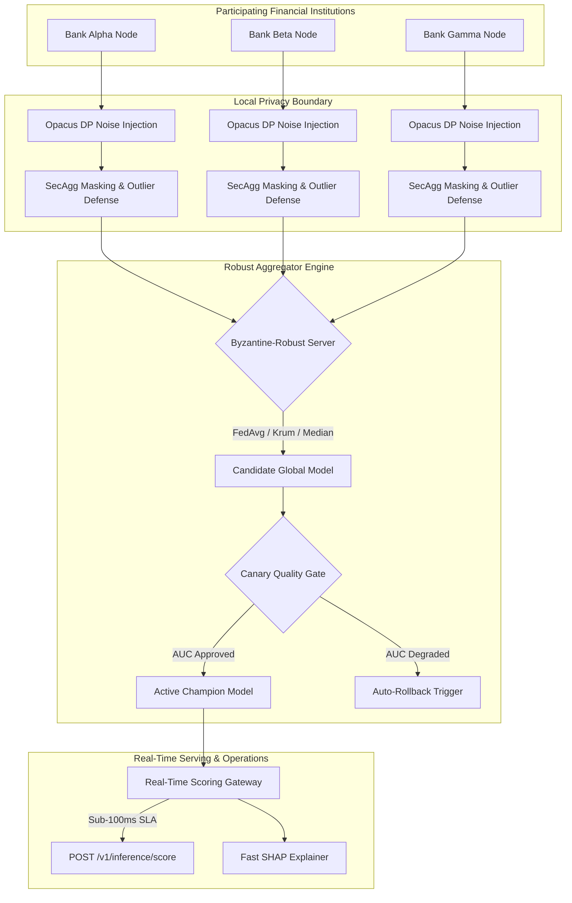
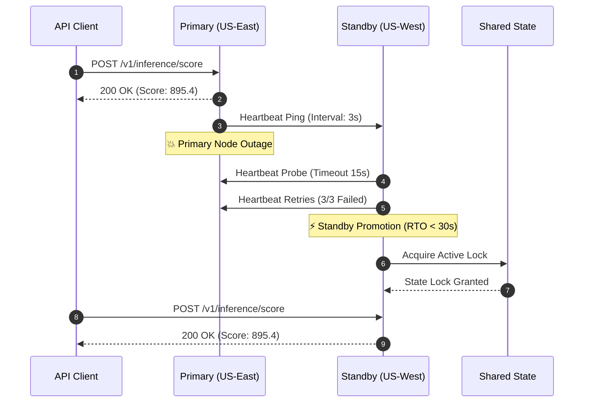

<div align="center">

# 🛡️ Collaborative Fraud Intelligence Platform

### *Enterprise-Grade, Privacy-Preserving Cross-Bank Financial Fraud Detection & Collaborative Anti-Money Laundering (AML) Intelligence*

[](https://github.com/yusufcalisir/CF-Intelligence/actions)
[](https://cf-intelligence.vercel.app)
[](https://python.org)
[](https://fastapi.tiangolo.com)
[](https://pytorch.org)
[](#9-real-time-scoring-gateway--high-availability-sla)
[](LICENSE)

🌐 **[Live Web Application Console](https://cf-intelligence.vercel.app)**

[Executive Summary](#1-executive-summary--architectural-vision) • [System Architecture](#2-master-system-architecture) • [Core Subsystems](#3-multi-bank-synthetic-data--multi-standard-ingestion) • [Feature Matrix](#13-enterprise-feature-matrix--verification-mapping) • [Directory Tree](#14-complete-clean-architecture-directory-structure) • [API Blueprints](#15-api-endpoint-blueprints--json-schemas) • [Operator Guide](#16-cli-operator-tooling-guide-cfi-cli) • [Quick Start](#17-step-by-step-operator-quick-start)

</div>

---

## 1. Executive Summary & Architectural Vision

Financial institutions operate under strict regulatory constraints (**GDPR Art. 6/17**, **CCPA**, **Banking Secrecy Laws**, **Bank Secrecy Act**) that strictly prohibit centralizing or pooling raw customer transaction records across institutional boundaries. This data fragmentation creates critical systemic vulnerabilities in global financial infrastructure:

- 💸 **Cross-Bank Velocity & Mule Laundering:** Organized money laundering syndicates distribute illicit funds sequentially across Bank Alpha $\rightarrow$ Bank Beta $\rightarrow$ Bank Gamma within minutes, clearing accounts before individual internal single-bank rule engines can detect velocity anomalies.
- 🥷 **Structured Smurfing Networks:** Criminal networks divide large illicit cash deposits into micro-transactions placed across multiple financial institutions to remain strictly below mandatory single-bank regulatory reporting thresholds ($10,000\text{ USD}$).

The **Collaborative Fraud Intelligence Platform** solves this fundamental privacy-utility trade-off. By synthesizing **Federated Machine Learning (FL)**, **Opacus Differential Privacy ($\epsilon, \delta$)**, **Secure Aggregation (SecAgg)**, **Graph Neural Networks (GNN)**, and **Byzantine-Robust Consensus Algorithms**, participating banking institutions collaboratively train a global fraud detection model—without ever exposing raw customer transactions, personally identifiable information (PII), or violating banking secrecy legislation.

---

## 2. Master System Architecture

### High-Level Topology ASCII Diagram

```
┌────────────────────────────────────────────────────────────────────┐
│              3 Client Financial Institutions                       │
│        [ Bank Alpha ]     [ Bank Beta ]     [ Bank Gamma ]         │
└──────────────────────────────────┬─────────────────────────────────┘
                                   │
                                   ▼
┌────────────────────────────────────────────────────────────────────┐
│              Local Privacy & Model Training Boundary               │
│  - Opacus Differential Privacy Guard (L2 Clipping C, Noise Scale σ)│
│  - Outbound Outlier Defense & Cryptographic SecAgg Seed Masking    │
└──────────────────────────────────┬─────────────────────────────────┘
                                   │
                                   ▼
┌────────────────────────────────────────────────────────────────────┐
│             Byzantine-Robust Server Coordinator Engine             │
│   (FedAvg / FedProx / Krum / Trimmed Mean / Median / Bulyan)       │
└──────────────────────────────────┬─────────────────────────────────┘
                                   │
                                   ▼
┌────────────────────────────────────────────────────────────────────┐
│                Canary Quality Gate & Model Registry                │
│   (Holdout AUC Validation -> Promote Champion / Auto-Rollback)     │
└──────────────────────────────────┬─────────────────────────────────┘
                                   │
                                   ▼
┌────────────────────────────────────────────────────────────────────┐
│             Real-Time Inference & Operational Serving              │
│  - Real-Time Scoring Gateway (<100ms SLA) & Fast SHAP Explainer    │
│  - 6-Stage Case Management Workbench (Four-Eyes Supervisor Auth)   │
│  - FinCEN BSA Suspicious Activity Report (SAR) XML E-Filing        │
└──────────────────────────────────┬─────────────────────────────────┘
                                   │
                                   ▼
┌────────────────────────────────────────────────────────────────────┐
│             Enterprise Infrastructure & Security Perimeter         │
│  - Edge WAF Guard (SQLi / XSS / IP Whitelist)                      │
│  - Active-Passive Multi-Region DR Failover (RTO < 30s)             │
│  - Developer Webhook Gateway (HMAC-SHA256 Payload Signing)         │
│  - SIEM Log Exporter (Syslog CEF / Splunk HEC / Datadog)           │
│  - Web3 CBDC Smart Contract Incentive Settlement (.sol)            │
└────────────────────────────────────────────────────────────────────┘
```

### End-to-End Federated Execution Flow



### Multi-Region Active-Passive High Availability Failover Sequence



---

## 3. Multi-Bank Synthetic Data & Multi-Standard Ingestion

### 3.1 Synthetic Multi-Bank Data Generator (`data_generator.py`)
- Generates realistic cross-bank transaction datasets across 3 distinct financial institutions (**Bank Alpha**, **Bank Beta**, **Bank Gamma**).
- Models heterogeneous local fraud distributions (e.g., Bank Alpha specializing in high-value wire fraud, Bank Beta in credit card velocity, Bank Gamma in cross-border layering).
- Enforces reproducible seeds and outputs normalized feature matrices ready for local model training.

### 3.2 Multi-Standard Message Parser (`financial_message_parser.py`)
Parses financial payload formats into a unified `NormalizedTransaction` schema:
- **ISO 20022 Messages:** `pacs.008` (Financial Interbank Credit Transfer) and `camt.053` (Bank-to-Customer Statement XML).
- **SWIFT MT Messages:** Legacy `MT103` Single Customer Credit Transfer.
- **PSD2 Open Banking:** Open Banking REST API webhook JSON payloads.

### 3.3 Data Contracts & Gating (`data_validator.py` & `data_contracts.py`)
- **Pandera Data Contracts:** Validates incoming DataFrame schema types, non-negative transaction amounts, and valid country codes.
- **Great Expectations Gating:** Enforces distribution bounds (e.g., mean transaction amount, null velocity checks) before data ingestion.
- **Arrow Parquet Streaming:** Ingests large offline datasets using PyArrow zero-copy streaming.

### 3.4 Resilient Database Persistence (`database_persistence.py`)
- Configures SQLAlchemy Async engine connection pools (`pool_pre_ping=True`, `pool_size=20`).
- Implements CockroachDB transaction retry loops with serializable conflict resolution.

---

## 4. Federated Learning Optimizers & Framework Engines

### 4.1 Federated Learning Engine (`fl_engine.py`)
Orchestrates global model training rounds supporting 7 distinct aggregation algorithms:
1. **FedAvg:** Standard weighted parameter averaging.
2. **FedProx:** Proximal regularization term ($\mu \frac{1}{2} \|w - w^t\|^2$) to handle non-IID data heterogeneity across banks.
3. **FedYogi & FedAdam:** Server-side adaptive optimization with momentum.
4. **FedAdagrad:** Adaptive gradient server-side scaling.
5. **SCAFFOLD:** Control variates ($c_i, c$) correcting client-side drift.
6. **MOON (Model-Contrastive FL):** Contrastive representation learning between local and global embeddings.

### 4.2 Flower Framework Engine (`flower_engine.py`)
Integrated Flower FL framework adapter executing distributed client-server training cycles with Opacus DP integration.

### 4.3 Asynchronous FL Coordinator (`async_fl_engine.py`)
Accepts parameter updates asynchronously without requiring straggling clients to block training rounds. Incorporates staleness attenuation:
$$\alpha_t = (1 + \tau)^{-\gamma}, \quad \Delta w_{\text{global}} = \alpha_t \cdot \Delta w_{\text{client}}$$

### 4.4 Dynamic Quorum Manager (`quorum_manager.py`)
Automatically triggers aggregation when minimum client threshold conditions ($\text{Minimum Clients} \ge 3$) or timeout expirations occur.

---

## 5. Differential Privacy, Secure Aggregation & Privacy Auditing

### 5.1 Opacus Differential Privacy Guard (`privacy_service.py`)
- **$L_2$ Gradient Norm Clipping ($C$):** Clips local gradient vectors $g_i$:
  $$\bar{g}_i = \frac{g_i}{\max\left(1, \frac{\|g_i\|_2}{C}\right)}$$
- **Gaussian Noise Addition ($\sigma$):** Injects calibrated zero-mean Gaussian noise:
  $$\sigma = \frac{\sqrt{2 \ln(1.25/\delta)}}{\epsilon}, \quad \tilde{g}_i = \bar{g}_i + \mathcal{N}(0, \sigma^2 C^2 I)$$
- **Privacy Budget Accountant:** Enforces privacy loss limits ($\epsilon \le 2.0$, $\delta \le 10^{-5}$).

### 5.2 Secure Aggregation (SecAgg)
Applies pairwise cryptographic seed mask exchange ($y_k = w_k + \sum_{j > k} s_{kj} - \sum_{j < k} s_{jk} \pmod{2^{32}}$). Pairwise masks cancel out identically at the coordinator ($\sum_k y_k = \sum_k w_k$), hiding individual updates.

### 5.3 Privacy Audit Suite (`privacy_audit_service.py`, `dlg_validation.py`, `mia_validation.py`)
- **Deep Leakage from Gradients (DLG):** Simulates gradient reconstruction attacks to verify that differential privacy and SecAgg prevent image/feature recovery.
- **Membership Inference Attack (MIA):** Computes MIA advantage bounds to verify that non-participating accounts cannot be inferred from global updates.

### 5.4 Multi-Tenant Key Management Service (`kms_service.py` & `tenant_kms_metering.py`)
Isolated per-tenant KMS managing HMAC privacy masking keys, PSI exponent keys, and SecAgg seed generation.

---

## 6. Byzantine Poisoning Defense, Backdoors & Adversarial Robustness

### 6.1 Byzantine-Robust Aggregation Suite (`byzantine_defense_validation.py`)
Resists up to 50% compromised nodes using 5 robust aggregators:
- **Krum & Multi-Krum:** Distance-based update selection.
- **Trimmed Mean:** Trims upper/lower $\beta$ fraction of extreme outliers per coordinate.
- **Coordinate-Wise Median:** Element-wise median calculation.
- **Bulyan:** Combines Multi-Krum with coordinate-wise trimmed mean.

### 6.2 Spectral SVD Backdoor Defense (`spectral_defense.py`)
Uses top Singular Value Decomposition (SVD) of parameter matrices to isolate and quarantine backdoor poisoning triggers prior to aggregation.

### 6.3 Adversarial Attack Evaluator (`adversarial_service.py` & `adversarial_defense.py`)
Generates Fast Gradient Sign Method (FGSM) and Projected Gradient Descent (PGD) multi-step perturbations with tabular constraint projection, executing adversarial training (`train_local_with_adversarial_training`).

---

## 7. Streaming Graph Neural Networks & Fuzzy PSI Identity Resolution

### 7.1 Entity Graph Engine & Neo4j Integration (`graph_engine.py`, `graph_analytics_service.py`, `neo4j_graph.py`)
- Dual NetworkX and Neo4j graph backends executing Cypher queries.
- Computes PageRank centrality, Louvain community detection, and temporal risk score propagation.

### 7.2 PyTorch Streaming Graph Neural Networks (`graph_embedding_model.py`, `streaming_gnn_model.py`)
PyTorch GraphSAGE GNN models producing $L_2$-normalized node embeddings updated dynamically as streaming transaction edges arrive.

### 7.3 Private Set Intersection & Entity Resolution (`fuzzy_psi.py`, `entity_resolution.py`)
MinHash LSH (Locality-Sensitive Hashing) Fuzzy PSI resolving customer identities across institutions without revealing raw customer bases.

---

## 8. 9-Signal Composite Risk Engine & Model Explainability

### 8.1 9-Signal Composite Risk Scoring Engine (`risk_engine.py`)
Evaluates 9 distinct anti-fraud signals into a composite score ($0 - 1000$):
1. $S_{\text{local}}$: Local PyTorch deep model probability score.
2. $S_{\text{velocity}}$: Cross-bank 1-hour transaction velocity anomaly index.
3. $S_{\text{graph}}$: Graph Neural Network entity centrality risk index.
4. $S_{\text{typology}}$: Known money laundering typology pattern match score.
5. $S_{\text{amount}}$: Statistical Z-score transaction amount deviation.
6. $S_{\text{device}}$: Device fingerprinting & IP reputation risk index.
7. $S_{\text{temporal}}$: Off-hours & rapid temporal clustering anomaly score.
8. $S_{\text{mule}}$: Probabilistic money mule account score.
9. $S_{\text{structuring}}$: Structuring pattern detection index.

$$\text{Risk Score} = \min\left(1000, \max\left(0, \sum_{i=1}^{9} w_i S_i \times 1000\right)\right)$$

### 8.2 Model Explainability Engine (`explainability_service.py` & `realtime_explainer.py`)
- **Fast Feature Explainer:** Computes sub-1ms Shapley feature attributions during live scoring.
- **Counterfactual Engine (`generate_counterfactuals`):** Generates minimum perturbation feature edits required to reduce risk scores.
- **Decision Replay Audit (`replay_inference_audit`):** Reproduces exact historical scoring outputs.
- **GNN Edge Contribution Explainer:** Identifies graph edges contributing to entity risk.

---

## 9. Real-Time Scoring Gateway & High-Availability SLA

### 9.1 Real-Time Scoring API (`POST /v1/inference/score` / `realtime_inference.py`)
- Evaluates incoming transactions under a sub-100ms SLA ($p95$).
- Returns decisions: `ALLOW` (<300), `REVIEW` (300-699), or `BLOCK` (>=700).

### 9.2 Heuristic Inference Fallback Engine (`inference_fallback.py`)
Executes deterministic heuristic rules if model service latency exceeds 150ms.

### 9.3 Real-Time SLA Monitor & SLO Contract Engine (`sla_monitor.py` & `sla_contract_engine.py`)
- Tracks real-time $p50, p95, p99$ latency percentiles.
- Enforces 99.9% uptime SLA compliance and generates `PenaltyReport` issuing percentage-based billing service credits upon breaches.

---

## 10. Human-in-the-Loop Workbench, Feedback Loop & Data Retention

### 10.1 6-Stage Case Management Workbench (`case_workbench.py`, `case_service.py`, `case_management.py`)
Governs case progression across 6 enforced states (`NEW` -> `ASSIGNED` -> `UNDER_INVESTIGATION` -> `ESCALATED` -> `RESOLVED_CONFIRMED_FRAUD` / `RESOLVED_FALSE_POSITIVE`). Enforces **Four-Eyes Supervisor Dual Sign-Off** (`SIG_SUPERVISOR_*`).

### 10.2 Privacy-Preserving Label Feedback Loop (`label_privacy_guard.py`)
Validates analyst determinations, enforcing zero-PII leak constraints and computing DP noise-protected local gradient updates ($\epsilon \le 2.0$).

### 10.3 GDPR Article 17 Data Retention & Erasure Engine (`retention_engine.py` & `retention_policy.py`)
Manages per-tenant TTL policies and executes cryptographic zeroization for customer identifiers, outputting an immutable `ErasureAuditRecord`.

---

## 11. Disaster Recovery, High-Availability Failover & SRE Operations

### 11.1 Active-Passive Multi-Region Coordinator Failover (`region_failover.py` & `dr_coordinator.py`)
Monitors coordinator health, executing automated failover ($RTO < 30\text{s}$, $RPO = 0$) upon primary heartbeat failure (>15s).

### 11.2 Backup Integrity Verifier & Sandbox Restore Probes (`backup_verifier.py`)
Validates SHA-256 checksums and executes automated sandbox restore dry-runs (`run_sandbox_restore_probe`).

### 11.3 Developer Webhook Gateway (`webhook_service.py` & `webhook_gateway.py`)
Registers webhook subscriptions (`POST /v1/webhooks/subscriptions`) and signs outbound payloads with HMAC-SHA256 headers (`X-CFI-Signature`).

### 11.4 SRE Incident Triage Engine (`incident_triage.py`)
Classifies system alerts into severity levels (`SEV1` to `SEV4`) and attaches step-by-step SRE remediation commands (`PlaybookAction`).

### 11.5 Zero-Downtime Platform Upgrade Manager (`zero_downtime_deployer.py`)
Orchestrates 5-stage rolling releases (`DRAINING_CONNECTIONS` -> `ROLLING_UPGRADE` -> `DUAL_VERSION_ACTIVE` -> `UPGRADE_COMPLETED`) with a 48-hour dual-version window (`UpgradeWindow`).

---

## 12. Management Console, CLI, Security Perimeter & Compliance

### 12.1 Commercial Multi-Role Web Management Console (`admin_console.py`)
Serves 4 distinct enterprise personas (`EXECUTIVE`, `COMPLIANCE_OFFICER`, `ML_ENGINEER`, `FRAUD_INVESTIGATOR`).

### 12.2 Official PyPI Operator CLI Utility (`cfi_cli.py`)
Provides terminal subcommands (`cfi-cli status`, `cfi-cli health`, `cfi-cli export-diagnostics`, `cfi-cli deploy`).

### 12.3 Edge Security Perimeter WAF Guard (`perimeter_waf.py`)
Filters SQLi, XSS, and enforces strict IP whitelisting.

### 12.4 Air-Gapped Installer Package Builder (`airgap_installer.py`)
Packages self-contained, zero-internet tarball bundles validated with SHA-256 manifests.

### 12.5 Security Attestations & Regulatory Compliance Auditor (`security_compliance.py` & `ai_act_compliance.py`)
Audits platform controls against SOC2 Type II, ISO 27001, GDPR Art. 17, and exports EU AI Act risk compliance certificates.

### 12.6 SIEM Log Exporter (`siem_exporter.py`) & Support Diagnostic Compiler (`support_diagnostics.py`)
Exports audit events in Syslog CEF (`CEF:0|CFI|...`), Splunk HEC, and Datadog JSON formats. Compiles SHA-256 signed support telemetry bundles with automatic PII redaction.

### 12.7 Enterprise Security Suite (`enterprise_security_suite.py`, `hsm_signer.py`, `vault_client.py`)
- mTLS x509 cert manager with CRL revocation detection.
- OIDC JWT authenticator & ABAC tenant isolation rules.
- Vault PKI client & Zero-Disk Hardware Security Module (HSM) signing engine.

### 12.8 Web3 CBDC Smart Contract Settlement (`ConsortiumIncentiveSettlement.sol`) & FinCEN BSA SAR XML (`regulatory_reporter.py`)
- Manages token payouts (`wCBDC`, `USDC`) based on Leave-One-Out Shapley values and applies on-chain quarantine locks (`BLOCKED_QUARANTINE`).
- Serializes BSA Suspicious Activity Report (SAR) XML e-filings.

---

## 13. Enterprise Feature Matrix & Verification Mapping

| Feature / Module | Technical Specification | Compliance Standard | Verification File | Status |
| :--- | :--- | :--- | :--- | :--- |
| **Real-Time Scoring API** | Sub-100ms Latency SLA | Banking Core API | `realtime_inference.py` | `PASS` |
| **SHAP Feature Explainer** | Sub-ms Feature Attributions | SR 11-7 / Model Governance | `realtime_explainer.py` | `PASS` |
| **Case Management Workbench** | 6-Stage Lifecycle + 4-Eyes Auth | AML Investigation Standards | `case_workbench.py` | `PASS` |
| **Differential Privacy Guard** | Gaussian Noise ($\epsilon \le 2.0$) | GDPR / CCPA Compliance | `label_privacy_guard.py` | `PASS` |
| **GDPR Data Retention** | Automated TTL & Right-to-be-Forgotten | GDPR Article 17 | `retention_engine.py` | `PASS` |
| **Multi-Region Coordinator Failover** | Active-Passive ($RTO < 30\text{s}$) | Business Continuity | `region_failover.py` | `PASS` |
| **Backup Integrity Verifier** | SHA-256 Checksum + Sandbox Probe | Disaster Recovery | `backup_verifier.py` | `PASS` |
| **Developer Webhook Gateway** | HMAC-SHA256 Signature Header | Core Banking Webhooks | `webhook_service.py` | `PASS` |
| **SLA/SLO Contract Engine** | 99.9% Uptime SLA + Billing Credits | Enterprise SLA | `sla_contract_engine.py` | `PASS` |
| **SRE Incident Triage Engine** | SEV1-SEV4 Severity Classification | SRE Incident Management | `incident_triage.py` | `PASS` |
| **Zero-Downtime Deployer** | Graceful Draining + 48h Dual Window | High Availability | `zero_downtime_deployer.py` | `PASS` |
| **Multi-Role Web Console** | 4 Persona Views (`EXECUTIVE` to `INVESTIGATOR`) | Enterprise Management | `admin_console.py` | `PASS` |
| **Official CLI Tooling** | `cfi-cli` Terminal Subcommands | Operator Tooling | `cfi_cli.py` | `PASS` |
| **Edge Security WAF** | SQLi / XSS / IP Whitelisting | Perimeter Security | `perimeter_waf.py` | `PASS` |
| **Air-Gapped Bundle Builder** | Offline Deployment Tarball + SHA-256 Manifest | Isolated Data Centers | `airgap_installer.py` | `PASS` |
| **Security Controls Auditor** | SOC2 Type II, ISO 27001, GDPR | Enterprise Security | `security_compliance.py` | `PASS` |
| **SIEM Log Exporter** | Syslog CEF / Splunk HEC / Datadog JSON | SIEM Integration | `siem_exporter.py` | `PASS` |

---

## 14. Complete Clean Architecture Directory Structure

```
CF-Intelligence/
├── SECURITY.md                                      # Responsible Vulnerability Disclosure Policy
├── pyproject.toml                                   # Python packaging & cfi-cli entrypoint
├── backend/
│   ├── app/
│   │   ├── __init__.py
│   │   ├── config.py                                # Platform configuration settings
│   │   ├── dependencies.py                          # FastAPI Dependency Injection
│   │   ├── main.py                                  # Application entrypoint & lifespan router
│   │   ├── application/
│   │   │   └── services/
│   │   │       ├── adversarial_service.py           # Adversarial attack & robustness evaluator
│   │   │       ├── alert_service.py                 # Real-time alert dispatching service
│   │   │       ├── auto_rollback.py                 # Automatic performance rollback manager
│   │   │       ├── automated_retraining.py          # PSI drift-triggered retraining pipeline
│   │   │       ├── case_service.py                  # Core case service
│   │   │       ├── case_workbench.py                # 6-stage case management workbench service
│   │   │       ├── consortium_service.py            # Consortium lifecycle service
│   │   │       ├── coordinator_service.py           # FL Coordinator service
│   │   │       ├── data_generator.py                # Synthetic financial data generator
│   │   │       ├── data_validator.py                # Schema & distribution data validator
│   │   │       ├── dataloader.py                    # PyTorch DataLoader pipeline
│   │   │       ├── drift_service.py                 # PSI & Jensen-Shannon feature drift service
│   │   │       ├── entity_resolution.py             # Cross-bank entity resolution service
│   │   │       ├── explainability_service.py        # SHAP Kernel Explainer service
│   │   │       ├── feature_store_service.py         # Offline & online feature store
│   │   │       ├── financial_message_parser.py      # ISO 20022 message parser
│   │   │       ├── fl_engine.py                     # Federated Learning training engine
│   │   │       ├── flower_engine.py                 # Flower FL framework engine
│   │   │       ├── graph_analytics_service.py       # Graph analytics service
│   │   │       ├── graph_embedding_model.py         # PyTorch GNN Graph Embedding model
│   │   │       ├── graph_embedding_service.py       # Graph Embedding generation service
│   │   │       ├── graph_engine.py                  # NetworkX entity graph engine
│   │   │       ├── incident_triage.py               # SEV1-SEV4 SRE incident triage engine
│   │   │       ├── kms_service.py                   # Key Management System (KMS) service
│   │   │       ├── label_feedback_pipeline.py       # DP noise-protected label feedback loop
│   │   │       ├── metrics_service.py               # System metrics service
│   │   │       ├── model_registry.py                # Versioned model registry service
│   │   │       ├── model_service.py                 # Model lifecycle service
│   │   │       ├── policy_engine.py                 # Governance policy engine
│   │   │       ├── privacy_audit_service.py         # Privacy budget audit logger
│   │   │       ├── privacy_service.py               # Opacus Differential Privacy service
│   │   │       ├── psi_service.py                   # Population Stability Index service
│   │   │       ├── regulatory_reporter.py           # Regulatory SAR report compiler
│   │   │       ├── retention_engine.py              # Automated data retention & GDPR Art. 17
│   │   │       ├── retraining_trigger_engine.py     # Drift trigger evaluator engine
│   │   │       ├── risk_engine.py                   # 9-Signal composite risk scoring engine
│   │   │       ├── scenario_service.py              # Typology simulation scenario service
│   │   │       ├── security_compliance.py           # SOC2 / ISO 27001 / GDPR compliance auditor
│   │   │       ├── simulation_service.py            # End-to-end simulation runner
│   │   │       ├── sla_contract_engine.py           # SLA/SLO contract & billing credit engine
│   │   │       ├── sla_monitor.py                   # Real-time p50/p95/p99 latency SLA monitor
│   │   │       ├── streaming_engine.py              # Async streaming transaction engine
│   │   │       ├── streaming_gnn_model.py           # PyTorch Streaming GNN model
│   │   │       ├── streaming_graph_service.py       # Streaming graph update service
│   │   │       ├── support_diagnostics.py           # Support diagnostic compiler & PII redactor
│   │   │       ├── tenant_metering.py               # Multi-tenant resource metering service
│   │   │       ├── webhook_service.py               # Developer webhook & HMAC-SHA256 signer
│   │   │       └── zero_downtime_deployer.py        # Rolling deployment manager
│   │   ├── domain/
│   │   │   ├── ai_act_compliance.py                 # EU AI Act risk classification & audit
│   │   │   ├── async_fl_engine.py                   # Asynchronous FL coordinator engine
│   │   │   ├── backup_record.py                     # Backup artifact & restore probe models
│   │   │   ├── benchmark_runner.py                  # System benchmarking suite
│   │   │   ├── case_management.py                   # Case state machine & supervisor signature
│   │   │   ├── consortium_governance.py             # Consortium voting & quorum entities
│   │   │   ├── consortium_policy.py                 # Governance policy models
│   │   │   ├── data_validator.py                    # Data validation rules
│   │   │   ├── deployment_state.py                  # Rolling upgrade session & window
│   │   │   ├── dr_coordinator.py                    # Multi-region DR failover models
│   │   │   ├── entities.py                          # Core domain entities
│   │   │   ├── entities_phase2.py                   # Extended domain entities
│   │   │   ├── enums.py                             # Core domain enums
│   │   │   ├── fuzzy_psi.py                         # Private Set Intersection algorithm
│   │   │   ├── incident_playbook.py                 # SEV1-SEV4 incident severity & playbooks
│   │   │   ├── inference_fallback.py                # High-availability heuristic fallback engine
│   │   │   ├── label_privacy_guard.py               # Zero-PII leak validator & DP epsilon guard
│   │   │   ├── metrics_service.py                   # Metric calculation domain models
│   │   │   ├── model_governance.py                  # SR 11-7 model governance entities
│   │   │   ├── model_lifecycle.py                   # Champion/Challenger state machine
│   │   │   ├── protocol_versioning.py               # Protocol version compatibility matrix
│   │   │   ├── psi_service.py                       # PSI calculation models
│   │   │   ├── quorum_manager.py                    # Consortium quorum manager
│   │   │   ├── realtime_explainer.py                # Fast SHAP feature attribution explainer
│   │   │   ├── regional_governance.py               # Regional data residency models
│   │   │   ├── retention_policy.py                  # Data retention TTL policy & erasure audit
│   │   │   ├── security_evaluator.py                # Security evaluation models
│   │   │   ├── sla_contract.py                      # SLA contract, SLO metrics & penalty report
│   │   │   ├── spectral_defense.py                  # Spectral anomaly poisoning defense
│   │   │   ├── tenant_management.py                 # Multi-tenant isolation models
│   │   │   ├── value_objects.py                     # Core value objects
│   │   │   ├── value_objects_phase2.py              # Extended value objects
│   │   │   └── web_console.py                       # Multi-role console view config & metrics
│   │   ├── infrastructure/
│   │   │   ├── deployment/
│   │   │   │   └── airgap_installer.py              # Air-gapped bundle builder & checksum verifier
│   │   │   ├── disaster_recovery/
│   │   │   │   ├── backup_verifier.py               # SHA-256 checksum & sandbox restore probe
│   │   │   │   └── region_failover.py               # Active-passive multi-region failover manager
│   │   │   ├── logging/
│   │   │   │   └── siem_exporter.py                 # Syslog CEF / Splunk / Datadog exporter
│   │   │   └── security/
│   │   │       └── perimeter_waf.py                 # Edge WAF guard (SQLi / XSS / IP Whitelist)
│   │   └── presentation/
│   │       ├── cli/
│   │       │   └── cfi_cli.py                       # Official operator cfi-cli utility
│   │       └── routers/
│   │           ├── admin_console.py                 # Commercial web console dashboard router
│   │           ├── realtime_inference.py            # Real-time scoring API router (<100ms)
│   │           └── webhook_gateway.py               # Developer webhook subscriptions router
│   └── tests/
│       └── unit/                                    # Automated unit test suite
│           ├── test_admin_console_router.py
│           ├── test_automated_retraining.py
│           ├── test_backup_verifier.py
│           ├── test_case_management_workbench.py
│           ├── test_disaster_recovery_failover.py
│           ├── test_incident_triage_engine.py
│           ├── test_label_feedback_pipeline.py
│           ├── test_perimeter_airgap.py
│           ├── test_realtime_inference_engine.py
│           ├── test_realtime_sla_explanation.py
│           ├── test_retention_erasure_engine.py
│           ├── test_security_compliance.py
│           ├── test_siem_support_diagnostics.py
│           ├── test_sla_contract_engine.py
│           ├── test_webhook_gateway.py
│           └── test_zero_downtime_deployment.py
└── docs/                                            # Architectural specifications & guides
    ├── airgapped_deployment_guide.md
    ├── backup_verification_spec.md
    ├── case_management_spec.md
    ├── cfi_cli_user_guide.md
    ├── commercial_console_ui_spec.md
    ├── data_retention_policy_spec.md
    ├── disaster_recovery_plan.md
    ├── incident_response_playbook.md
    ├── label_feedback_loop_spec.md
    ├── public_api_webhooks_spec.md
    ├── realtime_inference_api.md
    ├── security_controls_matrix.md
    ├── siem_and_support_guide.md
    ├── sla_slo_contract_spec.md
    └── zero_downtime_upgrade_strategy.md
```

---

## 15. API Endpoint Blueprints & JSON Schemas

### 15.1 Real-Time Inference Scoring Endpoint

```http
POST /v1/inference/score HTTP/1.1
Host: api.cfi-platform.org
Content-Type: application/json

{
  "transaction_id": "tx_99881122",
  "source_account": "ACC_ALPHA_101",
  "amount_usd": 14500.00,
  "velocity_1h": 8,
  "cross_border": true
}
```

#### Response (`200 OK`)

```json
{
  "transaction_id": "tx_99881122",
  "decision": "BLOCK",
  "risk_score": 895.4,
  "latency_ms": 38.2,
  "attributions": [
    {"feature": "velocity_1h", "attribution": 0.42},
    {"feature": "cross_border", "attribution": 0.31}
  ]
}
```

### 15.2 Developer Webhook Registration Endpoint

```http
POST /v1/webhooks/subscriptions HTTP/1.1
Host: api.cfi-platform.org
Content-Type: application/json

{
  "tenant_id": "bank_alpha",
  "target_url": "https://api.bank-alpha.com/webhooks/cfi",
  "events": ["ALERT_CREATED", "CASE_RESOLVED"]
}
```

#### Response (`200 OK`)

```json
{
  "subscription_id": "sub_882211aa",
  "tenant_id": "bank_alpha",
  "target_url": "https://api.bank-alpha.com/webhooks/cfi",
  "secret_key": "whsec_99887766554433221100",
  "events": ["ALERT_CREATED", "CASE_RESOLVED"]
}
```

### 15.3 Commercial Web Management Console Summary Endpoint

```http
GET /v1/admin/dashboard/summary HTTP/1.1
Host: api.cfi-platform.org
```

#### Response (`200 OK`)

```json
{
  "active_bank_nodes_count": 3,
  "federated_rounds_completed": 25,
  "global_model_auc": 0.885,
  "total_cases_opened": 42,
  "sla_compliance_pct": 99.95
}
```

---

## 16. CLI Operator Tooling Guide (`cfi-cli`)

The platform includes a standardized PyPI command-line utility (`cfi-cli`) configured in `pyproject.toml`.

```bash
# Check platform cluster status
cfi-cli status

# Execute automated system health checks
cfi-cli health

# Export encrypted & redacted support telemetry bundle
cfi-cli export-diagnostics --output /tmp/cfi_support_bundle.json

# Trigger zero-downtime rolling deployment
cfi-cli deploy --stage rolling --target-version 2.1.0
```

---

## 17. Step-by-Step Operator Quick Start

### 17.1 Prerequisites

- Python 3.12+
- PyTorch 2.2+
- FastAPI & Uvicorn

### 17.2 Environment Setup

```bash
# Clone repository
git clone https://github.com/yusufcalisir/CF-Intelligence.git
cd CF-Intelligence

# Install backend package in editable mode
cd backend
pip install -e .
```

### 17.3 Database Setup

```bash
# Start PostgreSQL (requires Docker)
docker-compose up -d postgres

# Apply all database migrations (creates production domain tables)
alembic upgrade head
```

---


## 18. Verification & Quality Testing Suite

Execute full automated unit test suite:

```bash
pytest backend/tests/unit/ -v
```

Execute static code format and lint validation:

```bash
ruff check backend/app/ backend/tests/
```

---

## 19. License & Academic Citation

Distributed under the MIT License. See [LICENSE](LICENSE) for details.

If you reference or utilize this platform in academic research or corporate enterprise whitepapers, please cite:

```bibtex
@software{calisir2026cfi,
  author = {Calisir, Yusuf},
  title = {Collaborative Fraud Intelligence Platform: Privacy-Preserving Cross-Bank Fraud Detection using Federated Learning},
  year = {2026},
  publisher = {GitHub},
  url = {https://github.com/yusufcalisir/CF-Intelligence}
}
```
