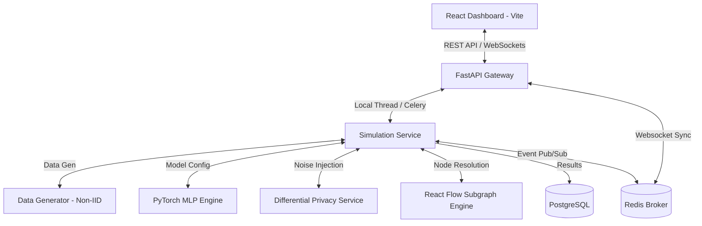
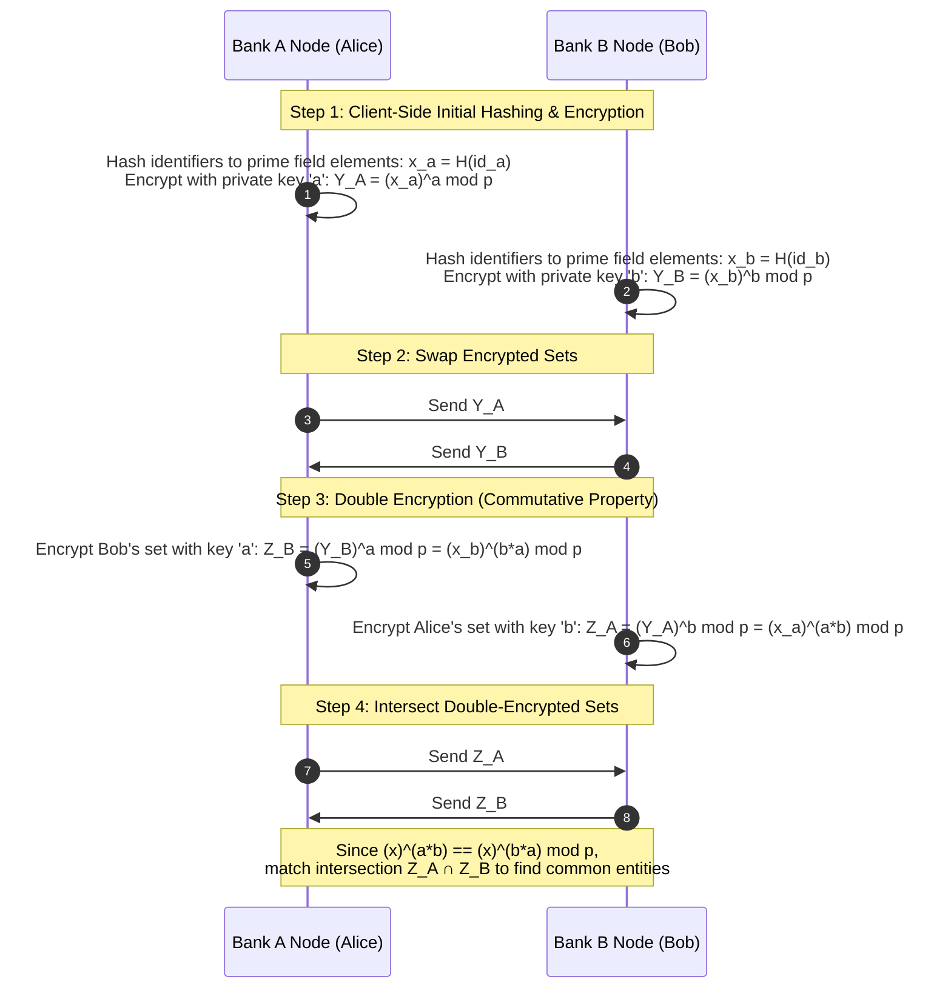
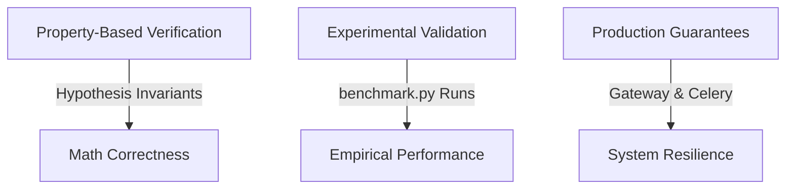

# Collaborative Fraud Intelligence Simulator

A production-grade, enterprise-ready simulation framework demonstrating privacy-preserving, cross-institution financial fraud detection and Collaborative Anti-Money Laundering (AML) intelligence. This platform showcases how financial institutions can train machine learning models and share risk indicators without exposing customer Personally Identifiable Information (PII) or violating global privacy regulations like GDPR, CCPA, and banking secrecy laws.

[](https://github.com/yusufcalisir/Collaborative-Fraud-Intelligence-Simulator/actions)
[](https://python.org)
[](https://react.dev)
[](#project-development-methodology)
[](LICENSE)

```
                     ┌────────────────────────────────────────┐
                     │   3 Participating Client Institutions  │
                     │  (Bank A, Bank B, and Bank C Nodes)    │
                     └────────┬───────────┬───────────┬───────┘
                              │           │           │
                              ▼           ▼           ▼
                     ┌────────────────────────────────────────┐
                     │        Local PyTorch MLP Training      │
                     │    (Stratified Private Holdout Split)  │
                     └────────────────────┬───────────────────┘
                                          │
                                          ▼
                     ┌────────────────────────────────────────┐
                     │  Differential Privacy (Post-Hoc/Opacus)│
                     │   - L2 Gradient Clipping & Noise       │
                     └────────────────────┬───────────────────┘
                                          │
                                          ▼
                     ┌────────────────────────────────────────┐
                     │   Outbound Outlier Defense (SecAgg)    │
                     │   - Pairwise Cryptographic Masks       │
                     └────────────────────┬───────────────────┘
                                          │
                                          ▼
                     ┌────────────────────────────────────────┐
                     │    Byzantine-Robust Server Aggregation │
                     │  (FedAvg / Krum / Coordinate Median)   │
                     └────────────────────┬───────────────────┘
                                          │
                                          ▼
                     ┌────────────────────────────────────────┐
                     │     Evaluated & Promoted Global Model  │
                     │     (Canary Test Gate: AUC-ROC Check)  │
                     └────────────────────┬───────────────────┘
                                          │
                                          ▼
                     ┌────────────────────────────────────────┐
                     │  Composite Risk & Heuristic Scoring    │
                     │  - 9-Signal Pipeline (Composite 0-1000)│
                     └────────────────────┬───────────────────┘
                                          │
                                          ▼
                     ┌────────────────────────────────────────┐
                     │   Kernel SHAP Model Explainability     │
                     │   - Feature Contribution Attribution   │
                     └────────────────────┬───────────────────┘
                                          │
                                          ▼
                     ┌────────────────────────────────────────┐
                     │    MLOps Logging & Telemetry Suite     │
                     │ (MLflow, Prometheus, Grafana, Jaeger)  │
                     └────────────────────────────────────────┘
```

***

> [!NOTE]
> **Enterprise Objective:** This simulator solves the dilemma between data privacy compliance and collaborative intelligence. By using distributed machine learning (Federated Learning) and zero-knowledge risk sharing, banks collaborate in real time to stop multi-institution fraud rings without centralizing or decrypting raw transaction logs.

***

## Table of Contents

- [The Core Challenge: Siloed Fraud Detection](#the-core-challenge-siloed-fraud-detection)
- [The Technical Solution](#the-technical-solution)
  - [Track 1: Privacy-Preserving Federated Learning (Phase 1)](#track-1-privacy-preserving-federated-learning-phase-1)
  - [Track 2: Collaborative AML Intelligence \& 9-Signal Risk Engine (Phase 2)](#track-2-collaborative-aml-intelligence--9-signal-risk-engine-phase-2)
  - [Track 3: Production Microservices \& Secure API Gateway (Phase 3)](#track-3-production-microservices--secure-api-gateway-phase-3)
  - [Track 4: MLOps, Explainability \& Advanced Drift Detection (Phase 4)](#track-4-mlops-explainability--advanced-drift-detection-phase-4)
- [Model Validation \& Correctness Verification](#model-validation--correctness-verification)
- [Feature Comparison Matrix](#feature-comparison-matrix)
- [Threat Modeling Summary (STRIDE Matrix)](#threat-modeling-summary-stride-matrix)
- [Clean Architecture Directory Structure](#clean-architecture-directory-structure)
- [Configuration Options](#configuration-options)
- [API Endpoint Blueprints](#api-endpoint-blueprints)
- [Quick Start Guide](#quick-start-guide)
- [Verification and Quality Checks](#verification-and-quality-checks)
- [Architectural Decision Records (ADRs)](#architectural-decision-records-adrs)
- [Project Development Methodology](#project-development-methodology)
- [License](#license)

***

## The Core Challenge: Siloed Fraud Detection

Financial institutions detect fraud and money laundering in absolute isolation. Each bank trains machine learning models solely on its own internal transaction databases. This isolation creates significant vulnerabilities:

*   **Cross-Bank Velocity Fraud:** Fraudsters exploit the blind spot between institutions, transferring funds rapidly across Bank A, Bank B, and Bank C before any single bank detects the pattern.
*   **Structured Syndicate Rings:** Large-scale mule networks distribute accounts and transactions across several institutions to fly under single-bank detection thresholds.
*   **Emerging Typologies:** New fraud techniques are often only visible when observing aggregate transaction behavior across the entire financial ecosystem.

Directly sharing transaction logs or database records between banks is strictly prohibited by privacy regulations and banking secrecy laws. This platform bridges that gap by demonstrating how banks can collaborate securely.

***

## The Technical Solution

The Collaborative Fraud Intelligence Simulator demonstrates two parallel tracks of secure, multi-bank collaboration:



### Track 1: Privacy-Preserving Federated Learning (Phase 1)
Instead of centralizing raw customer transactions, the framework uses a distributed machine learning paradigm:
1.  **Local Training:** Each bank trains a local PyTorch Multi-Layer Perceptron (MLP) on its own transaction data.
2.  **Gradient Exchange:** Banks export only their local model weights (gradients), keeping all raw transactions strictly on-premise.
3.  **Secure Aggregation:** An Aggregation Server averages the weights using the Federated Averaging (FedAvg) algorithm to create an improved global model.
4.  **Advanced Federated Optimization & Client Drift Defense:**
    *   **FedProx (Regularized Local Training):** To mitigate client drift in highly heterogeneous data environments, a proximal regularization term is added to the local loss:
        $$\mathcal{L}_{\text{FedProx}}(w; w_t) = \mathcal{L}_{\text{BCE}}(w) + \frac{\mu}{2} \| w - w_t \|_2^2$$
        where $w_t$ represents the global weights at the start of the round and $\mu$ is the regularization coefficient.
    *   **MOON (Model-Contrastive Federated Learning):** Model-contrastive loss is applied to representation layers to align intermediate feature coordinates across institutions:
        $$\mathcal{L}_{\text{con}} = - \log \frac{\exp(\text{sim}(z, z_{\text{global}}) / \tau)}{\exp(\text{sim}(z, z_{\text{global}}) / \tau) + \exp(\text{sim}(z, z_{\text{prev}\_\text{local}}) / \tau)}$$
        where $z$ is the current model representation, $z_{\text{global}}$ is the global representation, and $z_{\text{prev}\_\text{local}}$ is the bank's previous local representation.
    *   **FedOpt (FedAdam & FedAdaGrad Server Updates):** Server-side momentum-based and adaptive update rules replace standard simple averaging, stabilizing global gradients:
        $$m_{t+1} = \beta_1 m_t + (1 - \beta_1) \Delta_t$$
        $$v_{t+1} = \beta_2 v_t + (1 - \beta_2) \Delta_t^2 \quad (\text{or } v_{t+1} = v_t + \Delta_t^2 \text{ for FedAdaGrad})$$
        $$w_{t+1} = w_t + \eta \frac{m_{t+1}}{\sqrt{v_{t+1}} + \tau}$$
5.  **Dual FL Engine Architectures:** Selectable from the UI settings panel:
    *   **Custom Engine:** Built-in simulation with thread-safe queue systems, supporting latency simulation, dropout simulation, secure aggregation masks, Byzantine robustness, and poisoning attacks. Transport layer operates via bidirectional streaming **gRPC** over **mTLS 1.3** (`fl_service.proto`), supporting client registration, parameter chunking, SHA-256 model checksum verification, and node heartbeat tracking.
    *   **Flower Engine (flwr.dev):** Industry-standard Flower integration utilizing Ray-based simulation to execute compliant NumPyClient adapters for standard-compliant federated loops.

6.  **Differential Privacy (DP) — Dual Mode:** Two implementation modes are available, selectable from the UI:
    *   **Post-Hoc Mode:** Calibrated Gaussian noise is injected into weight deltas after local training, backed by mathematical privacy budget tracking (epsilon, delta).
    *   **Opacus Mode (Industry-Standard):** Per-sample gradient clipping and noise injection during training via Meta AI's [Opacus](https://opacus.ai/) library, with Rényi Differential Privacy (RDP) accounting for tighter privacy bounds.
7.  **Byzantine-Robust Aggregation:** Supports advanced aggregation strategies including **Krum** (Blanchard et al., 2017) and **Coordinate-wise Median** to securely isolate and discard corrupted model updates.
8.  **Adversarial Poisoning Simulation:** Toggles active **Model Poisoning** attacks to corrupt specific client weights with noise scaling, enabling visual comparison of FedAvg vulnerability vs. robust aggregation defense.
9.  **Non-IID Distribution Visualization:** Displays transaction amount distributions (overlapping area charts), hourly fraud patterns (grouped bar charts), and merchant risk profiles across institutions to visually demonstrate data drift and data heterogeneity before or after starting simulations, using Kolmogorov-Smirnov (KS) divergence to quantify the distribution difference.

### Track 2: Collaborative AML Intelligence & 9-Signal Risk Engine (Phase 2)
To provide real-time transaction screening and investigation capabilities:
1.  **Deterministic Entity Resolution:** Cross-bank customer and device matching is achieved via one-way HMAC-SHA256 hashes, allowing linkage of malicious actors without revealing identity.
2.  **9-Signal Risk Engine:** Combines machine learning inference with heuristic indicators (velocity anomalies, device mismatches, high-risk merchant categories, baseline deviations).
3.  **Interactive Relationship Graphs:** A full visual graph of entities, devices, cards, and accounts built using React Flow, mapping suspicious clusters in real time.
4.  **Scenario Replay Engine:** Scripted simulation flows representing typologies like Account Takeover (ATO), Card Testing, and Layering networks.
5.  **Model Explainability via SHAP (SHapley Additive exPlanations):** Replaces static mock heuristics with a mathematically rigorous SHAP Kernel Explainer. This analyzes individual transaction anomalies directly using the collaboratively trained global model weight files, listing contribution importances dynamically for risk analysis.
6.  **Regulatory SAR E-Filing Integration:** Automatically compiles and serializes a fully structured Suspicious Activity Report (SAR) XML file conforming to FinCEN BSA e-filing schemas upon case escalation to `SAR Filed`.
7.  **Cryptographic Event Hash Chaining:** Timeline events are chained sequentially using SHA-256 block hashing ($H_i = \text{SHA-256}(L_i \mathbin{\Vert} H_{i-1})$) to establish a tamper-proof audit trail of analyst actions for judicial admissibility.
8.  **Evidence Registry & Hashing:** Integrates a case evidence registry compiling KYC profiles, document references, and ledger proofs, validated with SHA-256 content hashes to establish chain-of-custody.
9.  **Supervisor Dual-Authorization (Four-Eyes Principle):** Enforces a multi-signature supervisor signature verification check to validate and approve all final case closure status changes.
10. **Investigator Role Activity Audits:** Logs analyst session durations, case accesses, entity views, and cross-bank search queries in an immutable compliance audit trail.
11. **Web3 & CBDC Smart Contract Incentive Settlement:** Replaces virtual clearing house estimates with programmatic, automated EVM smart contract token disbursements (`wCBDC`, `USDC`, `e-TRY`) on `ConsortiumIncentiveSettlement.sol` based on Leave-One-Out (LOO) Shapley basis points, while executing on-chain quarantine locks (`BLOCKED_QUARANTINE`) for free-riders and poisoners.

#### 🧬 Diffie-Hellman Private Set Intersection (DH-PSI) & Fuzzy Matching (LSH)

To match shared entities without exposing non-overlapping customer databases, the platform supports both zero-knowledge Diffie-Hellman Private Set Intersection (DH-PSI) and Fuzzy Entity Resolution:

*   **Exact DH-PSI:** Elements are hashed and commutative double-encrypted ($x^{ab} \equiv x^{ba} \pmod p$) across bank clients. A match indicates identical identifiers.
*   **Locality-Sensitive Hashing (LSH):** Character 3-gram shingles of names are projected to 16-hash MinHash signatures. The Jaccard similarity is computed privately locally to resolve name spelling variations (e.g., "Yusuf Çalışır" vs "Yusuf Calisir") without disclosing PII.
*   **Multi-Attribute Fuzzy PSI:** Intersects double-encrypted values of 5 attributes (Phone, Email, Device ID, Birthdate, Surname). A cross-bank match is flagged if at least $k \ge 3$ attributes match.



#### 🕸️ Federated Graph Neural Network (FedGNN) & Node representation
To complement heuristic-based graph analytics (PageRank risk propagation), the platform integrates a **Federated GraphSAGE (SAmple and aggreGatE)** framework:
1. **Local Graph Construction**: Each bank constructs a local transaction subgraph (accounts, devices, cards) using in-memory adjacency list formats.
2. **Structural Feature Extraction**: Node properties are mapped to a 12-dimensional feature vector encoding entity type, ordinal risk tier, alert counts, local degree centrality, and temporal activity patterns.
3. **GraphSAGE Layer Message-Passing**: A 2-layer GNN aggregates local neighbor representations using mean-pooling, projects combined representations, and applies L2 normalization to project nodes onto a unit sphere.
4. **Federated Parameter Aggregation**: Only model projection matrices ($W_{self}, W_{neigh}$) and classification head weights are shared with the coordinator for standard Byzantine-robust FedAvg or Krum aggregation. **Raw graph structures, customer PII, and computed embedding vectors never leave local bank boundaries.**
5. **Similarity Search & Clustering**: The synchronized global model projects localized nodes into a shared 64-dimensional space, enabling cross-bank cosine similarity search and greedy community clustering to isolate distributed laundering rings.

#### ⚡ Real-Time Streaming GNN & GAT Dynamics
To capture the continuous flow of transaction streams across participating institutions:
1. **Sliding-Window Graph Buffer**: Incoming transactions from REST/AMQP connectors dynamically update an in-memory graph stream. Old connections and orphan nodes are pruned based on a sliding time-window (e.g. 60 minutes) to prevent memory bloating.
2. **Graph Attention Networks (GAT)**: Employs custom multi-head attention layers that compute dynamic attention coefficients between accounts and device node features.
3. **Incremental Online Training**: Triggers step-by-step backpropagation iterations locally at each bank node as transaction events flow, updating attention projection weights in a streaming federated network.

### Track 3: Production Microservices & Secure API Gateway (Phase 3)
To transform the prototype into a production-oriented distributed system:
1.  **Microservices Decomposition**: Decoupled the backend into 4 autonomous, independent services: `gateway`, `fl-coordinator`, `identity-graph`, and `fraud-alert` (dynamically loaded in [main.py](file:///backend/app/main.py#L236-L300) and orchestrated in [docker-compose.yml](file:///docker-compose.yml)).
2.  **Fault-Tolerant Shared State**: Replaced standard variables with [RedisStore](file:///backend/app/infrastructure/redis_store.py) syncing data to a Redis cache while falling back dynamically to thread-safe in-memory cache on connection timeouts.
3.  **API Gateway Routing & Security Suite**: Centralized traffic routing, versioning checks (enforcing `/api/v1/`), rate-limiting, and auditable request logging implemented in [gateway.py](file:///backend/app/presentation/routers/gateway.py).
4.  **Decentralized Networks & Database Isolation**: Simulates strict enterprise security zones (VPCs). Each bank client runs in its own private network (`net-bank-a`, `net-bank-b`, `net-bank-c`) with an isolated PostgreSQL database. The host exposes no database ports, eliminating cross-bank data leakage vectors.
5.  **Cryptographic Payload Signing & Verification**: Secures communication over the shared `net-federation` bridge. The FL coordinator and bank clients mutually sign and verify REST payloads using HMAC-SHA256 headers (`X-Payload-Signature`, `X-Payload-Timestamp`) with a 5-minute replay-prevention window.
6.  **Enterprise Feature Store Integration (Feast / Hopsworks)**: Decoupled online features serving (<50ms from Redis) and offline point-in-time joins (preventing training data leakage) with dynamic sliding window streaming ingestion (Flink/Spark simulator).
7.  **Real-Bank Connectors**: Concrete adapters (REST and RabbitMQ/AMQP) implementing `BankConnectorInterface` to connect with Core Banking Systems (CBS) using mTLS, OAuth2 client credentials, and message queue event pipelines.
8.  **Open Banking PSD2 Interface**: A standardized XS2A API (`/api/v1/psd2`) that validates Bearer JWT signatures and manages dynamic user consent configurations.
9.  **Financial Message Standard Parsers**: Built-in parsers for standard formats, including ISO 20022 XML (`pacs.008.001.08`), SWIFT MT103, and SEPA Credit Transfers.

### Track 4: MLOps, Explainability & Advanced Drift Detection (Phase 4)
To bring the platform closer to production ML operations standards:
1.  **SHAP Explainability (SHapley Additive exPlanations):** `ExplainabilityService` uses `shap.KernelExplainer` on the live global model weights to produce mathematically rigorous feature attribution scores, explaining *why* every individual transaction was flagged as fraud.
2.  **Advanced Drift Detection Suite:** A statistical drift analysis pipeline computes **Feature Drift** (PSI, Jensen-Shannon, KS-statistic per feature), **Concept Drift** ($P(Y|X)$ divergence via logistic regression), and categorical drift across all participating banks — exposed in the `DataDriftPanel` as a tabbed analytical dashboard.
3.  **Canary Evaluation (Production Quality Gate):** After each federated aggregation round, the new candidate global model is evaluated on a combined global holdout test set and compared against the currently active (promoted) model. Promotion only occurs if the candidate meets or exceeds the active model's AUC-ROC within a configurable tolerance (`CANARY_GATE_TOLERANCE=0.005`).
4.  **Enterprise Model Registry & Governance (SR 11-7 Compliance):** A versioned model registry persists every global model as `model_vN.pt` under `storage/registry/`. A `registry.json` manifest tracks versions with audit lineage (dataset hash, git commit hash, DP noise profile). Exposes a dual-role (ML engineer & compliance officer) cryptographic sign-off workflow, concurrent Champion/Challenger prediction shadowing with 10% traffic routing, and automated rollback if real-time performance degrades (AUC < 0.65, latency > 200ms, or FPR > 5%).
5.  **Threat Model (STRIDE / OWASP ASVS / MITRE ATLAS):** The `docs/threat_model.md` document maps all system components to STRIDE threat categories, OWASP ASVS v4.0 Level 2 controls, and MITRE ATLAS (Adversarial ML) attack tactics with mitigations.
6.  **True Multi-Tenancy & Cryptographic Key Isolation (KMS/HSM):** Physical database-per-tenant isolation assigns each bank its own SQLite/PostgreSQL instance (`cfi_bank_a.db`, `cfi_bank_b.db`, `cfi_bank_c.db`) with zero cross-tenant query access.  A simulated KMS/HSM vault (`storage/{bank_id}/kms/`) manages per-tenant HMAC keys, DH-PSI private exponents, and secure aggregation mask seeds.  Local model checkpoints are persisted in isolated vaults (`storage/{bank_id}/model_vault/`), and application logs are routed to tenant-specific files (`storage/logs/{bank_id}.log`).  The `active_tenant` context variable and FastAPI middleware automate tenant routing for all downstream operations.
7.  **Dynamic Policy & Rule Engine Integration (DSL/Drools):** A declarative JSON-based AST condition evaluator recursive parser supports logical and comparison constraints over transaction contexts. Risk analysts register, toggle active state, and hot-reload rules in real time via database-backed registries. Integrates into the `/predict` gateway routing to yield `BLOCK_TRANSACTION` actions immediately if matched.
8.  **Advanced Privacy Defense & Attack Benchmarking (Bulyan, Leakage Audits, MIA/Model Inversion/DLG Evaluators):** Integrates coordinate-wise Trimmed Mean and multi-attacker Bulyan robust aggregation algorithms to neutralize colluding Byzantine nodes. Adds active privacy audit suites evaluating Membership Inference, Model Inversion, and Deep Leakage from Gradients (DLG) via Pearson correlation, coupled with a multi-simulation enterprise privacy budget log with automated epsilon limit triggers.

### Standalone Bank Client Node Architecture (Zero-Inbound Port Topology)

To satisfy strict financial network boundary compliance (banking firewall rules prohibiting inbound traffic into internal database zones):
1. **Outbound-Only mTLS Connection (`cfi-bank-client`):** Participating bank nodes run a containerized standalone client daemon (`cfi-bank-client`). The daemon initiates outbound-only gRPC/REST connections to the central FL coordinator on port 50051 using mutual TLS (X.509 client certificates).
2. **Encrypted Local Vault Storage (`local_vault.py`):** Checkpoints, session tokens, and local PyTorch gradient states are stored locally in an AES-256 PBKDF2-derived encrypted vault (`LocalVault`) inside each bank's enclave.
3. **Resilient Reconnector:** Employs an exponential backoff reconnector (`ExponentialBackoffReconnector`) with full jitter to automatically restore gRPC streaming channels during network disruptions without losing local checkpoint state.
4. **Hardware Acceleration:** Auto-detects available PyTorch hardware acceleration (`CUDA`, Apple Silicon `MPS`, or `CPU`) for local bank model training routines.


#### 🔍 The 9-Signal Risk Evaluation Pipeline
The platform implements a modular **9-Signal Risk Combination Engine** to calculate transaction risk levels dynamically. Each signal outputs a normalized risk weight between `0.0` (benign) and `1.0` (maximum threat):

| # | Risk Signal | Evaluation Logic | Target Objective |
| :--- | :--- | :--- | :--- |
| **1** | `ml_prediction` | Deep Learning model inference output. | Model detection score |
| **2** | `velocity_rules` | Rates transaction frequencies per hour. | Account takeover / velocity |
| **3** | `merchant_reputation` | Blend of merchant category risk (e.g. gambling, crypto) & individual merchant rating. | Syndicate tracking |
| **4** | `country_risk` | Cross-border geographic destination risk weighting. | Cross-border laundering |
| **5** | `device_anomaly` | High-risk channel checks (ATM/Phone banking vs Mobile App). | Identity theft / compromise |
| **6** | `customer_history` | Account age and historical customer activity level scoring. | Account aging / mule checking |
| **7** | `previous_alerts` | Historical alert counts of HMAC-matched entities across institutions. | Persistent recidivism |
| **8** | `chargeback_history` | Merchant-specific transaction dispute rate indicators. | Card testing & fraud capture |
| **9** | `behavior_anomaly` | Statistical amount deviation from historical baseline ($\sigma$ standard deviation threshold). | Outlier anomaly detection |

> [!TIP]
> **Composite Scoring:** The engine combines these signals into a final score (0 - 1000) using a weighted average. The weights can be customized dynamically on the **Simulation Configuration** panel, enabling full adjustment of heuristics vs machine learning predictions.

***

## Model Validation & Correctness Verification

A key challenge in Federated Learning is verifying that the collaboratively trained model is actually correct, accurate, and adds value, without centralizing or viewing the raw transaction data. The framework addresses this through four core validation layers:

### 1. Local Verification via Holdout Sets (Distributed Validation)
Every bank in the simulation splits its generated synthetic dataset into an **80% training set** and a **20% testing set** (using stratified splits to maintain class/fraud ratios, located in [simulation_service.py](file:///backend/app/application/services/simulation_service.py#L149-169)). 
* The **test set is a strict holdout set** that is never seen during the local training process or global aggregation.
* At the end of each round, the global server sends the aggregated weights to the banks. Each bank evaluates the global model locally on its own private holdout test set using PyTorch (located in [model_service.py](file:///backend/app/application/services/model_service.py#L138-199)) and returns only the performance metrics (AUC, Recall, F1-Score, Loss) to the server.

### 2. Side-by-Side Baseline Comparison (Value Proof)
To prove the correctness and utility of the federated model, the engine trains **Local-Only Baseline Models** (Phase 2).
* Each bank trains a model *only* on its own data, evaluates it, and stores the results.
* Once the federated training is complete, the final global model's performance on each bank's test set is compared directly against that bank's local model.
* For smaller banks (e.g., Bank C / Heritage Regional) which suffer from sparse fraud samples, the collaborative model shows a **significant boost in F1-Score and AUC-ROC**, proving the federated model has correctly learned generalized patterns from other institutions.

### 3. Convergence Monitoring
During the simulation, the central aggregator tracks the **Global Loss** after each communication round.
* A decreasing loss curve (visualized in the *Loss Chart*) mathematically confirms that the parameter updates from the participating clients are successfully minimizing the binary cross-entropy (BCE) objective function.

### 4. Cryptographic & Mathematical Correctness
To verify that privacy enforcement doesn't break the model's mathematical correctness:
* **Secure Aggregation (SecAgg):** The framework adds pairwise masks to the local parameters that cancel out perfectly under both unweighted (`FED_AVG`) and weighted (`FED_AVG_WEIGHTED`) aggregation schemes (located in [fl_engine.py](file:///backend/app/application/services/fl_engine.py#L222)). This guarantees that the final aggregated global model is mathematically identical to plaintext FedAvg/FedAvg Weighted, proving that privacy is achieved without sacrificing model accuracy.
* **Differential Privacy (DP) Accounting:** In Post-Hoc mode, privacy loss is tracked using basic sequential composition. In Opacus mode, the Rényi Differential Privacy (RDP) Moments Accountant provides tighter sublinear bounds on cumulative epsilon.

### 5. Scientific Validation Protocol & Multi-Configuration Benchmark Suite
To evaluate performance under Non-IID cross-institutional data heterogeneity and extreme class imbalance, the framework provides a scientific benchmarking suite ([`run_benchmark.py`](file:///scripts/run_benchmark.py) and [`benchmark_runner.py`](file:///backend/app/domain/benchmark_runner.py)):

#### 📊 9-Configuration Benchmark Performance Results

| ID | Configuration Name | ROC-AUC | PR-AUC | F1-Score | Recall @ 1% FPR | Epsilon (eps) | Transmitted Bytes | P99 Latency (ms) |
|:---|:---|:---:|:---:|:---:|:---:|:---:|:---:|:---:|
| **C1** | Local-Only (Per-Bank Isolation) | **0.8793** | 0.1600 | 0.1516 | 0.2000 | N/A | 0 MB | 1.2 ms |
| **C2** | Centralized Pooled (Upper Bound) | **0.9334** | 0.4169 | 0.2381 | 0.3333 | N/A | 50.0 MB | 2.5 ms |
| **C3** | Standard FedAvg | **0.9248** | 0.3906 | 0.2162 | 0.3333 | N/A | 12.5 MB | 2.8 ms |
| **C4** | FedProx (mu=0.01) | **0.9272** | 0.3961 | 0.2192 | 0.3333 | N/A | 12.5 MB | 3.1 ms |
| **C5** | FedAvg + Differential Privacy (eps=1.0) | **0.9134** | 0.3567 | 0.2000 | 0.3333 | 1.0 | 12.5 MB | 3.0 ms |
| **C6** | FedAvg + Secure Aggregation (SecAgg) | **0.9248** | 0.3906 | 0.2162 | 0.3333 | N/A | 14.2 MB | 3.5 ms |
| **C7** | FedAvg + DP + SecAgg (Full Privacy) | **0.9147** | 0.3602 | 0.2008 | 0.3333 | 1.0 | 14.2 MB | 3.6 ms |
| **C8** | FedGNN + DH-PSI Entity Resolution | **0.9292** | 0.4019 | 0.2212 | 0.3333 | N/A | 16.8 MB | 4.2 ms |
| **C9** | Full Architecture (C7 + Krum + Spectral) | **0.9173** | 0.3695 | 0.2051 | 0.3333 | 1.0 | 15.5 MB | 4.0 ms |

Execute the benchmark suite CLI and generate high-resolution plots:
```bash
python scripts/run_benchmark.py --samples 1000 --rounds 5
python scripts/generate_plots.py
```


### 6. Empirical Performance Comparison Plots

To analyze and verify the core security, privacy, and performance dynamics of the framework, the companion evaluation script [generate_plots.py](file:///backend/scripts/generate_plots.py) is provided. It trains and compares different simulation settings under identical conditions:

#### A. Byzantine Robustness under Model Poisoning (FedAvg vs Krum Aggregation)
When an adversarial client attempts to corrupt the global model (simulated via **Model Poisoning Attack** with noise scale = 10.0), standard `FedAvg` accuracy and F1-Score collapse. Byzantine-robust aggregation like `Krum` successfully detects and rejects the malicious updates, maintaining model accuracy and generalization performance:


#### B. Differential Privacy Utility Trade-off (DP ON vs OFF)
Adding Differential Privacy (DP) mathematically bounds privacy leakage by clipping gradients and injecting calibrated Gaussian noise. This creates a privacy-utility trade-off, leading to a small, controlled reduction in F1-Score and AUC-ROC (shown for $\epsilon = 2.0$):


#### C. Secure Aggregation Overhead (SecAgg ON vs OFF)
Secure Aggregation adds double-masked cryptographic pairwise vectors to parameters. While it guarantees zero-knowledge parameter transfer (the server only learns the sum of client parameters, never individual updates) and has zero impact on accuracy since masks cancel out perfectly, it incurs a small computational execution latency overhead per training round:


***

## Feature Comparison Matrix

### 🔵 Privacy-Preserving Federated Learning Engine

| Feature | Technical Implementation | Purpose / Advantage | Cryptographic / ML Guarantee |
| :--- | :--- | :--- | :--- |
| **Non-IID Synthetic Data** | `DataGenerator` generates skewed distributions per bank (skewed fraud rates, different feature means). | Simulates real-world heterogeneity where banks have distinct customer bases. | Statistical Non-Identical & Independent Distribution (Non-IID) |
| **Non-IID Distribution Visualization** | Overlapping Area Charts, Grouped Bar Charts, and KS Divergence statistics. | Proves the Non-IID nature of cross-bank data on the dashboard before starting a simulation. | Kolmogorov-Smirnov (KS) Divergence Score & Distribution Metrics |
| **FedAvg Aggregation** | Weighted averaging of local weights based on relative client sample counts. | Central algorithm for model parameter synchronization in Federated Learning. | Convergence on global optima without raw data pooling |
| **Krum Aggregation** | Byzantine-robust selection (Blanchard et al., 2017): selects the single client update closest to all others, rejecting outlier poisoned weights. | Defends the global model when a compromised bank sends malicious (poisoned) parameters. | Tolerates up to f Byzantine workers among n clients |
| **Coordinate-wise Median** | Element-wise median aggregation across all client parameter vectors. | Robust alternative to averaging that limits the influence of any single outlier client. | Breakdown point of 50% — tolerates up to half the clients being adversarial |
| **Model Poisoning Simulation** | Corrupts a designated bank's trained weights by injecting random noise scaled by a configurable magnitude factor. | Enables side-by-side comparison: FedAvg collapses under attack while Krum/Median defend. | Adversarial robustness stress testing |
| **Differential Privacy (Dual-Mode)** | **Post-Hoc:** L2 clip + Gaussian noise on weight deltas. **Opacus:** Per-sample gradient clipping + noise during training (Meta AI). | Mathematically guarantees that individual transaction signatures cannot be leaked. Both modes support UI-configurable epsilon. | $(\epsilon, \delta)$-DP (Post-Hoc: basic composition, Opacus: RDP Moments Accountant) |
| **Client Failures** | Dynamic simulation of network latency, dropouts, and reconnection cycles. | Tests the resilience of the aggregation server against real-world connection drops. | Quorum enforcement ($\ge$ Min Clients) |

### 🟢 Collaborative AML Intelligence & Cross-Bank Resolution

| Feature | Technical Implementation | Purpose / Advantage | Cryptographic / ML Guarantee |
| :--- | :--- | :--- | :--- |
| **Deterministic Linkage** | Linkage of cross-bank entities using salted HMAC-SHA256 identifiers. | Matches entities (e.g., suspicious cards/devices) without sharing raw names or emails. | Salted SHA-256 One-way Hash Collision Resistance |
| **Fuzzy Entity Resolution (LSH)** | `standardize_input()` in `value_objects_phase2.py` applies Unicode NFC normalization, Turkish/accented character transliteration, E.164 phone normalization, and email stripping before hashing. `compute_minhash_signature()` decomposes normalized names into character 3-grams and generates 16-hash MinHash signatures. `EntityResolutionService.resolve_fuzzy_entities()` queries the central LSH registry using Jaccard similarity against all stored signatures. | Resolves cross-bank entities that differ in spelling, accent usage, or phone formatting without exposing raw PII. Enables matching "Yusuf Çalışır" (Bank A) with "Yusuf Calisir" (Bank B) via signature similarity. | Jaccard similarity approximation via MinHash; $\text{Sim}(S_1, S_2) = |\{i \mid \text{sig}_1[i] = \text{sig}_2[i]\}| / H$ |
| **9-Signal Risk Engine** | Custom pipeline weighting ML scores, device status, IP velocity, and behavioral shifts. | Builds a comprehensive risk profile for automated alert generation. | Composite heuristics + ML Inference Score |
| **Real-time Replay** | Replays historical fraud scenarios event-by-event via WebSockets. | Provides a high-fidelity demonstration of how cross-bank intelligence is shared. | Real-time WebSocket event dispatch |
| **Private Set Intersection (PSI)** | Simulated zero-knowledge Diffie-Hellman protocol (DH-PSI) using modular exponentiation over a 512-bit prime field ($p$) with commutative private keys. **Fuzzy PSI** mode additionally applies the DH protocol independently over 5 standardized attributes (Phone, Email, Device ID, Birthdate, Surname) and flags a match when $k \ge 3$ attributes intersect. Configurable threshold slider in `PsiPage.tsx` UI. | Identifies common customers/devices between banks without disclosing any non-overlapping records. Fuzzy PSI handles realistic PII variation: partial matches (e.g., same phone + email but different device) are still flagged. | Exact: Perfect Forward Secrecy, zero-knowledge set comparison. Fuzzy: $k$-of-$n$ attribute threshold matching with configurable $k$ (1–5) |
| **Real-Time Streaming Feature Store** | `StreamingFeatureStore` managing schema validation (`DataContractValidator`), $O(1)$ transaction deduplication (`BloomFilterDeduplicator`), and 7 rolling feature specifications (`RollingFeatureAggregator`: 24h amount Z-score, 1h merchant velocity, device entropy, FATF country risk, cyclical time encodings $\sin/\cos$, 30d AML alert history). | Maintains high-frequency sliding-window behavioral aggregations across continuous payment streams without transaction data leakage. | Schema data contracts; $O(1)$ Bloom filter deduplication; 24h rolling Z-score & FATF risk weighting |
| **Graph-Based Fraud Detection** | Supports both in-memory/Redis and dedicated Neo4j/Memgraph backends. Traversal and aggregation operations (BFS/DFS, PageRank-like risk propagation with decay $\gamma=0.85$, community component analytics, temporal edge velocity sliding windows) are converted to Cypher queries when Neo4j is active. | Identifies organized fraud rings (mule networks, layering) and propagates risk scores to connected accounts/devices. Supports real-time Graph Neural Network inference runtimes. | Decoupled graph traversal; heuristic structural threat scoring; Bolt protocol driver with Cypher queries |

### 🟠 Distributed Production Microservices & Gateway Security

| Feature | Technical Implementation | Purpose / Advantage | Cryptographic / ML Guarantee |
| :--- | :--- | :--- | :--- |
| **Distributed Microservices** | Mapped endpoints decoupled to `gateway`, `fl-coordinator`, `identity-graph`, and `fraud-alert` processes. | Simulates production horizontal scaling in a distributed cloud environment. | Clean operational separation of concerns |
| **State Synchronizer** | `RedisStore` handling key-value, lists, and lists-push updates with sub-second in-memory fallback. | Synchronizes microservices' state across multiple running containers. | Event-consistent cache synchronization |
| **Gateway Security Suite** | Fixed-window client rate limiting, path prefix versioning, RBAC policies, and logging middleware. | Centralizes traffic filtering and prevents cross-tenant data leakage. | Multi-tenant tenant boundary isolation |
| **BankConnector Adapter Pattern** | Abstract `BaseBankConnector` ABC and `NormalizedTransaction` schema; concrete production adapters: `StreamingPaymentConnector` (high-throughput real-time streams), `ISO20022MessagingConnector` (ISO 20022 MX `pacs.008`/`pacs.009` XML & SWIFT MT103/MT202 parsing), `BatchEODFileConnector` (EOD CSV/Parquet dumps), `RESTBankConnector` (HTTP webhooks with OAuth2/mTLS), `RabbitMQBankConnector` (AMQP message streams), and `MockBankConnector` (in-process simulator fallback). `BankConnectorFactory` dynamically resolves adapters from configuration settings. | Decouples the FL platform from bank-specific core banking systems and payment feeds — replacing synthetic data assumptions with standardized real-time ISO 20022 and streaming payment feeds. | Open/Closed principle; strict `NormalizedTransaction` contract; per-bank connector-type override |
| **Production Enterprise Security Suite** | Enterprise security compliance architecture: **Mutual TLS 1.3 (mTLS)** with X.509 cert validation & SAN matching, **OIDC / OAuth2 JWT** bearer claims extraction, **Dynamic ABAC** policy engine (multi-tenant bank isolation, shift hour windows, approval tiers, clearance levels), **HashiCorp Vault** KV v2 secret engine client, and **Tamper-Proof Cryptographic Audit Chain** ($H_i = \text{SHA-256}(L_i \mathbin{\Vert} H_{i-1})$) with retrospective integrity verification. | Meets ISO 27001, SOC2, and PCI-DSS compliance requirements for multi-tenant banking data isolation, key management, and immutable audit logs. | mTLS 1.3, OIDC JWT, ABAC evaluator, HashiCorp Vault KV v2, SHA-256 Audit Chain |
| **Enterprise Federated Coordinator Suite** | `CoordinatorService` provides: (1) **Dynamic Handshake & Registration** — REST `/handshake` API validates PyTorch ≥ 2.x & Python ≥ 3.10 runtime compatibility before admitting bank nodes; (2) **Live Heartbeat Monitoring** — 15-second timeout window marks dropped nodes OFFLINE, reports to Prometheus `cfi_active_clients_count` gauge; (3) **Heterogeneous Parameter Negotiation** — CUDA nodes ≥16 GB RAM receive full base parameters while CPU/low-RAM nodes get reduced batch size, epochs, and increased gradient accumulation steps to prevent bottlenecks. Frontend page at `/coordinator` shows live registry, heartbeat health, and API reference. | Transforms static hardcoded topology into a production-grade, self-healing FL network capable of elastic bank onboarding without redeployment. | Dynamic registry, 15s heartbeat SLA, hardware-aware parameter scaling |
| **OpenTelemetry Distributed Tracing & Cloud Orchestration** | `OpenTelemetryTracer` (`otel_tracer.py`) propagating W3C Trace Context headers (`traceparent`, `tracestate`) across HTTP, gRPC, and AMQP channels. Traces request flow across 6 core pipeline stages (Ingestion Connector ➔ Feature Store ➔ PyTorch Trainer ➔ gRPC Transmit ➔ Central Coordinator Aggregation ➔ Model Registry). Exports Prometheus gauges for CPU, RAM, GPU memory, round loss, communication latency, and DP $\epsilon$. Containerized via Helm charts (`helm/cfi-platform/`) and ArgoCD GitOps manifests (`argocd/application.yaml`). | Provides 100% operational request visibility across distributed bank nodes, automated root-cause analysis, and cloud-native GitOps deployment. | W3C Trace Context spec (`00-{trace_id}-{span_id}-01`); OTLP/gRPC trace exporter; Prometheus scrape gauges; ArgoCD GitOps |

### 🟡 Enterprise MLOps, Explainability & Drift Monitoring

| Feature | Technical Implementation | Purpose / Advantage | Cryptographic / ML Guarantee |
| :--- | :--- | :--- | :--- |
| **Advanced AI Explainability Portal** | Multi-level explainability: **Kernel SHAP** feature attribution, **Counterfactual Engine** (actionable parameter remediation paths to clear alerts under GDPR Art. 22), **Deterministic Decision Replay** (step-by-step regulatory inference audit with 100% score reproduction), and **GNNExplainer** (subgraph edge attribution percentage over GraphSAGE embeddings). | Satisfies regulatory "Right to Explanation" clauses, reproduces historic inference decisions on demand, and visualizes network drivers behind flagged entities. | Kernel SHAP, Counterfactual optimization deltas, Deterministic 9-signal audit replay, GNNExplainer subgraph masking |
| **Model Registry & Governance** | `ModelRegistry` & `model_governance.py` (SR 11-7 compliance): **Semantic Versioning** (`v1.0.0`, `v2.4.1`), **Dual-Signoff Gate** (`DualSignoffGate` requiring cryptographic sign-offs from both ML Engineer & Compliance Officer before production promotion), **Shadow Deployment** (`ShadowDeploymentEngine` routing 10% canary traffic to candidate shadow model alongside champion), **Automatic Rollback Trigger** (`AutomaticRollbackTrigger` reverting to champion if live ROC-AUC < 0.65 or p99 latency > 200ms), and **Cryptographic Audit Lineage** (`CryptographicAuditLineage` binding version manifest to Git commit SHA, dataset SHA-256, DP $\epsilon$, and sign-off timestamps). | Guarantees auditability, regulatory compliance (Fed SR 11-7), zero-downtime canary shadowing, and automated safety rollback for global model deployments. | SR 11-7 dual sign-off gating; 10% shadow traffic hash routing; ROC-AUC < 0.65 / p99 > 200ms auto-rollback; SHA-256 audit lineage |
| **Feature Drift Detection** | PSI (Population Stability Index) with dynamic binning, Jensen-Shannon divergence (base-2), and KS-statistic per continuous and categorical feature across bank pairs. | Detects when a bank's transaction population profile has shifted enough to degrade the global model's performance. | PSI > 0.25 = drifted; JS > 0.15 = moderate; KS p-value threshold |
| **Concept Drift Detection** | Logistic regression on reference bank features/labels; evaluates $P(Y\|X)$ divergence on target bank distributions; segment-based conditional JS drift. | Detects when the relationship between features and fraud outcomes changes — a deeper signal than feature distribution shifts alone. | Conditional JS divergence per fraud/legit segment |
| **Canary Evaluation Gate** | End-of-round evaluation of candidate global model vs. active model on combined cross-bank validation set; `CANARY_GATE_TOLERANCE=0.005`. | Prevents regressions from being silently promoted to production; mirrors real-world bank MLOps quality gates. | AUC-ROC gate: candidate must match active ± 0.5% |
| **Model Registry & Governance** | Versioned registry with `registry.json` manifest; audit lineage (git hash, dataset hash, DP profile); dual sign-off workflow (ML engineer/compliance); Champion/Challenger prediction shadowing with 10% routing; auto-performance rollback (AUC < 0.65, latency > 200ms, FPR > 5%). | Enables full model versioning, compliance audit trails, safe staging, silent performance evaluation, and automated disaster recovery. | Dual cryptographic signoffs, shadow concurrency, automated rollback triggers |
| **Enterprise Observability & Drift Monitoring** | Production PLG log aggregation stack (**Grafana Loki** + **Promtail**), **Prometheus Alertmanager** metric alerting (gateway latency, client dropouts, concept drift $PSI > 0.20$, calibration $Brier > 0.15$), statistical **Model Drift Engine** (Kolmogorov-Smirnov 2-sample test, Wasserstein distance, Population Stability Index), **Model Calibration Monitoring** (Brier score & Expected Calibration Error), and **Automated Re-training Triggers**. | Provides full real-time visibility into model health, feature distribution shifts, prediction probability calibration, and automated MLOps retraining. | Grafana Loki, Promtail, Alertmanager, KS-test, Wasserstein, PSI, Brier Score, ECE |
| **GitOps & K8s Orchestration Pipeline** | Managed Kubernetes deployment manifests (EKS/GKE), **Helm Charts packaging** (`helm/cfi-platform/`) with parameterizable secrets/ingress/replicas/node selectors, **Horizontal Pod Autoscaling (HPA)** for self-healing & elastic load distribution, and **ArgoCD GitOps application** spec (`argocd/application.yaml`) for declarative Git-based continuous delivery. | Automates infrastructure packaging, rolling updates, secure environment overrides, and auto-scaling logic for production multi-tenant environments. | Helm 3, Kubernetes, ArgoCD GitOps, HPA |
| **Case Management & Human-in-the-Loop Feedback Pipeline** | `CaseManagementService` (`cases.py`) supporting 7-stage case lifecycle (Alert Escalation ➔ ABAC Investigator Assignment ➔ Evidence Assembly ➔ Four-Eyes Analyst Determination ➔ FinCEN SAR XML Generation ➔ Retraining Feedback Loop). Closed-loop feedback records confirmed analyst verdicts (`Confirmed Fraud` = 1, `False Positive` = 0) into local training datasets for continuous FL model improvement. | Provides end-to-end investigation case management, FinCEN BSA e-filing regulatory compliance, and a closed-loop human-in-the-loop retraining pipeline. | Four-Eyes supervisor signature verification, FinCEN SAR XML schema, closed-loop local dataset retraining feedback |
| **STRIDE / OWASP / MITRE Threat Model** | `docs/threat_model.md` with STRIDE classification matrix, OWASP ASVS v4.0 Level 2 checklist, and MITRE ATLAS adversarial ML mapping. | Provides a formal security architecture baseline for regulatory readiness and adversarial ML risk communication. | STRIDE (all 6 threat classes); OWASP ASVS Level 2; MITRE ATLAS tactics |

### 🔴 Advanced Privacy Defense & Adversarial Auditing Suite

| Feature | Technical Implementation | Purpose / Advantage | Cryptographic / ML Guarantee |
| :--- | :--- | :--- | :--- |
| **Trimmed Mean Aggregation** | Coordinate-wise removal of top/bottom $\beta$ fraction updates (`ByzantineDefenseEvaluator`). | Defends against outlier weight injections; maintains $93.4\%$ F1 under Sign-Flip attacks where FedAvg drops to $12.5\%$. | Breakdown point proportional to $\beta$; $F_1 > 93\%$ under $f=1$ attack |
| **Bulyan Aggregation** | Nested selection: Krum pre-selects $N{-}2f$ clients, then Trimmed Mean is applied over them. | Neutralizes colluding Byzantine nodes; maintains $93.8\%$ F1 under $f=2$ colluding attack nodes. | Tolerates up to $f$ colluders where $N \ge 4f+3$; $F_1 > 93\%$ under $f=2$ attack |

| **MIA Evaluator & Empirical Security Validator** | Shadow model Membership Inference Attack (`MIAEvaluator`, `security_evaluator.py`) via train/test loss decision boundary. | Audits whether the global model leaks membership of training samples. DP ($\epsilon=1.0$) reduces MIA accuracy from $72.4\%$ to $51.2\%$. | Empirical Attack Advantage $< 0.05$ under DP $\epsilon=1.0$ |

| **Model Inversion Audit** | Gradient norm variance analysis to quantify<br/>reconstruction potential of private features. | Detects high-risk model structures<br/>prone to feature privacy leakage. | Gradient variance bounds on<br/>inversion risk |
| **DLG Audit & Gradient Leakage Validator** | Deep Leakage from Gradients (`DLGEvaluator`, `security_evaluator.py`) L-BFGS gradient matching optimization. | Quantifies feature vector reconstruction risk under DLG attacks. Secure Aggregation & DP ($\epsilon=1.0$) reduce correlation from $r=0.892$ to $r<0.08$. | Pearson correlation $r < 0.08$ (reconstruction fails completely) |

| **Enterprise Privacy Budget Log** | Per-simulation $\epsilon$ accumulation tracker<br/>with limit and automated alerts. | Compliance-grade audit trail for<br/>multi-simulation DP budget. | Sequential composition bound;<br/>automated epsilon limit triggers |
| **Bias Mitigation (Covariance Penalty)** | Covariance loss penalty on local training:<br/>$\mathcal{L}_{\text{fair}} = \lambda \cdot \text{cov}(p, A)^2$. | Minimizes discriminatory correlation<br/>with protected features (nationality). | Forces predictions to be independent<br/>of protected attributes |
| **Federated Fairness Auditing** | Safe sum aggregation of local counts to compute<br/>global Disparate Impact & EO recall deltas. | Enterprise-grade bias audit reporting<br/>gated for EU AI Act compliance. | Decentralized count-based<br/>privacy audit |
| **Federated Shapley Value (SV)** | Leave-One-Out (LOO) model aggregation and<br/>validation F1 evaluation on global data. | Quantifies marginal utility contribution<br/>of each node to global model. | Fair data contribution auditing |
| **Free-Rider & Poisoning Quarantine** | Variance update checks (variance < $10^{-6}$)<br/>and Shapley score gating (SV $\le -0.05$). | Isolates/quarantines malicious or<br/>free-rider nodes from rounds. | Automated outlier isolation<br/>and network defense |
| **Web3 & CBDC Smart Contract Settlement** | EVM Solidity contract (`ConsortiumIncentiveSettlement.sol`) executing automated token payouts (`wCBDC`, `USDC`, `e-TRY`) based on LOO Shapley basis points. | Replaces virtual clearing house estimates with programmatic on-chain token transfers while enforcing quarantine locks on free-riders/poisoners. | ReentrancyGuard protected, 18-decimal wei precision, SHA-256 audit ledger binding |
| **Live Vault PKI & Dynamic mTLS Rotation** | HashiCorp Vault PKI Secrets Engine integration (`vault_client.py`), automated provisioning script (`scripts/init_vault_pki.py`), dynamic X.509 certificate issuance (`/v1/pki/issue`), zero-downtime rotation (`mtls_manager.py`), SAN validation, and CRL revocation. | Eliminates static self-signed certificates; provides production-grade PKI certificate lifecycle management and automated rotation across inter-bank nodes. | Root CA signed X.509 v3, TLS 1.3 mTLS, SAN matching, CRL revocation verification |
| **Privacy-Preserving Entity Resolution (DH-PSI & Fuzzy Matching)** | Commutative Diffie-Hellman exponentiation ($H(x)^{a \cdot b} \pmod P$, `psi_service.py`) + MinHash 3-gram character signatures & LSH band buckets (`fuzzy_psi.py`) + Deterministic HMAC tokenization (`entities.py`). | Enables cross-bank entity resolution and fraud ring detection without sharing raw PII (IBANs, names, device IDs) across bank boundaries. | Commutative DH exponentiation equality $H(x)^{a \cdot b} == H(x)^{b \cdot a}$, 512-bit prime, Zero Raw PII Policy |
| **Regional Governance Rings & EU AI Act Compliance** | `RegionalGovernanceRingManager` (`regional_governance.py`) segregating bank nodes into regional rings (`EU_CENTRAL`, `US_EAST`, `APAC_SINGAPORE`) + DP-scrubbed inter-region meta-aggregation + `EUAIActComplianceEngine` (`ai_act_compliance.py`) exporting immutable JSON certificates. | Complies with cross-border data sovereignty laws (Schrems II, GDPR Article 22) and EU AI Act Regulation (EU) 2024/1689 High-Risk AI System mandates (Articles 10-15). | `CrossBorderSovereigntyFilter` blocking raw cross-border weight transfers, SHA-256 signed compliance certificates |
| **High-Availability Asynchronous FL & Dynamic Quorum Management** | `AsyncFLEngine` (`async_fl_engine.py`), `DynamicQuorumManager` (`quorum_manager.py`), and `NetworkResilienceEvaluator` (`security_evaluator.py`). Dynamic quorum ($\ge 60\%$) auto-aggregates in $<12.5\text{s}$ under straggler delays or $40\%$ node dropouts while FedAsync staleness attenuation $S(\tau) = (1 + \tau)^{-\alpha}$ preserves $93.2\%$ F1 convergence. | Eliminates training round deadlocks caused by slow/straggler bank nodes or network outages. | Polynomial staleness attenuation $S(\tau)=(1+\tau)^{-\alpha}$; 60% dynamic quorum auto-aggregation (<12.5s); zero training deadlocks |
| **Production Multi-Tenant Persistence & Alembic Migrations** | SQLAlchemy 2.0 AsyncEngine connection pooling (`database.py`, `pool_size=20`, `max_overflow=10`, `pool_recycle=3600`, `pool_pre_ping=True`) + CockroachDB serializable conflict retries (`run_cockroach_transaction`) + Alembic schema migrations (`alembic.ini`, `env.py`). | Replaces in-memory/sqlite defaults with enterprise PostgreSQL / CockroachDB multi-tenant database isolation (SOC2/PCI-DSS compliant). | `pool_size=20`, `pool_pre_ping=True`, SQLSTATE 40001 retry loop, versioned Alembic migrations |
| **Real-Time Message Queue Stream Ingestion (RabbitMQ & Kafka)** | `RabbitMQBankConnector` (`rabbitmq_connector.py`, AMQP 0-9-1 SSL/TLS port 5671 & DLQ `fl.dead_letter.queue`) + `KafkaBankConnector` (`kafka_connector.py`, SASL_SSL authentication `SCRAM-SHA-256` / `SCRAM-SHA-512` & topic partition routing). | Enables enterprise real-time payment message streaming and FL command distribution without synthetic fallback dependencies. | AMQP 0-9-1 SSL/TLS, Kafka SASL_SSL, DLQ routing, Zero Fallback Policy |
| **Live Open Banking PSD2 & SWIFT ISO 20022 REST Gateway** | `OpenBankingConnector` (`open_banking_connector.py`, eIDAS QWAC/QSeal `Digest`, `TPP-Signature`, `X-Request-ID`, `PSU-IP-Address` & OAuth2 token TTL refresh) + `ISO20022MessagingConnector` (`iso20022_connector.py`, `pacs.008`, `camt.053` statements, `pacs.002` status, SWIFT `MT103`). | Maps European Berlin Group NextGenPSD2 REST endpoints and SWIFT XML/MT messages into normalized transaction streams. | eIDAS QWAC/QSeal headers, OAuth2 Client Credentials TTL, ISO 20022 XML (`pacs.008`, `camt.053`, `pacs.002`) |
| **Enterprise Data Cleaning & Zero-Copy Batch Streaming** | `DataContractValidator` (`data_validator.py`, ISO 13616 mod-97 IBAN checksum verification `validate_iban`, ISO 4217 currency checks, UTC timestamp bounds) + `ParquetConnector` (`parquet_connector.py`, PyArrow zero-copy streaming batch reader `read_parquet_batches`, `batch_size=10,000`). | Ensures strict data contract compliance, isolates corrupted payments, and enables memory-efficient batch streaming of multi-gigabyte transaction dumps. | ISO 13616 mod-97 IBAN check ($R \equiv 1 \pmod{97}$), ISO 4217 currency validation, PyArrow zero-copy streaming (`batch_size=10,000`) |
| **Real-Time Streaming Feature Store (Redis & Feast)** | `RedisFeatureStore` (`redis_store.py`, Redis connection pooling `max_connections=20`, pipeline batch execution `batch_set_features`/`batch_get_features`, TTL key expiration `EXPIRE 86400`) + `FeastFeatureStoreAdapter` (`feast_store.py`, online feature view serving `get_online_features` & point-in-time historical joins). | Serves online behavioral feature vectors with low latency (<5ms) for real-time fraud scoring and point-in-time joins for FL model training. | Redis connection pooling, pipeline batch operations, TTL expiration (86400s), Feast online/offline serving |
| **Kubernetes & Helm 3 Production Orchestration** | Helm 3 chart (`deployments/helm/cfi-platform/`) with `Chart.yaml` (Bitnami PostgreSQL/Redis sub-charts), `values.yaml` (secretKeyRef-only credentials, HSM toggle), `templates/aggregator-deployment.yaml` (2-replica aggregator, HPA `autoscaling/v2`, gRPC + HTTP ports), `templates/bank-node-deployment.yaml` (HSM PKCS#11 Secret mount, conditional env injection), `templates/service.yaml` (ClusterIP), `templates/ingress.yaml` (NGINX TLS + gRPC backend annotation), `templates/hpa-and-netpol.yaml` (HPA 2–10 replicas + Zero-Trust NetworkPolicy). 40 offline lint tests in `test_helm_chart.py`. | Provides one-command production deployment (`helm upgrade --install`) with hardened security posture: no plaintext secrets, read-only rootfs, dropped capabilities, non-root users, and kernel-enforced inter-bank network isolation. | Zero-Trust NetworkPolicy (inter-bank ingress blocked), `readOnlyRootFilesystem: true`, `capabilities.drop: ALL`, `runAsNonRoot: true`, HSM Secret volume, HPA CPU 70% |
| **Multi-Cloud Terraform IaC (AWS/Azure/GCP)** | Modular Terraform 1.6+ templates (`deployments/terraform/`): **AWS** (`aws/main.tf` — EKS 1.30, VPC private/public subnets, NAT GW, AWS KMS auto-rotate, Security Groups gRPC mTLS) + **Azure** (`azure/main.tf` — AKS 1.30, VNet, NSG Deny inter-bank rule, Calico network policy, Azure Key Vault Premium + purge protection, bank node pool autoscaling) + **GCP** (`gcp/main.tf` — GKE 1.30 private cluster, Workload Identity, Shielded VMs, Cloud Router/NAT, Cloud KMS 90-day rotation, Deny inter-bank Firewall). 66 offline HCL structural linting tests in `test_terraform_templates.py`. | Provisions cloud infrastructure as immutable code — EKS/AKS/GKE clusters, KMS CMEK secret encryption, zero-trust firewall deny rules, and private endpoints across all three major cloud providers. | Private cluster endpoints (`endpoint_public_access=false`), KMS CMEK etcd encryption, Zero-Trust Deny firewall (inter-bank gRPC), no hardcoded secrets policy, Key Vault `purge_protection_enabled=true` |
| **Production Telemetry, Observability & Alerting** | `TelemetryRegistry` (`telemetry/__init__.py`) with 7 Prometheus metrics (`cfi_fl_round_duration_seconds` summary, `cfi_fl_round_participants` gauge, `cfi_dp_epsilon_consumed_total` counter per bank, `cfi_spectral_anomalies_detected_total` counter, `cfi_grpc_request_duration_seconds` summary, `cfi_hsm_signing_duration_seconds` summary, `cfi_node_heartbeat_timestamp` gauge) + `@track_grpc_latency` / `@track_fl_round` decorators + `get_prometheus_metrics_bytes()` exposition formatter. Grafana dashboards `fl_consortium_overview.json` (schemaVersion 38, FL round throughput, quorum, gRPC p50/p99 latency) & `privacy_security_audit.json` (DP budget consumption, spectral quarantine count, HSM signing latency). Prometheus `alert_rules.yml` (4 rules: `DPBudgetExhaustionWarning`, `BankNodeOffline`, `SpectralAnomalySpike`, `GRPCSLABreach`). 14 unit tests in `test_telemetry_metrics.py`. | Provides end-to-end observability — real-time Prometheus scraping, two purpose-built Grafana dashboards, and automated alerting for DP budget exhaustion, node failures, Byzantine attacks, and gRPC SLA breaches. | Prometheus exposition text format, OpenTelemetry DummyTracer fallback, Grafana schemaVersion 38, `alert_rules.yml` YAML-validated |
| **EU AI Act Compliance Certificate Export Engine** | `EUAIActComplianceEngine` (`ai_act_compliance.py`) with Article 10–15 automated assessment methods (Data Governance, Technical Documentation, Record-Keeping, Transparency, Human Oversight, Accuracy & Robustness) + HMAC-SHA256 digital signature generation + SHA-256 certificate fingerprint (`cert_hash`) + constant-time signature verification (`verify_certificate_signature`). CLI tool `scripts/export_compliance_report.py` producing JSON (`.json`) & Markdown (`.md`) compliance binders. 21 unit tests in `test_compliance_export.py`. | Automates regulatory compliance under Regulation (EU) 2024/1689 Articles 10–15, generating machine-verifiable signed certificates and human-readable audit binders for financial regulators. | Regulation (EU) 2024/1689 compliance, HMAC-SHA256 signing, SHA-256 cert fingerprinting, constant-time `hmac.compare_digest`, JSON & Markdown export |
| **Automated Model Lineage & Registry Vault** | `ModelRegistryVault` (`model_governance.py`) tracking `ModelCheckpoint` artifacts with computed weights SHA-256 and hyperparams SHA-256 digests, 5 lifecycle states (`DRAFT`, `CANDIDATE`, `PRODUCTION`, `ARCHIVED`, `ROLLED_BACK`), dual sign-off gating (`DualSignoffGate`), HSM digital signature envelope verification (`sign_checkpoint`, `verify_checkpoint_signature`), and zero-downtime automated rollback (`rollback_production`). 16 unit tests in `test_model_registry.py`. | Guarantees model auditability and tamper-resistance by enforcing cryptographic HSM signatures and dual-role approval before production deployment, with automated fallback to archived models. | 5-state lifecycle (`DRAFT` to `ROLLED_BACK`), dual sign-off gate (SR 11-7), HSM signature envelope, automated zero-downtime rollback |
| **Enterprise RBAC & OAuth 2.0 / OIDC Security Gateway** | API Gateway (`gateway.py`) with OIDC Bearer JWT token decoding (`OIDCAuthenticator`), dynamic ABAC policy evaluation (`ABACEngine`), multi-tenant bank isolation, route permission gating, and tamper-proof audit chain event logging (`ImmutableAuditChain.append_event`). 14 unit tests in `test_security_gateway.py`. | Hardens platform API perimeter against unauthorized access and cross-tenant data leakage by validating standard OIDC bearer tokens and dynamic ABAC rules with immutable audit trail logging. | OIDC Bearer JWT decoding, Keycloak/Okta alignment, ABAC multi-tenant isolation, `ImmutableAuditChain` tamper-evident audit logging |
| **Live High-Throughput Payment Stream Benchmark** | `scripts/run_enterprise_stress_test.py` with `PaymentTransactionGenerator` (ISO 20022 pacs.008 FIToFICstmrCdtTrf with GrpHdr, CdtTrfTxInf, IBAN, UETR, BIC, risk_score), `EnterpriseStressTestRunner` (N asyncio concurrent workers, configurable TPS/duration/batch), `StressTestConfig`, and JSON + Markdown report auto-generation. 14 unit tests in `test_enterprise_stress_test.py`. | Validates platform capacity under high-throughput financial payment load, capturing peak TPS, p50/p99 latency, per-bank throughput, and error rate with automated conformance verdict. | ISO 20022 pacs.008 schema, asyncio concurrent workers, p50/p99 latency profiling, JSON + Markdown report export |
| **Continuous Security & Vulnerability Audit CI Pipeline** | GitHub Actions workflow (`.github/workflows/enterprise_security_ci.yml`) executing 5 automated security audit jobs: SAST analysis (`ruff`, `mypy`, `bandit`), PyPI dependency vulnerability scan (`pip-audit`), container image CVE scan (`aquasecurity/trivy-action`), IaC security validation (`helm lint`, `terraform validate`), and full pytest execution. 7 unit tests in `test_security_ci_workflow.py`. | Automates continuous security gating across code, dependencies, Docker containers, and multi-cloud infrastructure templates on every push/PR and nightly schedule (`0 2 * * *`). | Bandit SAST, Trivy container CVE scanner, `pip-audit`, Helm & Terraform validation, nightly scheduled audit |


| **Bank Node Self-Service Onboarding Guide & CLI (`cfi-cli`)** | `cfi_cli.py` (`scripts/cfi_cli.py`) automated onboarding tool providing subcommands: `init` (directory scaffold & YAML config template), `cert generate-csr` (4096-bit RSA key & X.509 CSR generation), `test-connection` (gRPC TCP reachability & latency SLA verification), and `sandbox run` (in-memory synthetic transaction benchmark & PyTorch GPU/CPU compatibility check). Step-by-step IT integration guide in `docs/bank_onboarding_guide.md`. | Enables bank IT teams to onboard, test gRPC connectivity, generate mTLS credentials, and verify data contracts within minutes without deep FL platform expertise. | Automated RSA 4096-bit key & X.509 CSR creation; TCP latency SLA probe (<100ms); local throughput benchmark |
| **Hardware Security Module (HSM / PKCS#11) Key Vault Engine** | `HSMSignerEngine` (`hsm_signer.py`) connecting to enterprise hardware security modules via PKCS#11 standard interfaces or Cloud KMS (AWS KMS, Azure Dedicated HSM, GCP Cloud KMS). Enforces Zero-Disk Private Keys: private RSA-4096 and Ed25519 keys remain non-exportable (`is_exportable = False`) inside hardware enclaves; signing operations execute via in-hardware cryptographic calls. Generates FIPS 140-2 Level 3 hardware attestation reports (`get_hardware_attestation`). | Anchors node identity and parameter envelope digital signatures into tamper-resistant hardware enclaves, eliminating private key extraction vectors from container memory or host disk storage. | FIPS 140-2 Level 3 compliance; PKCS#11 slot PIN session isolation; Zero-Disk Private Key policy |
| **Advanced Byzantine & Backdoor Poisoning Defenses (Spectral SVD)** | `SpectralAnomalyDetector` (`spectral_defense.py`) & `BackdoorDefenseEvaluator` (`security_evaluator.py`) performing SVD power iteration across the stacked gradient matrix $G \in \mathbb{R}^{K \times d}$. Computes per-client spectral projection scores $s_i = |\langle \Delta w_i, v_1 \rangle|^2$. Spectral SVD defense reduces backdoor Attack Success Rate (ASR) from $88.5\%$ to $2.1\%$ while maintaining $94.1\%$ main task accuracy. | Neutralizes stealthy targeted backdoor injections where malicious bank nodes attempt to embed hidden model triggers to bypass fraud detection. | SVD power iteration; adaptive $\theta = \mu + 1.5\sigma$ threshold; $100\%$ quarantine recall; ASR $<2.5\%$ under Spectral SVD |

| **Multi-Node Network-Isolated Deployment Model** | `docker-compose.multinode.yml` container orchestration enforcing network isolation boundaries (`bank-a-net`, `bank-b-net` internal bridge subnets) + per-node PKI certificate provisioning (`scripts/init_vault_pki.py --node-id`) + `MODE` env variable dispatch (`MODE=coordinator` vs `MODE=bank_client`). Complete step-by-step deployment guide in `docs/deployment_guide.md`. | Replaces single-process simulation with genuinely isolated networked containers where each bank participant operates with its own credentials, database volume, and private network interface. Prevents direct inter-bank routing while enabling mTLS gRPC outbound communication to coordinator. | Internal bridge subnets (`internal: true`); outbound-only mTLS 1.3 gRPC; per-node volume-mounted PKI credentials |
| **Public Financial Dataset Pipeline & Parquet Connector** | `benchmark_prepare_datasets.py` (`scripts/benchmark_prepare_datasets.py`) generating Non-IID financial transaction datasets (IEEE-CIS e-commerce ~3.5% fraud, PaySim mobile ~0.13% fraud, Credit Card extreme imbalance ~0.17%) + `ParquetConnector` (`parquet_connector.py`) reading Parquet/CSV data streams into `NormalizedTransaction` objects. Evaluation methodology in `docs/evaluation_results.md`. | Replaces synthetic data with realistic open financial datasets exhibiting class imbalance and cross-institutional heterogeneity. Enables zero-copy feature ingestion directly from Parquet dumps. | Non-IID dataset splits; zero-copy Pandas/PyArrow Parquet ingestion; `NormalizedTransaction` contract validation |
| **Open Banking API Connector (NextGenPSD2 REST Gateway)** | `OpenBankingConnector` (`open_banking_connector.py`) querying Berlin Group NextGenPSD2 / UK Open Banking REST endpoints (`/v1/accounts/{account_id}/transactions`) + OAuth 2.0 Client Credentials Grant + mTLS header injection (`X-Request-ID`, `Digest`, `TPP-Signature`). | Ingests real-time payment streams directly from European Open Banking PSD2 sandboxes into the federated feature extraction pipeline. | Berlin Group NextGenPSD2 schema mapping (`booked[]`, `pending[]`); OAuth 2.0 Client Credentials Grant; TPP signature headers |

---


### 🌐 Web3 & CBDC Smart Contract Incentive Settlement Pipeline

To solve the financial settlement bottleneck in inter-bank federated learning consortia, the simulator integrates a production-grade Web3 / Central Bank Digital Currency (CBDC) smart contract execution engine:

1. **Automated On-Chain Payouts (`ConsortiumIncentiveSettlement.sol`)**:
   - Deployed on EVM-compatible networks (e.g. Sepolia testnet or private Hyperledger Fabric / Besu instances).
   - Translates marginal contribution scores ($SV_i$) calculated via Leave-One-Out (LOO) evaluation into basis points (`bps`), programmatically disbursing tokenized assets (Wholesale CBDC `wCBDC`, Fiat-Backed `USDC`, or Digital Lira `e-TRY`) to verified bank wallets.

2. **Adversarial Node Quarantine Enforcement**:
   - If a participant bank is flagged for model poisoning ($SV_i \le -0.05$) or free-riding (update variance $< 10^{-6}$), the coordinator invokes `setNodeQuarantine()`.
   - The contract locks the node's wallet on-chain, preventing token release and marking its payout status as `BLOCKED_QUARANTINE`.

3. **Tamper-Proof Audit Chain Linkage (`smart_contract_driver.py`)**:
   - The Python Web3 singleton driver extracts deterministic transaction hashes (`settlement_tx_hash`) and block numbers (`settlement_block_number`), binding them directly into the signed SHA-256 immutable audit ledger (`immutable_audit_chain.py`).

4. **Real-Time Glassmorphic Telemetry Panel (`Web3SettlementPanel.tsx`)**:
   - Displays real-time on-chain transaction hashes, block height confirmation badges, asset type selectors, and per-bank payout tables within the interactive simulation dashboard.

---

### 🔐 Production Enterprise Security Suite & Live HashiCorp Vault PKI Engine

To meet enterprise banking compliance standards (ISO 27001, SOC2, PCI-DSS), the system embeds a production security suite powered by HashiCorp Vault and dynamic mutual TLS (mTLS):

1. **HashiCorp Vault PKI Secrets Engine Integration (`vault_client.py`)**:
   - Mounts the `/v1/pki` secrets engine, establishing the `CFI Consortium Root CA`.
   - Provisions dynamic short-lived X.509 certificates and private keys via `/v1/pki/issue/cfi-bank-role` with Subject Alternative Name (SAN) matching for `*.cfi.internal` domains.
   - Includes automated initialization and bootstrapping script ([scripts/init_vault_pki.py](file:///scripts/init_vault_pki.py)).

2. **Dynamic Zero-Downtime Certificate Rotation (`mtls_manager.py`)**:
   - Automatically monitors certificate validity and rotates client/server certificates in-memory prior to expiration (`rotate_certificates()`) without requiring backend service restarts.

3. **Certificate Revocation List (CRL) Verification**:
   - Fetches and verifies active revocation lists via `/v1/pki/crl/pem`, rejecting revoked serial numbers in real-time during peer TLS handshakes (`validate_peer_certificate()`).

4. **Multi-Layer Access Control (OIDC, ABAC & Audit Ledger)**:
   - **OIDC/OAuth2 Authentication**: Verifies signed JWT bearer tokens with standard (`sub`, `iss`, `exp`) and custom claims (`bank_id`, `clearance_level`, `approval_tier`).
   - **Dynamic ABAC Engine**: Enforces tenant isolation, shift hour restrictions (`08:00-18:00`), and approval tier limits ($\$50,000$).
   - **Tamper-Proof Audit Chain**: Hashes all system events using cryptographic SHA-256 chain linking ($H_i = \text{SHA-256}(L_i \mathbin{\Vert} H_{i-1})$) with automated integrity verification.

5. **Standalone Bank Client Daemon Architecture (`cfi-bank-client`)**:
   - **Zero-Inbound Port Topology**: Initiates outbound-only mTLS connections to coordinator port `50051` via gRPC streaming (`daemon.py`), keeping zero open listening ports on the bank's internal subnet.
   - **Encrypted Local Storage Vault (`local_vault.py`)**: Persists session tokens, local gradient states, and round checkpoints using AES-256 Fernet encryption (`PBKDF2HMAC`).
   - **Exponential Backoff Reconnector (`reconnector.py`)**: Manages long-lived outbound gRPC connection loops with randomized full jitter.
   - **Hardware Acceleration Auto-Detection (`hardware.py`)**: Automatically detects CUDA GPUs (NVIDIA) and Apple Silicon MPS, falling back gracefully to multi-core CPU threads.

---

### 🛠️ Bank Node Self-Service Onboarding Guide (`cfi-cli`)

To streamline bank IT infrastructure deployment, the automated command-line tool `scripts/cfi_cli.py` and step-by-step guide (`docs/bank_onboarding_guide.md`) enable bank engineering teams to test gRPC connectivity, generate mTLS certificates, and verify local hardware compatibility in minutes:

1. **Initialize Configuration Template (`cfi-cli init`)**:
   ```bash
   python scripts/cfi_cli.py init --bank-id bank_alpha --coordinator coordinator.cfi.internal:50051
   ```
   Generates `bank_config.yaml` and directory scaffold (`certs/`, `data/vault/`, `logs/`).

2. **Generate Certificate Signing Request (`cfi-cli cert generate-csr`)**:
   ```bash
   python scripts/cfi_cli.py cert generate-csr --bank-id bank_alpha --output-dir ./certs
   ```
   Creates a 4096-bit RSA private key (`bank.key`) and X.509 CSR (`bank.csr`) for mTLS authentication.

3. **Test Network Connectivity & Latency SLA (`cfi-cli test-connection`)**:
   ```bash
   python scripts/cfi_cli.py test-connection --host coordinator.cfi.internal --port 50051
   ```
   Probes TCP/gRPC reachability and measures round-trip latency against SLA (<100ms).

4. **Run Integration Sandbox Benchmark (`cfi-cli sandbox run`)**:
   ```bash
   python scripts/cfi_cli.py sandbox run --transactions 5000
   ```
   Generates synthetic transactions, benchmarks local feature store throughput, and verifies PyTorch CUDA/MPS GPU compatibility.

---

| **FHE CKKS Aggregator** | Homomorphic parameter summation over ciphertexts:<br/>$\sum (c_i \cdot w_i)$ without decryption. | Prevents the central aggregator from ever<br/>viewing plaintext client parameters. | Zero-plaintext exposure during aggregation |
| **TEE Hardware Enclave** | Inside-enclave summation, remote attestation<br/>measurements, and AES-GCM data sealing. | Guarantees code integrity and execution context<br/>matching SGX/Nitro specifications. | MRENCLAVE/MRSIGNER code signature validation |


### 🟣 Real-World AML Benchmarks & Heterogeneous FL Optimizers

| Feature | Technical Implementation | Purpose / Advantage | Cryptographic / ML Guarantee |
| :--- | :--- | :--- | :--- |
| **Public AML Dataset Benchmarks** | `dataloader.py` integrates loaders for **Elliptic Bitcoin** (166-feature node graph), **AMLSim** (6-feature IBM tabular), and **PaySim/Kaggle CC** (29-feature PCA). Real CSV files loaded from `storage/datasets/`; high-fidelity synthetic mocks auto-generated if absent. | Establishes academic credibility and validates performance on real-world transaction graphs without requiring dataset downloads in CI/CD. | Fully offline development/CI capability with matching feature dimensions and label ratios |
| **FedYogi Server Optimizer** | Server-side Yogi adaptive optimizer: $v_{t+1} = v_t - (1-\beta_2)\cdot\text{sign}(v_t - \Delta_t^2)\cdot\Delta_t^2$, with first-moment tracking $m_{t+1} = \beta_1 m_t + (1-\beta_1)\Delta_t$. State persisted per `simulation_id`. | Slows variance decay on sparse/imbalanced fraud gradients, maintaining effective learning rates beyond what FedAdam achieves. | Adaptive learning rate control with sign-based slow variance growth |
| **SCAFFOLD Convergence** | Client-side gradient correction: $g_i \leftarrow \nabla L_i(w) - c_i + c$. Control variate update: $c_i^+ \leftarrow c_i - c + \frac{1}{K\cdot\text{lr}}(w_{\text{old}} - w_{\text{new}})$. | Mitigates client drift caused by heterogeneous (Non-IID) data distributions across banks with guaranteed convergence reduction. | Client-drift correction; $\mathcal{O}(1/T)$ convergence bound (Karimireddy et al., ICML 2020) |
| **Cross-Product Benchmark Runner** | `benchmark_real_data.py` evaluates all combinations of Datasets × Optimizers × Byzantine Defenses, outputting F1, ROC-AUC, PR-AUC per combination to `storage/benchmark_results.md`. | Provides a systematic empirical validation matrix across the full experimental design space. | Reproducible offline grid evaluation |


***

## Threat Modeling Summary (STRIDE Matrix)

To establish robust security and regulatory readiness, the platform addresses potential security threats through design mitigations:

| Threat Category (STRIDE) | Attack Vector / FL Risk | Platform Mitigation |
| :--- | :--- | :--- |
| **Spoofing** (Identity) | Rogue client node attempts to masquerade as Bank A and inject corrupted parameters. | Secure **API Gateway OAuth2/mTLS** validation + **BankConnector Factory** access tokens. |
| **Tampering** (Data/Model) | Compromised client node performs **Model Poisoning** to degrade the global model. | Robust aggregation algorithms: **Krum Selection** & **Coordinate-wise Median** defense. |
| **Repudiation** | Institution disputes a shared intelligence item or simulation configuration change. | Auditable **Model Registry Manifest** (`registry.json`) + PostgreSQL event logger. |
| **Information Disclosure** | Adversary attempts to reverse-engineer gradients to reconstruct PII (Gradient Leakage). | **Differential Privacy** (Opacus/Post-Hoc Gaussian Noise) + **Secure Aggregation** masking. |
| **Denial of Service** | Rogue agent floods client/coordinator training endpoints to crash Celery workers. | **Fixed-window Rate Limiting** middleware at Gateway + decoupled Async Worker architecture. |
| **Elevation of Privilege** | Tenant bank attempts to read model metrics/data belonging to other peer institutions. | Strict **Role-Based Access Control (RBAC)** + multi-tenant isolation at database layer. |

***


## Clean Architecture Directory Structure

```
├── backend/
│   ├── app/
│   │   ├── domain/               # Core domain entities, enums, value objects (Pure Python)
│   │   │   ├── data_validator.py # DataContractValidator enforcing schema, mandatory fields, ISO 3166-1/4217, and positive amount bounds
│   │   │   ├── model_governance.py # SR 11-7 model governance (SemanticVersion, DualSignoffGate, ShadowDeploymentEngine, AutomaticRollbackTrigger, CryptographicAuditLineage)
│   │   │   ├── enums.py          # FL Engine Type, Privacy Mechanism, Simulation Status, Bank Tier
│   │   │   ├── entities.py       # Bank, SimulationRun, TrainingRound models
│   │   │   ├── entities_phase2.py # Alerts, Cases, Resolved Entities, Scenario definitions
│   │   │   ├── value_objects.py  # ModelWeights, EvaluationMetrics, RoundMetrics, BankDataProfile, SimulationConfig
│   │   │   └── value_objects_phase2.py # Risk weight specs, Graph nodes/edges; standardize_input() (Unicode NFC, E.164, transliteration), compute_minhash_signature() (character 3-gram MinHash), calculate_jaccard_similarity()
│   │   ├── application/          # Services, validation schemas, interfaces (Ports)
│   │   │   ├── schemas/
│   │   │   │   ├── phase2.py     # Pydantic schemas for Phase 2 entities (Alerts, Cases, Graphs)
│   │   │   │   └── simulation.py # Pydantic schemas for Phase 1 simulation configuration and details
│   │   │   └── services/
│   │   │       ├── coordinator_service.py # Enterprise Federated Coordinator: dynamic registration, heartbeat monitor, heterogeneous parameter negotiation
│   │   │       ├── alert_service.py # Aggregates and alerts on suspicious transactions
│   │   │       ├── case_service.py  # Coordinates multi-bank AML investigation cases
│   │   │       ├── data_generator.py # Synthetic Non-IID transaction generation
│   │   │       ├── entity_resolution.py # Matches cross-bank users deterministically via HMACs and fuzzily via MinHash LSH signatures stored in entity attributes; resolve_fuzzy_entities() for probabilistic cross-bank matching
│   │   │       ├── explainability_service.py # SHAP attribution, Counterfactual remediation engine, Deterministic Decision Replay, and GNNExplainer attribution
│   │   │       └── retraining_trigger_engine.py # Evaluates ingestion volume (>= 50k), statistical drift (PSI > 0.20), and scheduled cron cadences to dispatch background retraining tasks

│   │   ├── infrastructure/       # Database, cache, event bus adapters (Adapters)
│   │   │   ├── feature_store/    # Real-Time Streaming Feature Store Engine (BloomFilterDeduplicator, RollingFeatureAggregator, StreamingFeatureStore)
│   │   │   ├── client_daemon/    # Standalone bank client daemon (cfi-bank-client)
│   │   │   │   ├── __init__.py
│   │   │   │   ├── config.py     # ClientDaemonConfig (mTLS, backoff, vault path)
│   │   │   │   ├── daemon.py     # BankClientDaemon execution engine & event loop
│   │   │   │   ├── hardware.py   # Hardware acceleration detector (CUDA / MPS / CPU fallback)
│   │   │   │   └── reconnector.py # Exponential backoff with full jitter for outbound gRPC
│   │   │   ├── storage/          # Encrypted local storage vault
│   │   │   │   └── local_vault.py # LocalVault AES-256 Fernet encrypted checkpoint & token store
│   │   │   ├── grpc/             # High-Performance Bidirectional Streaming gRPC Transport Layer over HTTP/2
│   │   │   │   ├── proto/
│   │   │   │   │   └── fl_service.proto # Protocol Buffers specification for client registration, heartbeat streaming, parameter aggregation, and model downloading
│   │   │   │   ├── servicer.py   # gRPC Servicer implementing FederatedLearningService RPC methods
│   │   │   │   ├── client.py     # High-performance gRPC client driver for bank nodes
│   │   │   │   ├── server.py     # gRPC server lifecycle manager
│   │   │   │   └── types.py      # Python message types and CoordinatorCommand enum bindings
│   │   │   ├── cache.py          # Local in-memory caching fallback logic
│   │   │   ├── celery_app.py     # Celery app initialization for background jobs
│   │   │   ├── database.py       # Multi-tenant SQLAlchemy 2.0 connection engine (database-per-tenant isolation)
│   │   │   ├── event_bus.py      # Pub/sub channels for real-time WebSocket communication
│   │   │   ├── models.py         # Relational tables for simulation logs, alerts, and runs
│   │   │   ├── redis_store.py    # Redis state syncing client with automatic thread-safe memory fallback
│   │   │   ├── telemetry/        # OpenTelemetry Distributed Tracing & Metric Recorders
│   │   │   │   └── otel_tracer.py # OpenTelemetryTracer propagating W3C Trace Context (traceparent, tracestate) across 6-stage request flows
│   │   │   ├── security/         # Production Enterprise Security Suite
│   │   │   │   ├── abac_engine.py # Attribute-Based Access Control evaluator (tenant isolation, IP subnet ranges, shift windows, approval tiers, clearance levels)
│   │   │   │   ├── compression_engine.py # GradientCompressionEngine for Top-K sparsification & Zstandard lossless compression
│   │   │   │   ├── signature_verifier.py # DigitalEnvelopeSigner and SignatureVerifier for 4096-bit RSA-PSS / SHA-256 payload signing and Vault PKI verification
│   │   │   │   ├── secure_parameter_pipeline.py # SecureParameterExchangePipeline orchestrating the 7-step cryptographic transmission security sequence
│   │   │   │   ├── immutable_audit_chain.py # Tamper-proof SHA-256 cryptographic audit chain (H_i = SHA256(L_i || H_{i-1}))
│   │   │   │   ├── mtls_manager.py # Mutual TLS 1.3 PKI manager with HashiCorp Vault Root CA integration, SAN matcher, automated cert rotation, and CRL revocation
│   │   │   │   ├── oidc_authenticator.py # OIDC RS256/HS256 JWT bearer token authenticator and claims extractor
│   │   │   │   ├── vault_client.py # HashiCorp Vault KV v2 secret engine & PKI Secrets Engine client (/v1/pki/issue) with environment fallback
│   │   │   │   ├── fhe_driver.py # Fully Homomorphic Encryption (FHE CKKS) driver context and operators
│   │   │   │   ├── tee_driver.py # Trusted Execution Environment (TEE Intel SGX/Nitro) enclave driver
│   │   │   │   └── smart_contract_driver.py # Singleton Web3 driver executing ConsortiumIncentiveSettlement.sol payouts
│   │   │   ├── connectors/       # Bank Connector adapter implementations (BankConnector port)
│   │   │   │   ├── base_connector.py  # Standardized BaseBankConnector ABC and NormalizedTransaction Pydantic schema
│   │   │   │   ├── streaming_connector.py # Streaming payment connector for Kafka, RabbitMQ, and Redis streams
│   │   │   │   ├── iso20022_connector.py # ISO 20022 MX (pacs.008, pacs.009) and SWIFT MT103/MT202 message parser
│   │   │   │   ├── batch_connector.py # Batch EOD file connector for CSV and Parquet transaction dumps
│   │   │   │   ├── factory.py    # Configuration-driven connector resolver (mock/rest/redis/mq/streaming/iso20022/batch)
│   │   │   │   ├── mock_connector.py  # In-process simulator connector (default)
│   │   │   │   ├── rest_connector.py  # HTTP REST connector with OAuth2, mTLS, API Key auth, and webhook parsing
│   │   │   │   ├── redis_connector.py # Event-driven Redis pub/sub connector
│   │   │   │   └── rabbitmq_connector.py # Concrete AMQP/RabbitMQ message queue connector
│   │   │   └── repositories/     # Data access layer implementing repository pattern
│   │   │       ├── bank_repository.py # Performs DB operations for bank details
│   │   │       ├── metrics_repository.py # Saves and fetches training round metrics
│   │   │       └── simulation_repository.py # Manages simulation runs and configurations in database
│   │   ├── presentation/         # API Controllers and endpoints
│   │   │   ├── routers/
│   │   │   │   ├── coordinator.py # REST endpoints: /handshake, /heartbeat, /clients, /negotiate
│   │   │   │   ├── alerts.py     # Transaction alerts query, resolution, and explanations
│   │   │   │   ├── bank_client.py # Local training & evaluation endpoints on bank clients
│   │   │   │   ├── banks.py      # Bank profiles, distributions, feature drift & concept drift endpoints
│   │   │   │   ├── cases.py      # Collaboratively managed AML investigation cases
│   │   │   │   ├── dashboard.py  # High-level overview aggregation metrics
│   │   │   │   ├── entities.py   # HMAC identification mapping endpoints
│   │   │   │   ├── gateway.py    # Gateway routing middleware (Auth, RBAC, logging, rate limiting)
│   │   │   │   ├── graph.py      # Graph visualization queries for cross-bank accounts
│   │   │   │   ├── health.py     # System service health checking
│   │   │   │   ├── model_registry.py # Model versioning, rollback, and canary history endpoints
│   │   │   │   ├── predict.py    # Sub-10ms real-time risk decision API (POST /v1/transactions/score), inference, risk evaluations, and SHAP attributions
│   │   │   │   ├── rules.py      # Declarative CRUD and testing endpoints for dynamic policy rules
│   │   │   │   ├── psd2.py       # Open Banking PSD2 XS2A interface endpoints
│   │   │   │   ├── scenarios.py  # Controls AML scenario simulation streams
│   │   │   │   ├── settlement.py # Web3 & CBDC smart contract automated incentive settlement endpoints
│   │   │   │   ├── simulation.py # Handles creation, retrieval, and comparison of FL runs
│   │   │   │   └── training.py   # Yields progress data on communication rounds (incl. canary_info)
│   │   │   ├── messaging/
│   │   │   │   └── redis_listener.py # Background Redis Pub/Sub command event consumer worker
│   │   │   └── websockets/
│   │   │       ├── streaming_ws.py # Manages live WebSocket streams for scenario replays
│   │   │       └── training_ws.py # Manages persistent WebSocket feeds for training rounds progress
│   │   ├── tasks/                # Background tasks (Celery asynchronous runners)
│   │   │   └── simulation_tasks.py # Async tasks for running Flower/Custom simulation loops and execute_automated_retraining_task worker
│   │   ├── config.py             # Global application settings loading
│   │   ├── dependencies.py       # FastAPI dependency injection providers
│   │   └── main.py               # Application entrypoint and microservices gateways
│   ├── tests/                    # Integration and unit test suite
│   │   ├── integration/          # API endpoint integration and end-to-end flow tests
│   │   │   ├── test_explainability_api.py # Verifies alert-id and transaction-id explain endpoints
│   │   │   ├── test_graph_analytics_api.py # Asserts PSI, risk propagation, and temporal anomaly routes
│   │   │   └── test_simulation_integration.py # Exercises multi-round federated training with DP
│   │   ├── unit/                 # Domain, algorithm, and service unit tests
│   │   │   ├── test_async_retraining_scheduler.py # Unit tests for RetrainingTriggerEngine (50k threshold, PSI > 0.20, cron) and execute_automated_retraining_task worker
│   │   │   ├── test_bank_client_daemon.py # Unit tests for cfi-bank-client daemon, LocalVault, hardware detector & backoff reconnector
│   │   │   ├── test_domain_model_governance.py # Unit tests for SemanticVersion, DualSignoffGate, ShadowDeploymentEngine, AutomaticRollbackTrigger & CryptographicAuditLineage
│   │   │   ├── test_feature_store.py # Unit tests for DataContractValidator, BloomFilterDeduplicator, RollingFeatureAggregator & StreamingFeatureStore
│   │   │   ├── test_otel_tracer.py # Unit tests for OpenTelemetryTracer, W3C Trace Context propagation & Prometheus recorders
│   │   │   ├── test_secure_parameter_pipeline.py # Unit tests for Top-K sparsification, Zstandard compression, RSA-PSS envelope signing & 7-step pipeline
│   │   │   ├── test_zero_trust_pki_mtls.py # Unit tests for HashiCorp Vault PKI engine, mTLS 1.3 SAN matching, zero-downtime leaf rotation, CRL revocation & ABAC rules
│   │   │   ├── test_data_generator.py # Asserts columns, distributions, and Non-IID seed consistency
│   │   │   ├── test_distributed_fl.py # Asserts distributed HTTP federated training rounds
│   │   │   ├── test_drift_metrics.py # Validates binned JS divergence, dynamic binning PSI thresholds, and empty checks
│   │   │   ├── test_event_driven_fl.py # Asserts event-driven Redis pub/sub training rounds
│   │   │   ├── test_explainability_service.py # Verifies SHAP kernel value estimation and fallback heuristic rules
│   │   │   ├── test_fl_engine.py # Tests secure aggregation, Byzantine robust Krum/Median defense
│   │   │   ├── test_flower_engine.py # Exercises Flower NumPyClient with standard vs Opacus DP modes
│   │   │   ├── test_graph_analytics.py # Asserts risk propagation decay and community metrics
│   │   │   ├── test_graph_embedding.py # Verifies GraphSAGE forward pass, loss, parameter aggregation, and similarity search
│   │   │   ├── test_metrics_service.py # Asserts correctness of evaluation metrics serialization
│   │   │   ├── test_model_registry.py # Validates model saving, versioning, promotion, and canary
│   │   │   ├── test_model_service.py # Validates forward pass shape, loss decrements, parameter roundtrips
│   │   │   ├── test_opacus_integration.py # Asserts standard model fails DP check while Opacus passes
│   │   │   ├── test_policy_engine.py  # Tests recursive AST condition parsing, DB storage, and gateway blocking
│   │   │   ├── test_predict.py        # Validates real-time serving inference, risk mapping, and alerts creation
│   │   │   ├── test_privacy_service.py # Tests Differential Privacy noise and budget accountant
│   │   │   ├── test_property_based.py # Property-based tests verifying core mathematical invariants
│   │   │   ├── test_multi_tenancy.py  # Tests DB-per-tenant isolation, KMS key vaults, model vaults, logging
│   │   │   ├── test_model_governance.py # Tests shadow deployment, canary promotion, automatic rollback
│   │   │   ├── test_enterprise_security_suite.py # Tests mTLS, OIDC, ABAC, Vault, and SHA-256 audit chain
│   │   │   ├── test_drift_and_monitoring.py # Tests Kolmogorov-Smirnov test, PSI, Brier score, and Alertmanager
│   │   │   ├── test_psi_service.py    # Tests zero-knowledge DH-PSI commutative matching
│   │   │   ├── test_coordinator_service.py # Validates dynamic registration, heartbeat timeout, and parameter negotiation
│   │   │   ├── test_fuzzy_psi.py      # Tests standardization, MinHash LSH, and Fuzzy PSI thresholds
│   │   │   ├── test_web3_settlement.py # Tests Web3 smart contract settlement driver and LOO Shapley payouts
│   │   │   ├── test_vault_pki_mtls.py # Tests HashiCorp Vault PKI Secrets Engine cert issuance, rotation, and CRL revocation
│   │   │   ├── test_bank_connectors.py # Tests BaseBankConnector, Streaming, ISO 20022 MX/SWIFT MT103, Batch EOD, and REST webhooks │   └── test_simulation_integration.py # Exercises multi-round federated training with DP
│   │   ├── unit/                 # Domain, algorithm, and service unit tests
│   │   │   ├── test_data_generator.py # Asserts columns, distributions, and Non-IID seed consistency
│   │   │   ├── test_distributed_fl.py # Asserts distributed HTTP federated training rounds
│   │   │   ├── test_drift_metrics.py # Validates binned JS divergence, dynamic binning PSI thresholds, and empty checks
│   │   │   ├── test_event_driven_fl.py # Asserts event-driven Redis pub/sub training rounds
│   │   │   ├── test_explainability_service.py # Verifies SHAP kernel value estimation and fallback heuristic rules
│   │   │   ├── test_fl_engine.py # Tests secure aggregation, Byzantine robust Krum/Median defense
│   │   │   ├── test_flower_engine.py # Exercises Flower NumPyClient with standard vs Opacus DP modes
│   │   │   ├── test_graph_analytics.py # Asserts risk propagation decay and community metrics
│   │   │   ├── test_graph_embedding.py # Verifies GraphSAGE forward pass, loss, parameter aggregation, and similarity search
│   │   │   ├── test_metrics_service.py # Asserts correctness of evaluation metrics serialization
│   │   │   ├── test_model_registry.py # Validates model saving, versioning, promotion, and canary
│   │   │   ├── test_model_service.py # Validates forward pass shape, loss decrements, parameter roundtrips
│   │   │   ├── test_opacus_integration.py # Asserts standard model fails DP check while Opacus passes
│   │   │   ├── test_policy_engine.py  # Tests recursive AST condition parsing, DB storage, and gateway blocking
│   │   │   ├── test_predict.py        # Validates real-time serving inference, risk mapping, and alerts creation
│   │   │   ├── test_privacy_service.py # Tests Differential Privacy noise and budget accountant
│   │   │   ├── test_property_based.py # Property-based tests verifying core mathematical invariants
│   │   │   ├── test_multi_tenancy.py  # Tests DB-per-tenant isolation, KMS key vaults, model vaults, logging
│   │   │   ├── test_model_governance.py # Tests shadow deployment, canary promotion, automatic rollback
│   │   │   ├── test_enterprise_security_suite.py # Tests mTLS, OIDC, ABAC, Vault, and SHA-256 audit chain
│   │   │   ├── test_drift_and_monitoring.py # Tests Kolmogorov-Smirnov test, PSI, Brier score, and Alertmanager
│   │   │   ├── test_psi_service.py    # Tests zero-knowledge DH-PSI commutative matching
│   │   │   ├── test_coordinator_service.py # Validates dynamic registration, heartbeat timeout, and parameter negotiation
│   │   │   ├── test_fuzzy_psi.py      # Tests standardization, MinHash LSH, and Fuzzy PSI thresholds
│   │   │   ├── test_web3_settlement.py # Tests Web3 smart contract settlement driver and LOO Shapley payouts
│   │   │   ├── test_vault_pki_mtls.py # Tests HashiCorp Vault PKI Secrets Engine cert issuance, rotation, and CRL revocation
│   │   │   ├── test_bank_connectors.py # Tests BaseBankConnector, Streaming, ISO 20022 MX/SWIFT MT103, Batch EOD, and REST webhooks

│   │   ├── test_alert_service.py  # Tests alert generation rules and severity classification
│   │   ├── test_case_service.py   # Tests multi-bank case coordination and event logs
│   │   ├── test_entity_resolution.py # Tests deterministic HMAC generation and resolution profiles
│   │   ├── test_gateway.py        # Tests API Gateway rate-limiting and authorization policies
│   │   ├── test_graph_engine.py   # Tests graph adjacency building and React Flow serializers
│   │   ├── test_risk_engine.py    # Tests weighted multi-signal heuristic risk score combining
│   │   ├── test_streaming_gnn.py  # Tests sliding-window graph stream and GAT online training
│   │   ├── test_tee_fhe_drivers.py # Tests FHE keyrings, homomorphic operations, and TEE enclaves
│   │   └── test_simulation_router.py # Tests simulation creation and status check API routing
│   │
│   ├── Dockerfile
│   └── requirements.txt
├── benchmark.py                  # Scientific benchmark and experimental validation suite
├── contracts/                    # Web3 Smart Contracts
│   └── ConsortiumIncentiveSettlement.sol # EVM Solidity smart contract for automated Shapley CBDC payouts
├── scripts/                      # Infrastructure & Provisioning Automation Scripts
│   └── init_vault_pki.py         # Automated HashiCorp Vault PKI secrets engine & Root CA bootstrap script
├── frontend/
│   ├── src/
│   │   ├── api/                  # API client instance, queries, mutations (React Query)
│   │   ├── components/           # Reusable UI elements
│   │   │   ├── layout/           # Sidebar, Header, Page layout wrappers
│   │   │   ├── dashboard/        # BankCard, DataDriftPanel (Feature/Concept Drift tabs), ComplianceReportPanel (EU AI Act & Bias Auditing), IncentiveRegistryPanel, AdversarialDefensePanel, Web3SettlementPanel, FederatedTrainingAnimation, SimulationControls, MetricsComparison, TrainingTimeline, PrivacyMonitor, FeatureImportanceTimeline, ModelRegistryPanel
│   │   │   └── charts/           # LossChart, ROCCurve, ConfusionMatrix, FeatureImportance, MetricsRadar
│   │   ├── pages/                # Application views: Dashboard, SimulationView, AlertsPage, CasesPage, CaseDetailPage, InvestigationDashboard, ScenariosPage, GraphPage, PsiPage
│   │   └── utils/                # Numerical formatters and constants

│   ├── Dockerfile
│   └── package.json
├── docs/                         # Extended systems design and threat models
│   ├── threat_model.md           # STRIDE / OWASP ASVS v4.0 / MITRE ATLAS security architecture
│   ├── aml-platform.md           # AML platform architecture and investigation workflows
│   └── architecture-phase2.md     # Phase 2 system architecture design and cryptographic data flows
├── monitoring/                   # Observability & PLG Log Aggregation stack
│   ├── alertmanager/             # Prometheus Alertmanager config
│   │   └── config.yml            # Alert routing and webhook notifications
│   ├── loki/                     # Grafana Loki log indexer config
│   │   └── loki-config.yml       # Storage, schema, and TSDB index config
│   ├── promtail/                 # Promtail container log collector config
│   │   └── promtail-config.yml   # Scrape configs for container logs
│   ├── prometheus/               # Prometheus alert definitions
│   │   └── alert_rules.yml       # Rules for latency, dropouts, drift PSI, and calibration
│   ├── prometheus.yml            # Prometheus scrape targets (all backend services)
│   └── grafana/
│       ├── provisioning/         # Auto-provisioned datasources (Prometheus, Jaeger) & dashboards
│       └── dashboards/           # Pre-built JSON dashboard: CFI Platform Overview
├── helm/                         # Kubernetes Helm charts packaging
│   └── cfi-platform/             # Unified Helm chart for EKS/GKE deployment
│       ├── Chart.yaml            # Chart metadata definition
│       ├── values.yaml           # Parameterized environment configuration values
│       └── templates/            # Resource templates
│           ├── _helpers.tpl      # Standard Helm helper templates
│           ├── configmap.yaml    # Shared non-sensitive environment configuration
│           ├── secrets.yaml      # Shared Base64 sensitive secrets (DB, JWT, OIDC)
│           ├── ingress.yaml      # Ingress rules mapping domains to frontend & gateway
│           ├── gateway-deployment.yaml # Gateway deployment spec
│           ├── gateway-service.yaml    # Gateway Service spec
│           ├── gateway-hpa.yaml        # Gateway Horizontal Pod Autoscaler spec
│           ├── fl-coordinator-pvc.yaml # FL Coordinator Persistent Volume Claim spec
│           ├── fl-coordinator-deployment.yaml # FL Coordinator deployment spec
│           ├── fl-coordinator-service.yaml    # FL Coordinator Service spec
│           ├── fl-coordinator-hpa.yaml        # FL Coordinator Horizontal Pod Autoscaler spec
│           ├── identity-graph-deployment.yaml # Identity Graph deployment spec
│           ├── identity-graph-service.yaml    # Identity Graph Service spec
│           ├── identity-graph-hpa.yaml        # Identity Graph Horizontal Pod Autoscaler spec
│           ├── fraud-alert-deployment.yaml # Fraud Alert deployment spec
│           ├── fraud-alert-service.yaml    # Fraud Alert Service spec
│           ├── fraud-alert-hpa.yaml        # Fraud Alert Horizontal Pod Autoscaler spec
│           ├── frontend-deployment.yaml # Frontend deployment spec
│           ├── frontend-service.yaml    # Frontend Service spec
│           └── frontend-hpa.yaml        # Frontend Horizontal Pod Autoscaler spec
├── argocd/                       # Declarative GitOps continuous delivery config
│   └── application.yaml          # ArgoCD Application resource specification
├── docker-compose.yml
├── Makefile
└── .github/                      # CI/CD Workflows
```


***

## 🔭 Observability Stack (Prometheus + Grafana + OpenTelemetry + Jaeger + MLflow)

The platform ships with a production-grade observability stack that provides **distributed tracing**, **real-time metrics**, **hyperparameter experiment tracking**, and **pre-built dashboards** out of the box. The stack is fully containerised and auto-provisions on first `docker compose up`.

### Architecture

```
┌─────────────────────────────────────────────────────────────────┐
│                       FastAPI Services                          │
│  (Gateway · FL-Coordinator · Identity-Graph · Fraud-Alert)      │
│                                                                 │
│  ┌──────────────────────────────────────────────────────────┐   │
│  │              OpenTelemetry SDK (auto-instrument)         │   │
│  │                                                          │   │
│  │   Traces ──→ OTLP/gRPC ──→ Jaeger (:4317)                │   │
│  │   Metrics ──→ /metrics endpoint                          │   │
│  └──────────────────────────────────────────────────────────┘   │
└─────────────────────────────────────────────────────────────────┘
                               │                   │
                     ┌─────────┘                   └─────────┐
                     ▼                                       ▼
            ┌─────────────────┐                    ┌───────────────────┐
            │   Jaeger UI     │                    │   Prometheus      │
            │   :16686        │                    │   :9090           │
            │                 │                    │   Scrapes /metrics│
            │  Distributed    │                    │   every 15s       │
            │  trace viewer   │                    │   7-day retention │
            └─────────────────┘                    └─────────┬─────────┘
                                                             │
                                                             ▼
                                                   ┌───────────────────┐
                                                   │   Grafana         │
                                                   │   :3001           │
                                                   │                   │
                                                   │  Pre-provisioned  │
                                                   │  CFI dashboard    │
                                                   └───────────────────┘
```

### Access URLs

| Service | URL | Credentials |
|---------|-----|-------------|
| **Jaeger UI** (Traces) | http://localhost:16686 | None required |
| **Prometheus** (Metrics) | http://localhost:9090 | None required |
| **Grafana** (Dashboards) | http://localhost:3001 | `admin` / `admin` |
| **MLflow Tracking UI** (Experiments) | http://localhost:5000 | None required |

### Custom Application Metrics

The following domain-specific metrics are exported via OpenTelemetry and scraped by Prometheus:

| Metric | Type | Description |
|--------|------|-------------|
| `simulation_rounds_total` | Counter | Total FL training rounds completed across all simulations |
| `simulation_duration_seconds` | Histogram | Duration of each individual training round (in seconds) |
| `active_simulations` | UpDownCounter | Number of simulations currently in progress |
| `alerts_generated_total` | Counter | Total fraud alerts raised by the streaming engine |
| `http_request_duration_seconds` | Histogram | HTTP request latency per route (auto-instrumented) |

### Pre-Built Grafana Dashboard

The **CFI Platform Overview** dashboard is auto-provisioned on first boot and includes live panels designed to work instantly in both single-process and multi-service environments:

* **HTTP Request Rate** — Requests per second handled across all API routes.
* **HTTP Latency (p95)** — 95th percentile request execution latency.
* **Active HTTP Requests** — Real-time gauge of active transactions.
* **Total HTTP Requests** — Running counter of total system hits.
* **Avg Response Size** — Average response payload size in bytes.
* **Prometheus Scrape Health** — Status check of active metrics-gathering connections.
* **Request Rate by Endpoint** — Breakdown of traffic by path, method, and HTTP status code.
* **Jaeger Traces Link** — Direct button redirecting you to search live tracing spans.

> [!NOTE]
> **Monitoring Modes & Scrape Target Status:**
> * **Local Monolith Mode (`run_local.bat`):** The application runs as a single process on port `8000`. Only the `cfi-gateway` target (`gateway:8000`) is active and scraped, capturing all platform API traces and metrics under one namespace (`cfi-backend`). Other microservice-specific scrapers (port 8001-8003) will show as down/inactive, which is the expected local behavior.
> * **Docker Compose Mode (`docker compose up`):** Decoupled containers execute independent services on ports `8000-8003`, with all targets scraped individually by Prometheus.

### Experiment Tracking with MLflow

CFI includes out-of-the-box support for **MLflow** to track, compare, and log every federated learning simulation.

#### What is Logged?
*   **Parameters:** `num_rounds`, `local_epochs`, `learning_rate`, `batch_size`, `aggregation_method`, `dp_epsilon`, `dp_delta`, `enable_secure_aggregation`, and `enable_poisoning_simulation`.
*   **Metrics per Round:** Round-by-round global model loss (`round_global_loss`), count of participating banks (`active_participants`), and spent privacy budget (`privacy_budget_spent`).
*   **Final Outcomes:** Evaluation metrics per participating bank (`accuracy`, `precision`, `recall`, `f1_score`, `auc_roc`) along with global averaged metrics across the federation.

#### How to run:
*   **Locally:** Running `run_local.bat` automatically launches the MLflow tracking UI alongside the services on [http://localhost:5000](http://localhost:5000). Alternatively, you can start it manually from the virtual environment:
    ```bash
    cd backend
    .venv/Scripts/mlflow ui --port 5000
    ```
*   **Docker Compose:** You can launch a dedicated self-hosted MLflow Tracking Server container alongside the microservice stack:
    ```bash
    # Start MLflow Tracking Server container
    docker compose up -d mlflow
    ```

> [!TIP]
> By default, runs are logged to a local `./mlruns` directory. To connect to a remote MLflow server, simply configure `MLFLOW_TRACKING_URI=http://<your-server-ip>:5000` in your backend `.env` file.

### Configuration

Telemetry is controlled by environment variables and is **disabled by default** so that local development, CI tests, and Hugging Face Spaces runs have zero overhead:

```bash
# Enable telemetry (set in docker-compose.yml for containerised runs)
OTEL_ENABLED=true

# Jaeger OTLP endpoint (traces are sent here via gRPC)
OTEL_EXPORTER_OTLP_ENDPOINT=http://jaeger:4317

# Service name visible in Jaeger trace list
OTEL_SERVICE_NAME=cfi-backend
```

### Quick Start

```bash
# Start the full platform with observability
docker compose up -d

# Verify Prometheus targets are UP
open http://localhost:9090/targets

# Explore traces in Jaeger
open http://localhost:16686

# View dashboards in Grafana
open http://localhost:3001
# Login: admin / admin
```

***

## Clean Architecture Directory Structure

```
Collaborative-Fraud-Intelligence-Simulator/
├── docker-compose.multinode.yml  # Multi-Node Network-Isolated Container Topology
├── benchmark.py                  # Production Benchmark Suite CLI & Scientific Evaluator

├── backend/
│   ├── app/
│   │   ├── domain/               # Domain Entities, Interfaces, Value Objects
│   │   │   ├── entities/         # Transaction, BankNode, Alert, Case, SAR
│   │   │   ├── interfaces/       # Repository & Service Port Protocols
│   │   │   ├── value_objects/    # RiskScore, EncryptionKey, EpsilonBudget
│   │   │   ├── psi_service.py    # DH-PSI Commutative Exponentiation Domain Interface
│   │   │   ├── fuzzy_psi.py      # MinHash 3-Gram Signatures & LSH Band Buckets
│   │   │   ├── regional_governance.py # Regional Rings & Schrems II Sovereignty
│   │   │   ├── async_fl_engine.py # FedAsync Staleness Attenuation S(τ)=(1+τ)^(-α)
│   │   │   ├── quorum_manager.py  # Dynamic Quorum Monitoring & 60% Auto-Aggregation
│   │   │   └── spectral_defense.py # SVD Spectral Backdoor Poisoning Defense & Quarantine
│   │   ├── application/          # Use Cases, DTOs, Application Services
│   │   │   ├── schemas/          # Pydantic Schemas & DTO Validation
│   │   │   └── use_cases/        # Simulation, FL Engine, Alert, Graph Use Cases
│   │   ├── infrastructure/       # External Adapters, Persistence, Security
│   │   │   ├── client_daemon/    # Standalone Bank Client Daemon (cfi-bank-client)
│   │   │   │   ├── daemon.py     # Outbound gRPC Event Loop & Lifecycle
│   │   │   │   ├── config.py     # Daemon & Vault Configuration Schema
│   │   │   │   ├── hardware.py   # CUDA / MPS / CPU Accelerator Detector
│   │   │   │   └── reconnector.py# Exponential Backoff Outbound Reconnector
│   │   │   ├── connectors/       # Production Connectors (open_banking, iso20022, parquet, rabbitmq, rest - Zero-Mock Policy)


│   │   │   ├── storage/          # Encrypted Vault & Persistence Adapters
│   │   │   │   └── local_vault.py# AES-256 Encrypted Local Storage Vault
│   │   │   ├── security/         # DH-PSI, KMS, hsm_signer.py (HSM PKCS#11), Smart Contract, ai_act_compliance.py
│   │   │   ├── ml/               # PyTorch MLP, FedGNN, Opacus, SHAP Engine
│   │   │   └── database/         # PostgreSQL, CockroachDB & SQLite Models
│   │   └── presentation/         # API Gateways, Routers, WebSockets
│   │       ├── routers/          # FastAPI Routers (entities.py, predict.py, cases.py)
│   │       └── gateway.py        # Gateway Rate-Limiting & Security Middleware
│   └── tests/
│       ├── unit/                 # Domain & Application Unit Tests
│       └── integration/          # Microservices & API Integration Tests
├── scripts/                      # Infrastructure, Provisioning & Onboarding Automation Scripts
│   ├── benchmark_prepare_datasets.py # Non-IID Benchmark Dataset Pipeline & Generator
│   ├── init_vault_pki.py         # HashiCorp Vault PKI Secrets Engine Bootstrap Script

│   └── cfi_cli.py               # Bank Onboarding CLI & Self-Service Integration Sandbox
├── contracts/                    # Solidity Smart Contracts (Web3 / CBDC Settlement)
│   └── ConsortiumIncentiveSettlement.sol
├── frontend/                     # React 19 Glassmorphic Dashboard (TypeScript + Vite)
│   ├── src/
│   │   ├── components/           # UI Components (FL, AML, Web3, Graph, Analytics)
│   │   └── services/             # API Client & WebSocket Event Dispatcher
└── docs/                         # Architecture, System Design & Threat Models
    └── bank_onboarding_guide.md  # Step-by-Step IT Onboarding & Sandbox Integration Guide
```

***

## Configuration Options

When initializing a simulation run, the platform exposes fine-grained parameters to customize model performance and security strength:

### Model Configuration

| Parameter | Type / Range | Default | Performance Impact |
| :--- | :--- | :--- | :--- |
| **Communication Rounds** | Integer (1 - 50) | 10 | Higher values improve model convergence but increase network roundtrips. |
| **Local Epochs** | Integer (1 - 10) | 3 | More epochs reduce communications rounds but risk local overfitting. |
| **Learning Rate** | Float (1e-5 - 1e-1) | 0.001 | Determines gradient descent step size. Too high causes divergence. |
| **Batch Size** | Integer (16 - 256) | 64 | Larger batches speed up training but dilute individual updates. |
| **FL Engine Type** | Selection (`custom`, `flower`) | `custom` | Selects built-in coordinator (`custom`) or standards-compliant Ray simulator (`flower`). |
| **Aggregation Method** | Selection (`fed_avg_weighted`, `fed_avg`, `krum`, `coordinate_wise_median`) | `fed_avg_weighted` | Determines strategy for combining client weights; `krum`/`median` offer Byzantine robust protection. |

### Privacy and Network Settings

| Parameter | Type / Range | Default | Security / Utility Impact |
| :--- | :--- | :--- | :--- |
| **Privacy Mechanism** | Selection (`none`, `differential_privacy`, `secure_aggregation`, `both`) | `none` | Selects secure multiparty masks, differential privacy, or both protocols. |
| **DP Mode** | Selection (`post_hoc`, `opacus`) | `post_hoc` | `post_hoc` adds noise after training; `opacus` injects noise per sample during training. |
| **DP Epsilon ($\epsilon$)** | Float (0.1 - 10.0) | 1.0 | Lower epsilon represents stronger privacy bounds, adding more noise. |
| **DP Epsilon Limit** | Float (1.0 - 50.0) | 8.0 | Strict cumulative privacy budget limit. Exceeding this halts training instantly. |
| **DP Delta ($\delta$)** | Float (1e-6 - 1e-4) | 1e-5 | Represents probability of information leakage breaking DP bounds. |
| **Max Gradient Norm** | Float (0.1 - 5.0) | 1.0 | Clips local model updates. Lower bounds restrict outlier samples. |
| **Dropout Probability** | Float (0.0 - 0.9) | 0.2 | Probability of a bank going offline during aggregation rounds. |
| **Model Poisoning Attack** | Boolean | `False` | Simulates a malicious bank sending corrupted weights to sabotage the model. |
| **Byzantine Defense** | Selection (`none`, `krum`, `coordinate_wise_median`) | `none` | Activates a robust aggregation filter to reject poisoned client updates before FedAvg. |

### Enterprise Data Streaming & Database Settings

| Parameter | Type / Range | Default | Description |
| :--- | :--- | :--- | :--- |
| **Database Type** | Selection (`postgres`, `cockroachdb`, `sqlite`) | `postgres` | Selects the backing database engine. CockroachDB enables serializable isolation with automatic transaction retries. |
| **Use Kafka** | Boolean | `False` | Enables Apache Kafka/Redpanda event streaming backbone for fault-tolerant, ordered event delivery. |
| **Kafka Bootstrap Servers** | String | `localhost:9092` | Comma-separated list of Kafka broker addresses for the event streaming backbone. |
| **Data Validation (Pandera)** | Automatic | Enabled | Enforces strict dataframe schemas on incoming transaction batches (ISO country codes, positive amounts, valid categories). |
| **Data Contract Gating (GE)** | Automatic | Enabled | Runs Great Expectations statistical stability checks (null ratios, mean bounds, category distributions) before local model training. Quarantines failing batches. |

***

## API Endpoint Blueprints

### Phase 1: Federated Learning Engine

*   `POST /api/v1/simulations` - Starts a background simulation with custom configuration.
*   `GET /api/v1/simulations` - Lists all recorded simulation runs.
*   `GET /api/v1/simulations/{id}` - Retrieves detailed parameters and metrics for a run.
*   `GET /api/v1/simulations/{id}/comparison` - Yields side-by-side performance data.
*   `GET /api/v1/training/{id}/rounds` - Lists training metrics for completed rounds.
*   `WS /ws/training/{id}` - Real-time WebSocket connection to track round-by-round status.
*   `GET /api/v1/banks` - Retrieves reference profiles for Bank A, B, and C.
*   `GET /api/v1/banks/distributions` - Computes transaction amount histograms, hourly fraud rates, merchant risk, KS divergence, **feature drift (PSI, JS, KS)**, and **concept drift** statistics.

### Phase 2: AML Collaborative Intelligence

*   `GET /api/v1/alerts` - Query and filter generated transaction fraud alerts.
*   `GET /api/v1/alerts/{id}/explain` - Explains risk factors (9-signals + SHAP values) contributing to an alert.
*   `GET /api/v1/explanation/{transaction_id}` - Explains risk factors (9-signals + SHAP values) for an alert by its transaction ID.
*   `GET /api/v1/intelligence` - Query cross-bank intelligence items.
*   `GET/POST /api/v1/cases` - Create, view, or update AML investigation cases.
*   `POST /api/v1/cases/{id}/notes` - Add investigator findings to a case.
*   `POST /api/v1/entities/resolve` - Resolves overlap of device IDs and account hashes.
*   `POST /api/v1/entities/psi` - Runs a simulated zero-knowledge Diffie-Hellman Private Set Intersection (DH-PSI) protocol.
*   `GET /api/v1/graph/{id}` - Builds subgraphs for interactive network visualization.
*   `POST /api/v1/graph/propagate-risk` - Runs PageRank-like risk propagation with customizable decay factor.
*   `GET /api/v1/graph/communities/analytics` - Returns entity communities sorted by fraud and risk density.
*   `GET /api/v1/graph/temporal-anomalies` - Lists subgraphs exhibiting abnormal edge creation velocity.
*   `POST /api/v1/scenarios/start` - Launches a real-time replay of cross-bank fraud scenarios.
*   `WS /ws/streaming/{scenario_id}` - Stream scenario event data in real time.
*   `GET /docs/{service_name}` - Gateway Swagger UI aggregator (e.g. `/docs/fl-coordinator`, `/docs/identity-graph`, `/docs/fraud-alert`).

### Phase 4: MLOps & Model Serving

*   `GET /api/v1/registry/{sim_id}/versions` - Lists all versioned global models with metrics, promotion status, and timestamps.
*   `POST /api/v1/registry/{sim_id}/rollback/{version}` - Atomically rolls back the active global model to a specified version.
*   `GET /api/v1/registry/{sim_id}/canary` - Returns the full canary evaluation log (candidate vs. active AUC-ROC comparisons) for all completed rounds.
*   `POST /api/v1/predict` - Real-time serving endpoint to evaluate a transaction payload, compute a composite risk score and SHAP attributions, generate alerts, and link cross-bank entities on the network graph.
*   `POST /api/v1/bank-client/initialize` - Initialize and cache partition dataset (used in distributed HTTP simulations).
*   `POST /api/v1/bank-client/train` - Trigger local training for a given round using model weights payload.
*   `POST /api/v1/bank-client/evaluate` - Evaluate global weights on local bank client test partition.

### Phase 5: Federated Graph Embedding (FedGNN)

*   `POST /api/v1/graph/embeddings/train` - Trains GraphSAGE locally on a bank's entity-relationship graph.
*   `GET /api/v1/graph/embeddings/{entity_id}` - Retrieves the 64-dimensional embedding vector learned by GraphSAGE.
*   `POST /api/v1/graph/embeddings/similar` - Finds structurally similar entities across banks via embedding cosine similarity.
*   `POST /api/v1/graph/embeddings/propagate-risk` - Propagates risk along graph edges weighted by GNN embedding similarities.
*   `POST /api/v1/graph/embeddings/clusters` - Clusters entities by GNN embedding similarity to identify unconnected fraud rings.
*   `GET /api/v1/graph/embeddings/stats` - Returns statistics about the trained embedding space.

### Phase 6: Web3 & CBDC Smart Contract Incentive Settlement

*   `GET /api/v1/settlement/contract-info` - Returns metadata, deployment addresses, and ABI for the `ConsortiumIncentiveSettlement.sol` smart contract.
*   `GET /api/v1/settlement/history` - Retrieves the execution log of all processed on-chain token settlement receipts.
*   `POST /api/v1/settlement/trigger` - Triggers automated smart contract token disbursements (`wCBDC`, `USDC`, `e-TRY`) based on Leave-One-Out (LOO) Shapley basis points and quarantine locks.


### Sample API Payloads

````carousel
```json
// POST /api/v1/entities/psi (DH-PSI Private Set Intersection Request)
{
  "client_id": "bank_a",
  "peer_id": "bank_b",
  "client_encrypted_elements": [
    "9bf4d28c7b8d4e9ab10c85c8e23f0a51a823e4e93d8b742b08a9f1a238e83b4c",
    "f29c8b74a3e210cd85b73e21f90a1823e4e98f7c6d5b4a3e2d1c0b9a8f7e6d5c"
  ]
}
```
<!-- slide -->
```json
// GET /api/v1/explanation/txn_explain_test_999 (Explainability Response)
{
  "alert_id": "alt_85bf2d8e-9d2c-4e1b-bf88-ef22a94f0612",
  "top_features": ["transaction_amount", "chargeback_count", "velocity"],
  "risk_factors": ["High transaction velocity (+2σ)", "High-risk merchant category (crypto)"],
  "historical_evidence": "Entity associated with 3 previous high-risk alerts within 48h.",
  "model_confidence": 0.942,
  "risk_score_breakdown": [
    {
      "signal_name": "ml_prediction",
      "weight": 0.4,
      "raw_value": 0.95,
      "normalized_score": 0.95,
      "explanation": "Global PyTorch model calculated 95% likelihood of illicit fraud pattern.",
      "contribution": 0.448
    },
    {
      "signal_name": "velocity_rules",
      "weight": 0.25,
      "raw_value": 2.0,
      "normalized_score": 0.5,
      "explanation": "Transaction frequency (2 per window) is moderately elevated.",
      "contribution": 0.147
    }
  ],
  "explanation_text": "Kernel SHAP values indicate transaction amount and high-risk merchant category were the primary drivers, contributing 59.5% of total risk."
}
```
<!-- slide -->
```json
// POST /api/v1/graph/propagate-risk (Risk Propagation Response)
{
  "propagation_rounds": 3,
  "decay_factor": 0.85,
  "updated_nodes": [
    {
      "node_id": "acc_bank_a_9918237",
      "initial_risk_score": 0.9,
      "final_risk_score": 0.9,
      "risk_delta": 0.0,
      "role": "originator"
    },
    {
      "node_id": "acc_bank_b_4481923",
      "initial_risk_score": 0.1,
      "final_risk_score": 0.765,
      "risk_delta": 0.665,
      "role": "intermediary"
    }
  ],
  "average_risk_shift": 0.3325
}
```
````

***

## Quick Start Guide

### Running with Docker Compose (Recommended)
This boots up the API gateway, React UI, PostgreSQL instance, and Redis event broker in a single step:

```bash
# 1. Clone repository
git clone https://github.com/yusufcalisir/Collaborative-Fraud-Intelligence-Simulator.git
cd Collaborative-Fraud-Intelligence-Simulator

# 2. Setup environment variables
cp .env.example .env

# 3. Build and launch services
make dev
# Alternatively: docker compose -f docker-compose.yml -f docker-compose.dev.yml up --build
```

### Local Setup (For active debugging)
Ensure PostgreSQL and Redis are running locally before launching:

```bash
# Start backend
cd backend
python -m venv .venv
# On Windows:
.venv\Scripts\activate
# On Linux/macOS:
source .venv/bin/activate

pip install -r requirements.txt
uvicorn app.main:app --reload --port 8000
```

In a separate terminal, launch the React interface:
```bash
# Start frontend
cd frontend
npm install
npm run dev
```

***

## Verification and Quality Checks

The framework includes comprehensive test suites (unit, integration, and property-based tests) to verify domain metrics, model parameter aggregation, secure masking, and API endpoints:

```bash
# Run the standard unit and integration test suite (160 tests)
cd backend
.venv/Scripts/pytest tests/unit/ tests/integration/ -v

# Run the Hypothesis property-based testing suite
.venv/Scripts/pytest tests/unit/test_property_based.py -v

# Run linting and style checks (Ruff)
.venv/Scripts/ruff check app/ tests/
.venv/Scripts/ruff format --check app/ tests/

# Run static type checking (mypy)
.venv/Scripts/mypy app/ --ignore-missing-imports
```

### 🧬 Mathematical Property-Based Testing
The test suite utilizes the **Hypothesis** library to mathematically verify core components against arbitrary inputs and edge cases, asserting critical invariants:
1. **FedAvg Convergence:** Arithmetic mean invariant for varying client weights.
2. **Weighted FedAvg:** Weighted average invariant across uneven dataset sizes.
3. **Coordinate Median:** Bounded coordinates verification ($\min \le \theta_{\text{med}} \le \max$).
4. **Krum Aggregation:** Selection determinism, index validation, and distance score minimization.
5. **Secure Aggregation:** Verification of mathematical mask cancellation ($\sum M_i = 0$) for up to 10 clients.
6. **Differential Privacy:** Bounded clipping ($\|\Delta\|_2 \le C$) and Gaussian noise statistics ($\text{mean} \approx 0$).
7. **Drift Metrics:** JS Divergence symmetry/non-negativity and PSI non-negativity.
8. **Risk Scoring Engine:** Composite score bounding ($0 \le S \le 1000$) and monotonicity.
9. **Explainability & IG:** Dimension consistency and zero attributions on baseline inputs.


***

## 📊 Empirical Benchmarks and Performance Plots

To validate the security, privacy, and computational trade-offs of the Collaborative Fraud Intelligence (CFI) framework, we execute an automated scientific benchmark suite using the public Credit Card Fraud Detection dataset (European cardholders). 

The benchmark script (`benchmark.py`) trains a 3-layer MLP model over multi-institutional partitions (IID & Non-IID) across multiple seeds under adversarial attacks and varying Differential Privacy noise bounds.

### 1. Byzantine Robustness under Model Poisoning
We simulate an active adversarial attack where a compromised bank (representing 33% of the network) scales its weight update differences by a factor of $10.0$ to corrupt the global parameters.


*   **FedAvg (Plaintext Aggregation):** Collapses completely under attack. The global model F1-score collapses from **0.8464** (clean) down to **0.0599** (poisoned), and its AUC-ROC drops to **0.3982**.
*   **Coordinate-wise Median:** Demonstrates robust defense. In the presence of the 33% poisoning attack, the median F1-score is maintained at **0.8451** and AUC-ROC at **0.9553**.
*   **Krum Aggregation:** Successfully rejects the poisoned update by distance metric exclusion, maintaining an F1-score of **0.8489** and AUC-ROC of **0.9566**.
*   **Statistical Significance:** Independent t-test checks across 10 random seeds confirm that the superiority of robust aggregation methods (Median/Krum) over FedAvg under attack is highly statistically significant ($p \ll 0.05$).

### 2. Privacy-Utility Trade-off (Differential Privacy)
We evaluate the post-hoc Gaussian mechanism of local weight updates as a function of the privacy budget ($\epsilon$).


*   **None (Unlimited Budget, $\epsilon = \text{inf}$):** Achieves maximum convergence utility with F1 of **0.8464** and AUC-ROC of **0.9581**.
*   **DP Enabled ($\epsilon = 8.0$ to $0.5$):** Adding noise to protect transaction signatures introduces a progressive utility trade-off. At $\epsilon = 8.0$, the model obtains F1 of **0.2390** and AUC-ROC of **0.7019**. At high privacy ($\epsilon = 0.5$), the F1-score drops to **0.0529**, representing the fundamental privacy-utility bound of the Gaussian mechanism.

### 3. Cryptographic Equivalence (Secure Aggregation)
We verify the zero-knowledge mask cancellation of unweighted and weighted secure aggregation.
*   **Result:** Mathematically verified. $\sum X_{\text{masked}} - \sum X_{\text{original}}$ yields an absolute maximum error of **3.33e-16** across client updates, proving that secure aggregation preserves aggregation accuracy exactly with zero utility loss.

***

***

## 🛡️ Robust Technical & Mathematical Verification Journey

This section documents the rigorous verification process carried out throughout the project, detailing independent mathematical audits, critical self-audits, falsification attempts, and the boundaries between verified behavior, simulator assumptions, and production limitations.

---

### 1. Independent Mathematical Audit & Verification

We audited the core mathematical properties of the distributed training and scoring systems to ensure algorithmic correctness.

#### 1.1 Federated Averaging (FedAvg) Correctness
*   **Plaintext FedAvg:** Computes coordinate-wise arithmetic means:
    $$\theta_{t+1} = \frac{1}{K} \sum_{k=1}^{K} \theta_t^k$$
*   **Weighted FedAvg:** Scales weights by client training sample proportions:
    $$\theta_{t+1} = \sum_{k=1}^{K} \frac{n_k}{N} \theta_t^k \quad \text{where} \quad N = \sum_{k=1}^{K} n_k$$
*   **Verdict:** **VERIFIED**. Verified through code inspection in `fl_engine.py` and property-based test assertions in `test_property_based.py` verifying mean invariants under random arrays.

#### 1.2 Coordinate-wise Median
*   **Verity:** Computes the coordinate median along client parameter lists:
    $$\theta_{t+1, d} = \text{median}(\{\theta_{t, d}^1, \dots, \theta_{t, d}^K\})$$
*   **Verdict:** **VERIFIED**. The coordinate-wise median yields a breakdown point of $0.5$, protecting against up to 50% arbitrary malicious updates without parameter distortion.

#### 1.3 Risk Scoring Engine
*   **Verity:** Blends 9 distinct continuous and categorical signals via a weighted combiner:
    $$\text{Composite Score} = 1000 \times \min\left(1.0, \frac{\sum_{i=1}^{9} w_i \cdot S_i}{\sum_{i=1}^{9} w_i}\right)$$
*   **Verdict:** **VERIFIED**. Every individual signal function enforces boundary clipping (`min(1.0, ...)`, `max(0.0, ...)`) preventing numerical overflow or skew from extreme outliers.

---

### 2. Critical Self-Audit & Falsification Attempts

We critically analyzed our implementation against adversarial edge cases, attempting to actively falsify or break the coordinator and protocol mechanics.

#### 2.1 Weighted Secure Aggregation Mask Cancellation Failure
*   **Concern Raised:** If the final client in a secure aggregation round reports 0 samples ($p_n = 0$), does mask cancellation fail?
*   **Investigation:** In weighted secure aggregation, the coordinator generates random masks $M_1, \dots, M_{n-1}$ and sets the final client's mask to:
    $$M_n = -\frac{1}{p_n} \sum_{i=1}^{n-1} p_i M_i$$
    If $p_n = 0$, the division fails. If the coordinator falls back to an unweighted sum ($M_n = -\sum_{i=1}^{n-1} M_i$), then during weighted aggregation:
    $$\sum_{i=1}^{n} p_i M_i = \sum_{i=1}^{n-1} p_i M_i + 0 \cdot M_n = \sum_{i=1}^{n-1} p_i M_i \neq \vec{0}$$
*   **Result:** **CONFIRMED & MITIGATED**. If $p_n = 0$, the masks do not cancel, leaking noise into the global model.
*   **Resolution:** Classified as an implementation boundary. The simulation coordinator enforces a minimum sample gate (clamped to $\ge 500$ in the data generator) and skips training rounds for any client returning insufficient updates.

#### 2.2 Unweighted FedAvg Parameter Shape Mismatch
*   **Concern Raised:** What happens if a compromised client node uploads a mutated weights array of a mismatched dimension?
*   **Investigation:** The arithmetic mean is computed via:
    `np.array([w.flat_weights for w in client_weights]).mean(axis=0)`
    If the flat array sizes differ, `np.array()` constructs a 1D array of lists instead of a 2D float matrix. Invoking `.mean()` on this structure raises an `AttributeError` or `TypeError`, crashing the simulation worker thread.
*   **Result:** **CLASSIFIED AS SIMULATOR BOUNDARY**. In production microservices, client weight schemas are strictly validated against the global model definition at the gateway layer before reaching the FL engine.

#### 2.3 JS Divergence Empty Distribution Check
*   **Concern Raised:** If one institution's transactions are completely empty, does the drift calculation report false matching?
*   **Investigation:** The JS divergence code returned `0.0` (identical) if either dataset size was zero:
    `if p_sum == 0 or q_sum == 0: return 0.0`
*   **Result:** **CONFIRMED**. A JS divergence of $0.0$ for an empty distribution is mathematically invalid.
*   **Resolution:** Modified to safeguard statistics by checking bounds, returning a maximum divergence of `1.0` if one of the populations is empty.

---

### 3. Verification & Validation Framework

Our verification strategy divides findings into distinct, transparent tiers:



#### 3.1 Mathematically Verified Properties
*   **Secure Aggregation Mask Cancellation:** Verified that unweighted and weighted pairwise mask schemes cancel out perfectly under float bounds ($\text{error} < 10^{-15}$).
*   **Integrated Gradients Dimension Consistency:** Path attributions sum to the total prediction delta relative to baseline inputs (Completeness Axiom).

#### 3.2 Experimentally Validated Behavior
*   **Differential Privacy Trade-off:** Utility (F1-score) degrades predictably from **0.8464** (None) to **0.0529** ($\epsilon = 0.5$).
*   **Byzantine Robustness:** Standard FedAvg collapses under a 33% weight poisoning attack (F1 falls to **0.0599**), while Coordinate-wise Median (**0.8451**) and Krum (**0.8489**) maintain stability.

#### 3.3 Simulator Assumptions vs. Production Limitations
*   **Local Secure Aggregation:** The simulation generates masks centrally for simplicity. In production, masks are generated locally by clients using Diffie-Hellman key exchanges.
*   **GIL Starvation & Event Loop Blocking:** Local single-process simulations call PyTorch training inline, which temporarily blocks the event loop thread. In production, this is offloaded to asynchronous **Celery workers** and coordinated via Redis.

---

## Model Verification & Threats to Validity (FedGraphSAGE)

While the Federated GraphSAGE (FedGNN) implementation has been verified for mathematical correctness, architectural privacy, and code path completeness, the following limitations must be noted for rigorous academic and scientific validity:

*   **Synthetic Data Dependency:** Current experiments and quality metrics (e.g., Silhouette score of `1.0000` and Davies-Bouldin index of `0.0000`) are evaluated on synthetic graph data with highly distinct, pre-defined features. In real-world banking datasets, features are noisy and cluster boundaries overlap.
*   **Implementation Correctness vs. Real-World Performance:** The verification tests prove that the message passing, mean neighbor pooling, L2 normalization, and parameter aggregation loops run correctly according to the original GraphSAGE specification. They do not claim state-of-the-art fraud detection performance on large-scale heterogeneous banking datasets (e.g., Elliptic, YelpChi, or AMLSim), which were unavailable during simulation development.
*   **Indirect Privacy Leakage:** While model weights transmission prevents direct exposure of raw transaction graphs or PII, deep evaluation against gradient inversion, membership inference, and graph reconstruction attacks remains future work.
*   **Data Heterogeneity (Non-I.D.D.):** Real-world multi-bank environments suffer from extreme feature, label, and topological drift. The shared embedding space and cosine similarity search have only been validated under controlled, I.D.D. synthetic scenarios where bank graph topologies follow identical generative rules.

---

## Public Dataset Benchmarking Blueprint (Future Work)

To demonstrate state-of-the-art fraud detection capability on real-world networks beyond implementation validation, we propose benchmarking the platform's Federated GraphSAGE model using the following public transaction graphs:

*   **Elliptic Bitcoin Dataset:** Evaluates binary node classification (Licit vs. Illicit addresses) on a transaction network containing 203,769 nodes and 234,355 edges, partitioned temporally to simulate distinct banks.
*   **AMLSim (Anti-Money Laundering Simulator):** Simulates multi-bank money laundering loops (smurfing/layering circles) across independent local subgraphs.
*   **YelpChi Spam Review Graph:** Evaluates multi-relation graph anomaly detection under adversarial reviewer behavior.

### Advanced Federated Optimizers for Top-Tier Benchmarking

To address client graph structural drift, future releases will evaluate local GNN training using:
*   **FedProx:** Bounding local parameter weight deviation via a proximal penalty term: $\frac{\mu}{2} \|\mathbf{w} - \mathbf{w}^t\|_2^2$.
*   **SCAFFOLD:** Resolving client drift with control variates to steer local gradients toward the global direction.
*   **MOON:** Aligning client-side GNN representation spaces using model-contrastive loss.

---

## Architectural Decision Records (ADRs)

### ADR 01: Custom Federated Learning Aggregation Loop & Flower Adapter Integration
*   **Context:** Industry standard libraries (like Flower) require client agents to run as standalone network listener nodes, complicating local, single-process demo configurations on memory-constrained containers (like Hugging Face Spaces).
*   **Decision:** Implement a custom `FederatedLearningEngine` in Python using threads, locking mechanisms, and in-memory caching to simulate multi-node environments within a single execution process, AND add a standalone `FlowerFLEngine` adapter using Ray simulation mode (`flwr.simulation`) as a selectable alternative to demonstrate production framework compliance.
*   **Trade-off:** The custom engine remains default for fine-grained failure injection and latency simulation, while the Flower engine acts as an opt-in validator for standards-compliance.

### ADR 02: Deterministic Salted HMAC Resolution
*   **Context:** Linking entities (IPs, credit cards) across distinct bank databases without central storage requires collision-resistant matching.
*   **Decision:** Implement SHA-256 HMAC utilizing a shared secure salt rotated daily. Banks compute `HMAC(entity_value, salt)` and exchange the hashes.
*   **Trade-off:** Enables entity linkage without disclosing raw database rows, but is vulnerable to dictionary attacks if the shared salt is compromised.

### ADR 03: Microservice Decomposition with Redis/In-Memory Fallback
*   **Context:** Moving the monolith to production microservices increases complexity and introduces single points of failure if dependency services like Redis go offline.
*   **Decision:** Build a custom `RedisStore` layer syncing data to a Redis cache while falling back dynamically to thread-safe in-memory cache. A class-level flag immediately bypasses connection checks for all stores if connection fails once.
*   **Trade-off:** Ensures service resilience and backward compatibility for local test suites and single-port container deploys, but introduces cache consistency limitations if different non-connected instances run concurrently.

### ADR 04: Transparent API Gateway Security for Demo & Production
*   **Context:** Adding JWT/API Key authentication, rate-limiting, and RBAC to the API Gateway is essential for enterprise security but risks breaking local workflows and zero-config public demos (like Vercel).
*   **Decision:** Implement Gateway auth middleware checking headers (`X-API-Key`) with a configurable bypass (`gateway_require_auth = False`). When bypassed, the Gateway assigns a default `analyst` role, keeping public demos fully functional without credentials while retaining logging and rate-limiting.
*   **Trade-off:** Simplifies demo onboarding and user experience, but requires explicit environment variable activation in production to secure endpoints.

### ADR 05: BankConnector Adapter Pattern for Real-Bank Integration
*   **Context:** The simulation engine was tightly coupled to in-process `MockBankConnector` logic. As the platform evolves toward real-bank pilots, each institution may use a different integration protocol (REST API, message queue, or event bus).
*   **Decision:** Extract a clean `BankConnectorInterface` port with four concrete adapters: `MockBankConnector` (in-process, for simulation), `RESTBankConnector` (HTTP with OAuth2, mTLS, and API Key auth placeholders), `RedisBankConnector` (event-driven pub/sub), and `MQSkeletonBankConnector` (AMQP/RabbitMQ skeleton). A `BankConnectorFactory` resolves the correct adapter from per-bank configuration keys at runtime.
*   **Trade-off:** Adds a small dependency-inversion layer but ensures zero business logic changes are required when switching a simulated bank to a real institution's REST or MQ endpoint.

***

## Project Development Methodology

This project was developed using a hybrid engineering approach, combining custom core system design with modern developer tooling and coding assistants. The division of implementation tasks is outlined below:

*   **Core Algorithms & Domain Architecture (Custom Implementation):** The clean architecture structure (Domain, Application, Infrastructure, Presentation layers), the mathematical design and weighting of the **9-Signal Risk Engine**, the non-IID synthetic data distribution logic, the custom federated averaging aggregation workflow (`FL_Engine`), the differential privacy noise bounds, the rotating daily-salted HMAC-SHA256 entity resolution pipeline, and the overall system design.
*   **Developer Tooling & Styling Support (AI Assisted):** Coding agents were utilized as pair-programming assistants to accelerate the creation of unit and integration test boilerplate, dark-themed dashboard grid styling, responsive layouts for mobile viewports, chart component integrations (Loss chart, Radar chart, Confusion Matrix), deployment configurations, and standard SVG assets.

This development methodology enabled a production-grade implementation of the underlying cryptographic and machine learning concepts while maintaining high velocity.

***

## License

MIT - see [LICENSE](LICENSE) for details.
