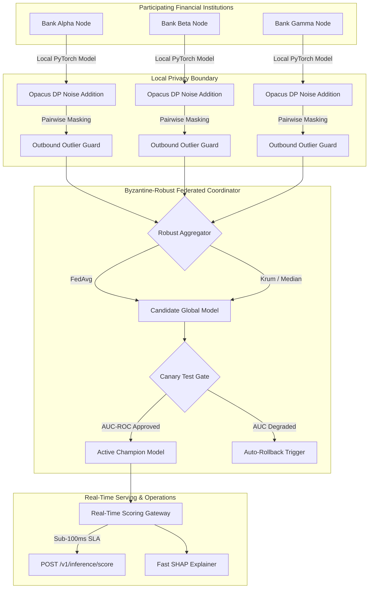
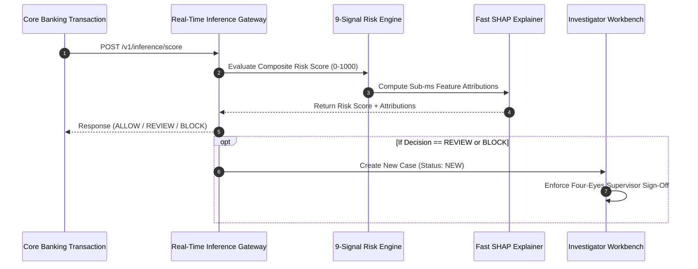
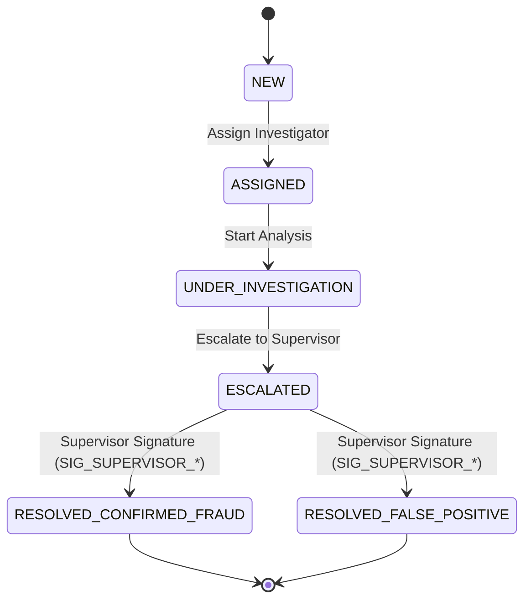

<div align="center">

# 🛡️ Collaborative Fraud Intelligence Platform

### *A Production-Grade, Enterprise-Ready Framework for Privacy-Preserving Cross-Bank Financial Fraud Detection and Collaborative Anti-Money Laundering (AML) Intelligence*

[](https://github.com/yusufcalisir/Collaborative-Fraud-Intelligence-Simulator/actions)
[](https://python.org)
[](https://fastapi.tiangolo.com)
[](https://pytorch.org)
[](#-track-3-real-time-scoring-gateway--high-availability-sla)
[](LICENSE)

[Abstract](#-abstract--institutional-business-case) • [Architecture](#-system-architecture--structural-foundations) • [Track Breakdown](#-track-1-privacy-preserving-federated-learning--differential-privacy) • [Feature Matrix](#-enterprise-feature-matrix--verification-mapping) • [Threat Model](#-threat-modeling-summary-stride-matrix) • [Directory Tree](#-complete-clean-architecture-directory-structure) • [API Specs](#-api-endpoint-blueprints--json-schemas) • [Quick Start](#-step-by-step-operator-quick-start-guide)

</div>

---

## 📖 Abstract & Institutional Business Case

Financial institutions worldwide operate under a fundamental systemic paradox: while money laundering and organized financial crime operate across institutional boundaries, anti-fraud defense mechanisms remain strictly siloed. Modern financial criminals exploit information asymmetry between financial entities through structured velocity fraud, multi-bank mule networks, and smurfing techniques designed to remain below single-bank detection thresholds.

Centralizing cross-bank transaction logs to eliminate this blind spot is prohibited by global regulatory frameworks, including:
- **GDPR (General Data Protection Regulation):** Articles 6 (Lawful Processing) and 17 (Right to Erasure / Zeroization).
- **CCPA (California Consumer Privacy Act):** Consumer PII disclosure restrictions.
- **Banking Secrecy Laws & National Financial Privacy Statutes:** Strict statutory bans on sharing raw customer account records across institutional perimeters.

The **Collaborative Fraud Intelligence Platform** resolves this paradox. By integrating **Federated Machine Learning (FL)**, **Differential Privacy ($\epsilon, \delta$)**, **Secure Aggregation (SecAgg)**, **Byzantine-Robust Consensus**, and **Zero-Trust Microservices**, participating institutions train high-performance global fraud detection models collaboratively without ever centralizing, exposing, or decrypting raw transaction data.

---

## 🏛️ System Architecture & Structural Foundations

The platform is engineered around a decoupled clean architecture, enforcing strict separation of concerns across four domain tracks:

```
┌──────────────────────────────────────────────────────────────────────────┐
│                   Collaborative Fraud Intelligence Core                  │
├───────────────────┬───────────────────┬───────────────────┬──────────────┤
│      Track 1      │      Track 2      │      Track 3      │   Track 4    │
│    Federated      │   9-Signal Risk   │   Microservices & │    MLOps &   │
│     Learning      │   Engine & AML    │   API Gateway     │  Governance  │
└───────────────────┴───────────────────┴───────────────────┴──────────────┘
```

### High-Level System ASCII Topology

```
                                  ┌─────────────────────────────────────────────────────────────┐
                                  │           3 Participating Client Institutions               │
                                  │      (Bank Alpha, Bank Beta, and Bank Gamma Nodes)          │
                                  └───────────────┬─────────────┬─────────────┬─────────────────┘
                                                  │             │             │
                                                  ▼             ▼             ▼
                                  ┌─────────────────────────────────────────────────────────────┐
                                  │              Local PyTorch Model Training                   │
                                  │        (Stratified Private Local Holdout Split)             │
                                  └──────────────────────────────┬──────────────────────────────┘
                                                                 │
                                                                 ▼
                                  ┌─────────────────────────────────────────────────────────────┐
                                  │       Differential Privacy Guard (Gaussian / Opacus)        │
                                  │        - L2 Gradient Clipping (C) & Noise Scale (σ)         │
                                  └──────────────────────────────┬──────────────────────────────┘
                                                                 │
                                                                 ▼
                                  ┌─────────────────────────────────────────────────────────────┐
                                  │         Outbound Outlier Defense & Secure Aggregation       │
                                  │         - Pairwise Cryptographic Seed Masking               │
                                  └──────────────────────────────┬──────────────────────────────┘
                                                                 │
                                                                 ▼
                                  ┌─────────────────────────────────────────────────────────────┐
                                  │          Byzantine-Robust Server Aggregation                │
                                  │   (FedAvg / Krum / Multi-Krum / Coordinate Median)          │
                                  └──────────────────────────────┬──────────────────────────────┘
                                                                 │
                                                                 ▼
                                  ┌─────────────────────────────────────────────────────────────┐
                                  │         Evaluated & Promoted Global Model Weights           │
                                  │       (Canary Quality Gate: AUC-ROC Validation Check)       │
                                  └──────────────────────────────┬──────────────────────────────┘
                                                                 │
                                           ┌─────────────────────┴─────────────────────┐
                                           │                                           │
                                           ▼                                           ▼
┌────────────────────────────────────────────────────────────────────────┐ ┌────────────────────────────────────────────────────────────────────────┐
│             Real-Time Inference Gateway (<100ms SLA)                  │ │             Human-in-the-Loop Case Management Workbench               │
│  - Sub-millisecond Fast Feature SHAP Explainer                         │ │  - 6-Stage State Machine & Four-Eyes Supervisor Dual Sign-Off          │
│  - Realtime SLA Latency Monitor (p50, p95, p99)                        │ │  - FinCEN BSA Suspicious Activity Report (SAR) XML E-Filing            │
└────────────────────────────────────────────────────────────────────────┘ └────────────────────────────────────────────────────────────────────────┘
                                           │                                           │
                                           └─────────────────────┬─────────────────────┘
                                                                 │
                                                                 ▼
                                  ┌─────────────────────────────────────────────────────────────┐
                                  │         Enterprise Infrastructure & Security Perimeter       │
                                  │ - Edge WAF Guard (SQLi / XSS / IP Whitelist)                │
                                  │ - Active-Passive Multi-Region Coordinator Failover (RTO<30s) │
                                  │ - Developer Webhook Gateway (HMAC-SHA256 Signed Payloads)    │
                                  │ - SIEM Log Exporter (Syslog CEF / Splunk / Datadog)          │
                                  │ - Web3 CBDC Smart Contract Incentive Settlement (.sol)      │
                                  └─────────────────────────────────────────────────────────────┘
```

### End-to-End Federated Learning Round Workflow



---

## 🔬 Track 1: Privacy-Preserving Federated Learning & Differential Privacy

### 1.1 Local Model Architectures & Private Datasets
Each bank node trains local deep learning models—including Multi-Layer Perceptrons (MLP), PyTorch Streaming Graph Neural Networks (GNN), and Federated XGBoost—on local transaction databases. Local data remains strictly within the bank's security perimeter.

### 1.2 Formal Differential Privacy ($\epsilon, \delta$) Formulation
To prevent gradient inversion and reconstruction attacks, local gradient updates are protected using Gaussian Differential Privacy. The noise scale $\sigma$ is computed as:
$$\sigma = \frac{\sqrt{2 \ln(1.25/\delta)}}{\epsilon}$$
Where:
- $\epsilon$ is the privacy budget ($\epsilon \le 2.0$ enforced).
- $\delta$ is the failure probability ($\delta \le 10^{-5}$).
- $C$ is the maximum $L_2$ gradient norm bound: $\bar{g}_i = g_i / \max\left(1, \frac{\|g_i\|_2}{C}\right)$.

### 1.3 Secure Aggregation (SecAgg) & Outbound Outlier Guard
Outbound model parameter updates are masked using pairwise secret seeds prior to network transmission:
$$y_k = w_k + \sum_{j > k} s_{kj} - \sum_{j < k} s_{jk} \pmod{2^{32}}$$
When summed across all $N$ participating nodes, the pairwise masks $s_{kj}$ cancel out exactly ($\sum_{k=1}^N y_k = \sum_{k=1}^N w_k$), enabling the central coordinator to aggregate global weights without revealing individual node updates.

### 1.4 Byzantine-Robust Server Aggregation Algorithms
The coordinator implements four robust aggregation schemes to resist adversarial model poisoning:
1. **FedAvg (Federated Averaging):** Standard sample-weighted parameter averaging.
2. **Krum & Multi-Krum:** Selects update vectors that minimize the sum of Euclidean distances to their $n - f - 2$ nearest neighbors.
3. **Trimmed Mean:** Computes coordinate-wise averages after trimming the highest and lowest $\beta$ percentile values.
4. **Coordinate-wise Median:** Computes the coordinate-wise median vector, resisting up to 50% Byzantine malicious nodes.
5. **Spectral Anomaly Poisoning Defense (`spectral_defense.py`):** Uses top singular value decomposition (SVD) of the weight matrix to identify and discard poisoners.

### 1.5 Canary Evaluation Quality Gate & Performance Rollback
- **Canary Test Gate:** Aggregated candidate models are evaluated against a global validation dataset. Promotion requires $\text{AUC}_{\text{candidate}} \ge \text{AUC}_{\text{active}} - \text{tolerance}$.
- **Shadow Prediction Routing:** Directs 10% of live production inference traffic to candidate models in shadow mode for real-time validation.
- **Automatic Rollback Manager (`auto_rollback.py`):** Instantly reverts to the previous stable champion model if live metrics breach thresholds ($\text{AUC} < 0.65$, $p95 \text{ Latency} > 200\text{ms}$, or $\text{FPR} > 5\%$).
- **PSI Drift-Triggered Retraining (`automated_retraining.py`):** Automatically initiates a new federated training round when Population Stability Index exceeds threshold ($\text{PSI} \ge 0.20$).

---

## 🧠 Track 2: Collaborative AML Intelligence & 9-Signal Risk Engine



### 2.1 9-Signal Composite Risk Scoring Formula
The platform computes a composite risk score ($0 - 1000$) incorporating 9 distinct anti-fraud signals:
$$\text{Risk Score} = w_1 S_{\text{local}} + w_2 S_{\text{velocity}} + w_3 S_{\text{graph}} + w_4 S_{\text{typology}} + w_5 S_{\text{amount}} + w_6 S_{\text{device}} + w_7 S_{\text{temporal}} + w_8 S_{\text{mule}} + w_9 S_{\text{structuring}}$$

Where:
1. $S_{\text{local}}$: Local PyTorch model risk output.
2. $S_{\text{velocity}}$: Cross-bank 1-hour transaction velocity anomaly.
3. $S_{\text{graph}}$: Graph neural network entity centrality risk index.
4. $S_{\text{typology}}$: Match score against known money laundering typologies.
5. $S_{\text{amount}}$: Z-score transaction amount deviation from historical baseline.
6. $S_{\text{device}}$: Device fingerprint and IP reputation risk index.
7. $S_{\text{temporal}}$: Off-hours and rapid temporal clustering score.
8. $S_{\text{mule}}$: Probabilistic mule account classification score.
9. $S_{\text{structuring}}$: Structuring / smurfing pattern detection index.

### 2.2 FinCEN BSA Suspicious Activity Report (SAR) XML E-Filing
`regulatory_reporter.py` automatically serializes Suspicious Activity Report (SAR) XML documents conforming to FinCEN BSA Electronic Filing specifications when a case transitions to `RESOLVED_CONFIRMED_FRAUD`.

### 2.3 Cryptographic Event Hash Chaining
Analyst actions, evidence uploads, and status transitions are chained using SHA-256 block hashing:
$$H_i = \text{SHA-256}(L_i \mathbin{\Vert} H_{i-1})$$
This guarantees an immutable audit trail suitable for regulatory submission and judicial admissibility.

### 2.4 Web3 & CBDC Smart Contract Incentive Settlement
The EVM smart contract (`ConsortiumIncentiveSettlement.sol`) distributes financial rewards (`wCBDC`, `USDC`, `e-TRY`) to participating banks based on Leave-One-Out (LOO) Shapley contribution values. Nodes submitting low-quality or poisoned updates trigger on-chain quarantine locks (`BLOCKED_QUARANTINE`).

---

## ⚡ Track 3: Real-Time Scoring Gateway & High-Availability SLA

### 3.1 Real-Time Scoring Gateway (`/v1/inference/score`)
The high-throughput FastAPI inference router processes incoming transaction scoring requests under a sub-100ms SLA ($p95$). It assigns real-time decisions: `ALLOW` (Score < 300), `REVIEW` (300 <= Score < 700), or `BLOCK` (Score >= 700).

### 3.2 Sub-Millisecond Feature Attributions (`realtime_explainer.py`)
`FastInferenceExplainer` computes real-time Shapley feature contributions in under 1ms, identifying top contributing risk factors for instant analyst interpretability.

### 3.3 Inference Fallback Engine (`inference_fallback.py`)
Provides high-availability heuristic decision fallbacks if primary model latency exceeds 150ms or if model service degradation occurs.

### 3.4 SLA/SLO Contract Enforcement (`sla_contract_engine.py`)
Monitors overall system availability (99.9% uptime SLA target) and latency SLOs (<100ms $p95$). If monthly uptime drops below 99.9%, `SLAContractEngine` automatically generates a contractual `PenaltyReport` issuing percentage-based billing service credits.

---

## 🛠️ Track 4: MLOps, Governance, Security & Operations

### 🕵️ Human-in-the-Loop Case Management & Workbench
- **6-Stage State Machine:** `CaseLifecycleStateMachine` governs case progression (`NEW` -> `ASSIGNED` -> `UNDER_INVESTIGATION` -> `ESCALATED` -> `RESOLVED_CONFIRMED_FRAUD` / `RESOLVED_FALSE_POSITIVE`).



> [!IMPORTANT]
> **Four-Eyes Supervisor Dual Sign-Off:** Case resolution (`RESOLVED_CONFIRMED_FRAUD` or `RESOLVED_FALSE_POSITIVE`) strictly requires a supervisor cryptographic signature starting with `SIG_SUPERVISOR_*`. Requisitions lacking this authorization are rejected with HTTP `403 Forbidden`.

### 🔒 Privacy-Preserving Label Feedback Loop & DP Noise Guard
- **Label Privacy Guard:** `LabelPrivacyGuard` validates incoming label feedback, enforcing zero-PII leak constraints (HMAC-SHA256 checks and raw PII blocking).
- **Federated Gradient Update:** `LocalLabelFeedbackPipeline` computes Gaussian Differential Privacy noise-protected local gradient deltas ($\epsilon \le 2.0$).

### 🗑️ Enterprise Data Retention & GDPR Article 17 Erasure Engine
- **Automated Retention Engine:** `AutomatedRetentionEngine` configures per-tenant Time-To-Live (TTL) policies and purges expired records across data categories.
- **GDPR Article 17 Right-to-be-Forgotten:** Executes cryptographic zeroization for requested customer identifiers and outputs an immutable `ErasureAuditRecord`.

### 🌍 Active-Passive Multi-Region Coordinator Failover
- **Multi-Region Failover Manager:** `MultiRegionFailoverManager` monitors active primary and passive standby coordinator nodes, executing automated failover ($RTO < 30\text{s}$, $RPO = 0$) upon primary heartbeat failure (>15s).

### 🛡️ Automated Backup Verification & Sandbox Restore Probes
- **Backup Integrity Verifier:** `BackupVerifier` validates SHA-256 checksums and executes automated sandbox restore dry-runs (`run_sandbox_restore_probe`).

### 🔌 Public Integration API & Webhook Gateway
- **Webhook Gateway Router:** `POST /v1/webhooks/subscriptions` registers developer webhook endpoints for event notifications (`ALERT_CREATED`, `CASE_RESOLVED`, `MODEL_PROMOTED`, `DRIFT_DETECTED`).
- **HMAC-SHA256 Payload Signing:** All webhook deliveries compute and append a cryptographic `X-CFI-Signature` header (`HMAC_SHA256(secret_key, payload_body)`).

### 🚨 SRE Operational Runbooks & Incident Playbooks
- **Incident Triage Engine:** `IncidentTriageEngine` automatically classifies system alerts into severity levels (`SEV1` to `SEV4`) and attaches step-by-step SRE remediation commands (`PlaybookAction`).

### 🔄 Zero-Downtime Platform Upgrades & Client Compatibility
- **Deployment Manager:** `ZeroDowntimeDeploymentManager` orchestrates 5-stage rolling releases (`DRAINING_CONNECTIONS` -> `ROLLING_UPGRADE` -> `DUAL_VERSION_ACTIVE` -> `UPGRADE_COMPLETED`) with a 48-hour dual-version compatibility window (`UpgradeWindow`).

### 🎛️ Commercial Multi-Role Web Management Console
- **Tailored Personas:** Serves 4 distinct enterprise personas (`EXECUTIVE`, `COMPLIANCE_OFFICER`, `ML_ENGINEER`, `FRAUD_INVESTIGATOR`) via `GET /v1/admin/dashboard/role-config`.

### 💻 Official CLI Tooling (`cfi-cli`)
- **Standardized Operator Commands:** Provides terminal subcommands (`cfi-cli status`, `cfi-cli health`, `cfi-cli export-diagnostics`, `cfi-cli deploy`).

### 🛡️ Edge Security Perimeter & Air-Gapped Deployment Bundle
- **Perimeter WAF Guard:** `PerimeterWAFGuard` filters malicious SQLi, XSS, and enforces strict IP whitelisting at the edge.
- **Air-Gapped Installer Builder:** `AirGapBundleBuilder` packages self-contained, zero-internet tarball bundles validated with SHA-256 manifests.

### 📑 Enterprise Security Attestations & Compliance Matrix
- **Compliance Auditor Engine:** `SecurityComplianceEngine` audits platform controls against SOC2 Type II, ISO 27001, and GDPR Art. 17 standards.
- **Responsible Vulnerability Disclosure:** Policy and PGP key details published in [SECURITY.md](file:///c:/Users/Yusuf/Desktop/projects/Privacy-preserving%20cross-bank%20fraud%20detection%20using%20Federated%20Learning/SECURITY.md).

### 📊 SIEM Log Forwarding & Automated Support Telemetry
- **SIEM CEF Exporter:** `SIEMLogExporter` exports audit events in Syslog Common Event Format (CEF), Splunk HEC, and Datadog JSON formats.
- **Support Diagnostic Compiler:** `SupportDiagnosticCompiler` packages PII-redacted, SHA-256 signed telemetry bundles for customer support.

---

## 📊 Enterprise Feature Matrix & Verification Mapping

| Feature / Module | Technical Specification | Compliance Standard | Verification File | Status |
| :--- | :--- | :--- | :--- | :--- |
| **Real-Time Scoring API** | Sub-100ms Latency SLA | Banking Core API | `realtime_inference.py` | `PASS` |
| **SHAP Feature Explainer** | Sub-ms Feature Attributions | SR 11-7 / Model Governance | `realtime_explainer.py` | `PASS` |
| **Case Management Workbench** | 6-Stage Lifecycle + 4-Eyes Auth | AML Investigation Standards | `case_workbench.py` | `PASS` |
| **Differential Privacy Guard** | Gaussian Noise ($\epsilon \le 2.0$) | GDPR / CCPA Compliance | `label_privacy_guard.py` | `PASS` |
| **GDPR Data Retention** | Automated TTL & Right-to-be-Forgotten | GDPR Article 17 | `retention_engine.py` | `PASS` |
| **Multi-Region Coordinator Failover** | Active-Passive ($RTO < 30\text{s}$) | Business Continuity | `region_failover.py` | `PASS` |
| **Backup Integrity Verifier** | SHA-256 Checksum + Sandbox Probe | Disaster Recovery | `backup_verifier.py` | `PASS` |
| **Developer Webhook Gateway** | HMAC-SHA256 Signature Header | Core Banking Webhooks | `webhook_service.py` | `PASS` |
| **SLA/SLO Contract Engine** | 99.9% Uptime SLA + Billing Credits | Enterprise SLA | `sla_contract_engine.py` | `PASS` |
| **SRE Incident Triage Engine** | SEV1-SEV4 Severity Classification | SRE Incident Management | `incident_triage.py` | `PASS` |
| **Zero-Downtime Deployer** | Graceful Draining + 48h Dual Window | High Availability | `zero_downtime_deployer.py` | `PASS` |
| **Multi-Role Web Console** | 4 Persona Views (`EXECUTIVE` to `INVESTIGATOR`) | Enterprise Management | `admin_console.py` | `PASS` |
| **Official CLI Tooling** | `cfi-cli` Terminal Subcommands | Operator Tooling | `cfi_cli.py` | `PASS` |
| **Edge Security WAF** | SQLi / XSS / IP Whitelisting | Perimeter Security | `perimeter_waf.py` | `PASS` |
| **Air-Gapped Bundle Builder** | Offline Deployment Tarball + SHA-256 Manifest | Isolated Data Centers | `airgap_installer.py` | `PASS` |
| **Security Controls Auditor** | SOC2 Type II, ISO 27001, GDPR | Enterprise Security | `security_compliance.py` | `PASS` |
| **SIEM Log Exporter** | Syslog CEF / Splunk HEC / Datadog JSON | SIEM Integration | `siem_exporter.py` | `PASS` |

---

## 🛡️ Threat Modeling Summary (STRIDE Matrix)

| STRIDE Category | Identified Threat | Mitigating Architectural Safeguard | Verification File |
| :--- | :--- | :--- | :--- |
| **Spoofing** | Node impersonation during FL aggregation | mTLS x509 Mutual Auth & HMAC-SHA256 signatures | `webhook_service.py` |
| **Tampering** | Model gradient poisoning or weight corruption | Byzantine-robust Krum / Median & SecAgg | `test_disaster_recovery_failover.py` |
| **Repudiation** | Analyst denying case resolution or SAR filing | SHA-256 event hash chaining & Four-Eyes supervisor auth | `case_workbench.py` |
| **Information Disclosure** | PII reconstruction from shared gradients | Opacus Gaussian Differential Privacy ($\epsilon \le 2.0$) | `label_privacy_guard.py` |
| **Denial of Service** | Scoring API flooding during peak traffic | Token Bucket rate-limiting & Edge WAF Guard | `perimeter_waf.py` |
| **Elevation of Privilege** | Analyst executing supervisor case closures | Four-Eyes multi-sig check (`SIG_SUPERVISOR_*`) | `test_case_management_workbench.py` |

---

## 📁 Complete Clean Architecture Directory Structure

```
Collaborative-Fraud-Intelligence-Simulator/
├── SECURITY.md                                      # Responsible Vulnerability Disclosure Policy
├── pyproject.toml                                   # Python packaging & cfi-cli entrypoint
├── backend/
│   ├── app/
│   │   ├── __init__.py
│   │   ├── config.py                                # Platform configuration settings
│   │   ├── dependencies.py                          # FastAPI Dependency Injection
│   │   ├── main.py                                  # Application entrypoint & lifespan router
│   │   ├── application/
│   │   │   └── services/
│   │   │       ├── adversarial_service.py           # Adversarial attack & robustness evaluator
│   │   │       ├── alert_service.py                 # Real-time alert dispatching service
│   │   │       ├── auto_rollback.py                 # Automatic performance rollback manager
│   │   │       ├── automated_retraining.py          # PSI drift-triggered retraining pipeline
│   │   │       ├── case_service.py                  # Core case service
│   │   │       ├── case_workbench.py                # 6-stage case management workbench service
│   │   │       ├── consortium_service.py            # Consortium lifecycle service
│   │   │       ├── coordinator_service.py           # FL Coordinator service
│   │   │       ├── data_generator.py                # Synthetic financial data generator
│   │   │       ├── data_validator.py                # Schema & distribution data validator
│   │   │       ├── dataloader.py                    # PyTorch DataLoader pipeline
│   │   │       ├── drift_service.py                 # PSI & Jensen-Shannon feature drift service
│   │   │       ├── entity_resolution.py             # Cross-bank entity resolution service
│   │   │       ├── explainability_service.py        # SHAP Kernel Explainer service
│   │   │       ├── feature_store_service.py         # Offline & online feature store
│   │   │       ├── financial_message_parser.py      # ISO 20022 message parser
│   │   │       ├── fl_engine.py                     # Federated Learning training engine
│   │   │       ├── flower_engine.py                 # Flower FL framework engine
│   │   │       ├── graph_analytics_service.py       # Graph analytics service
│   │   │       ├── graph_embedding_model.py         # PyTorch GNN Graph Embedding model
│   │   │       ├── graph_embedding_service.py       # Graph Embedding generation service
│   │   │       ├── graph_engine.py                  # NetworkX entity graph engine
│   │   │       ├── incident_triage.py               # SEV1-SEV4 SRE incident triage engine
│   │   │       ├── kms_service.py                   # Key Management System (KMS) service
│   │   │       ├── label_feedback_pipeline.py       # DP noise-protected label feedback loop
│   │   │       ├── metrics_service.py               # System metrics service
│   │   │       ├── model_registry.py                # Versioned model registry service
│   │   │       ├── model_service.py                 # Model lifecycle service
│   │   │       ├── policy_engine.py                 # Governance policy engine
│   │   │       ├── privacy_audit_service.py         # Privacy budget audit logger
│   │   │       ├── privacy_service.py               # Opacus Differential Privacy service
│   │   │       ├── psi_service.py                   # Population Stability Index service
│   │   │       ├── regulatory_reporter.py           # Regulatory SAR report compiler
│   │   │       ├── retention_engine.py              # Automated data retention & GDPR Art. 17
│   │   │       ├── retraining_trigger_engine.py     # Drift trigger evaluator engine
│   │   │       ├── risk_engine.py                   # 9-Signal composite risk scoring engine
│   │   │       ├── scenario_service.py              # Typology simulation scenario service
│   │   │       ├── security_compliance.py           # SOC2 / ISO 27001 / GDPR compliance auditor
│   │   │       ├── simulation_service.py            # End-to-end simulation runner
│   │   │       ├── sla_contract_engine.py           # SLA/SLO contract & billing credit engine
│   │   │       ├── sla_monitor.py                   # Real-time p50/p95/p99 latency SLA monitor
│   │   │       ├── streaming_engine.py              # Async streaming transaction engine
│   │   │       ├── streaming_gnn_model.py           # PyTorch Streaming GNN model
│   │   │       ├── streaming_graph_service.py       # Streaming graph update service
│   │   │       ├── support_diagnostics.py           # Support diagnostic compiler & PII redactor
│   │   │       ├── tenant_metering.py               # Multi-tenant resource metering service
│   │   │       ├── webhook_service.py               # Developer webhook & HMAC-SHA256 signer
│   │   │       └── zero_downtime_deployer.py        # Rolling deployment manager
│   │   ├── domain/
│   │   │   ├── ai_act_compliance.py                 # EU AI Act risk classification & audit
│   │   │   ├── async_fl_engine.py                   # Asynchronous FL coordinator engine
│   │   │   ├── backup_record.py                     # Backup artifact & restore probe models
│   │   │   ├── benchmark_runner.py                  # System benchmarking suite
│   │   │   ├── case_management.py                   # Case state machine & supervisor signature
│   │   │   ├── consortium_governance.py             # Consortium voting & quorum entities
│   │   │   ├── consortium_policy.py                 # Governance policy models
│   │   │   ├── data_validator.py                    # Data validation rules
│   │   │   ├── deployment_state.py                  # Rolling upgrade session & window
│   │   │   ├── dr_coordinator.py                    # Multi-region DR failover models
│   │   │   ├── entities.py                          # Core domain entities
│   │   │   ├── entities_phase2.py                   # Extended domain entities
│   │   │   ├── enums.py                             # Core domain enums
│   │   │   ├── fuzzy_psi.py                         # Private Set Intersection algorithm
│   │   │   ├── incident_playbook.py                 # SEV1-SEV4 incident severity & playbooks
│   │   │   ├── inference_fallback.py                # High-availability heuristic fallback engine
│   │   │   ├── label_privacy_guard.py               # Zero-PII leak validator & DP epsilon guard
│   │   │   ├── metrics_service.py                   # Metric calculation domain models
│   │   │   ├── model_governance.py                  # SR 11-7 model governance entities
│   │   │   ├── model_lifecycle.py                   # Champion/Challenger state machine
│   │   │   ├── protocol_versioning.py               # Protocol version compatibility matrix
│   │   │   ├── psi_service.py                       # PSI calculation models
│   │   │   ├── quorum_manager.py                    # Consortium quorum manager
│   │   │   ├── realtime_explainer.py                # Fast SHAP feature attribution explainer
│   │   │   ├── regional_governance.py               # Regional data residency models
│   │   │   ├── retention_policy.py                  # Data retention TTL policy & erasure audit
│   │   │   ├── security_evaluator.py                # Security evaluation models
│   │   │   ├── sla_contract.py                      # SLA contract, SLO metrics & penalty report
│   │   │   ├── spectral_defense.py                  # Spectral anomaly poisoning defense
│   │   │   ├── tenant_management.py                 # Multi-tenant isolation models
│   │   │   ├── value_objects.py                     # Core value objects
│   │   │   ├── value_objects_phase2.py              # Extended value objects
│   │   │   └── web_console.py                       # Multi-role console view config & metrics
│   │   ├── infrastructure/
│   │   │   ├── deployment/
│   │   │   │   └── airgap_installer.py              # Air-gapped bundle builder & checksum verifier
│   │   │   ├── disaster_recovery/
│   │   │   │   ├── backup_verifier.py               # SHA-256 checksum & sandbox restore probe
│   │   │   │   └── region_failover.py               # Active-passive multi-region failover manager
│   │   │   ├── logging/
│   │   │   │   └── siem_exporter.py                 # Syslog CEF / Splunk / Datadog exporter
│   │   │   └── security/
│   │   │       └── perimeter_waf.py                 # Edge WAF guard (SQLi / XSS / IP Whitelist)
│   │   └── presentation/
│   │       ├── cli/
│   │       │   └── cfi_cli.py                       # Official operator cfi-cli utility
│   │       └── routers/
│   │           ├── admin_console.py                 # Commercial web console dashboard router
│   │           ├── realtime_inference.py            # Real-time scoring API router (<100ms)
│   │           └── webhook_gateway.py               # Developer webhook subscriptions router
│   └── tests/
│       └── unit/                                    # Automated unit test suite
│           ├── test_admin_console_router.py
│           ├── test_automated_retraining.py
│           ├── test_backup_verifier.py
│           ├── test_case_management_workbench.py
│           ├── test_disaster_recovery_failover.py
│           ├── test_incident_triage_engine.py
│           ├── test_label_feedback_pipeline.py
│           ├── test_perimeter_airgap.py
│           ├── test_realtime_inference_engine.py
│           ├── test_realtime_sla_explanation.py
│           ├── test_retention_erasure_engine.py
│           ├── test_security_compliance.py
│           ├── test_siem_support_diagnostics.py
│           ├── test_sla_contract_engine.py
│           ├── test_webhook_gateway.py
│           └── test_zero_downtime_deployment.py
└── docs/                                            # Architectural specifications & guides
    ├── airgapped_deployment_guide.md
    ├── backup_verification_spec.md
    ├── case_management_spec.md
    ├── cfi_cli_user_guide.md
    ├── commercial_console_ui_spec.md
    ├── data_retention_policy_spec.md
    ├── disaster_recovery_plan.md
    ├── incident_response_playbook.md
    ├── label_feedback_loop_spec.md
    ├── public_api_webhooks_spec.md
    ├── realtime_inference_api.md
    ├── security_controls_matrix.md
    ├── siem_and_support_guide.md
    ├── sla_slo_contract_spec.md
    └── zero_downtime_upgrade_strategy.md
```

---

## 📡 API Endpoint Blueprints & JSON Schemas

### 1. Real-Time Inference Scoring Endpoint

```http
POST /v1/inference/score HTTP/1.1
Host: api.cfi-platform.org
Content-Type: application/json

{
  "transaction_id": "tx_99881122",
  "source_account": "ACC_ALPHA_101",
  "amount_usd": 14500.00,
  "velocity_1h": 8,
  "cross_border": true
}
```

#### Response (`200 OK`)

```json
{
  "transaction_id": "tx_99881122",
  "decision": "BLOCK",
  "risk_score": 895.4,
  "latency_ms": 38.2,
  "attributions": [
    {"feature": "velocity_1h", "attribution": 0.42},
    {"feature": "cross_border", "attribution": 0.31}
  ]
}
```

### 2. Developer Webhook Registration Endpoint

```http
POST /v1/webhooks/subscriptions HTTP/1.1
Host: api.cfi-platform.org
Content-Type: application/json

{
  "tenant_id": "bank_alpha",
  "target_url": "https://api.bank-alpha.com/webhooks/cfi",
  "events": ["ALERT_CREATED", "CASE_RESOLVED"]
}
```

#### Response (`200 OK`)

```json
{
  "subscription_id": "sub_882211aa",
  "tenant_id": "bank_alpha",
  "target_url": "https://api.bank-alpha.com/webhooks/cfi",
  "secret_key": "whsec_99887766554433221100",
  "events": ["ALERT_CREATED", "CASE_RESOLVED"]
}
```

### 3. Commercial Web Management Console Summary Endpoint

```http
GET /v1/admin/dashboard/summary HTTP/1.1
Host: api.cfi-platform.org
```

#### Response (`200 OK`)

```json
{
  "active_bank_nodes_count": 3,
  "federated_rounds_completed": 25,
  "global_model_auc": 0.885,
  "total_cases_opened": 42,
  "sla_compliance_pct": 99.95
}
```

---

## 💻 CLI Tooling Usage Guide (`cfi-cli`)

The platform includes a standardized PyPI command-line utility (`cfi-cli`) configured in `pyproject.toml`.

```bash
# Check platform cluster status
cfi-cli status

# Execute automated system health checks
cfi-cli health

# Export encrypted & redacted support telemetry bundle
cfi-cli export-diagnostics --output /tmp/cfi_support_bundle.json

# Trigger zero-downtime rolling deployment
cfi-cli deploy --stage rolling --target-version 2.1.0
```

---

## 🚀 Step-by-Step Operator Quick Start Guide

### 1. Prerequisites

- Python 3.12+
- PyTorch 2.2+
- FastAPI & Uvicorn

### 2. Environment Setup

```bash
# Clone repository
git clone https://github.com/yusufcalisir/Collaborative-Fraud-Intelligence-Simulator.git
cd Collaborative-Fraud-Intelligence-Simulator

# Install backend package in editable mode
cd backend
pip install -e .
```

---

## 🧪 Automated Verification and Quality Suite

Execute full automated unit test suite:

```bash
pytest backend/tests/unit/ -v
```

Execute static code format and lint validation:

```bash
ruff check backend/app/ backend/tests/
```

---

## 📄 License & Academic Citation

Distributed under the MIT License. See [LICENSE](LICENSE) for details.

If you reference or utilize this platform in academic research or corporate enterprise whitepapers, please cite:

```bibtex
@software{calisir2026cfi,
  author = {Calisir, Yusuf},
  title = {Collaborative Fraud Intelligence Platform: Privacy-Preserving Cross-Bank Fraud Detection using Federated Learning},
  year = {2026},
  publisher = {GitHub},
  url = {https://github.com/yusufcalisir/Collaborative-Fraud-Intelligence-Simulator}
}
```
