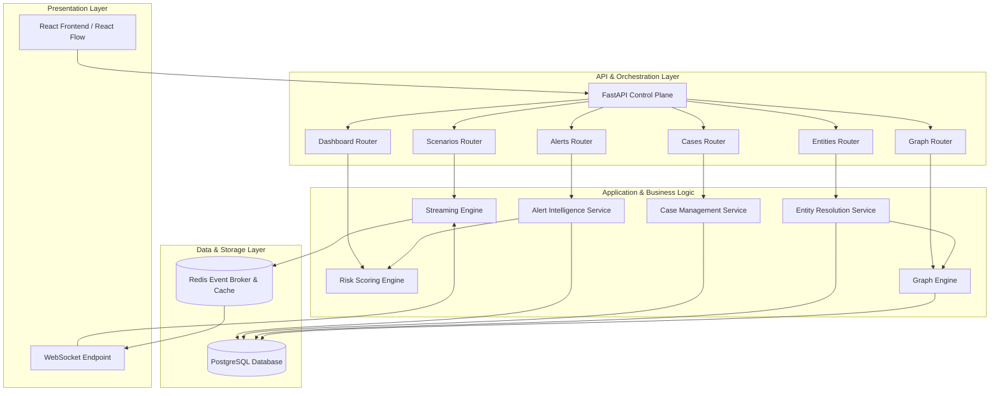

# Architecture & System Design: Phase 2 Collaborative AML Platform

This document describes the architectural additions and data flows introduced in Phase 2.

## Component Overview

Phase 2 builds upon the existing Federated Learning architecture, adding real-time alert processing, case management, entity resolution, and relationship graph analysis.



---

## Data Flow: Real-time Replay and Detection

During scenario replay, events flow through the system as follows:

```
[Scenario Simulator]
        │
        ▼ (Streaming Event)
[Streaming Engine] ────(Pub/Sub)────► [Redis Channel] ────► [WebSocket] ────► [Frontend UI]
        │
        ▼ (Process Transaction)
[Risk Scoring Engine]
   ├── evaluates 9 signals (ML, Velocity, Country, etc.)
   └── returns Composite Risk Score (0-1000)
        │
        ▼ (If Risk Score > Threshold)
[Alert Intelligence Service]
   ├── Generates Alert Entity
   ├── Extracts PrivacyPreservingIdentifiers (HMAC-SHA256)
   └── Publishes SharedIntelligence indicator
        │
        ▼ (Trigger Resolution)
[Entity Resolution Service]
   ├── Maps privacy hashes across banks
   └── Identifies cross-institution overlaps
        │
        ▼ (Update Network Map)
[Graph Engine]
   ├── Registers resolved nodes & edges
   └── Detects suspicious graph clusters (Connected Components)
```

---

## Privacy-Preserving Mechanics

To satisfy strict data protection regulations (e.g., GDPR, CCPA, bank secrecy acts), the architecture enforces the following security boundaries:

1. **Zero Raw PII Transmission**:
   * No raw emails, telephone numbers, card numbers, or transaction IDs leave the bank.
   * All PII is converted to deterministic hashes locally at the bank level before any shared analysis.
2. **HMAC-SHA256 Deterministic Hashing**:
   * Hashes are computed using a secure keyed-hash message authentication code:
     $$\text{Privacy Hash} = \text{HMAC-SHA256}(\text{Shared Key}, \text{Entity Type} \mathbin{\Vert} \text{Raw Value})$$
   * Using a type-specific salt prevents cross-type rainbow table attacks.
   * The resulting hash is truncated to a readable size (16 characters) for display within the simulation.
3. **Federated Learning Alignment**:
   * Model weights are trained using local SGD and aggregated using secure Federated Averaging (FedAvg). This is combined with Phase 2's collaborative intelligence layer to protect transaction integrity at all execution stages.

---

## Design Patterns & Architectural Choices

* **Signal-Combiner Pattern**: The `RiskScoringEngine` decouples independent risk assessment strategies (ML, rules, baseline comparisons). This makes it easy to add or adjust weights without changing the scoring engine skeleton.
* **Separation of Concerns (Clean Architecture)**:
  * **Domain Layer** (dataclasses in `entities_phase2.py` and `value_objects_phase2.py`) is completely independent of frameworks.
  * **Application Layer** (services in `app/application/services`) handles core AML algorithms.
  * **Presentation Layer** (routers in `app/presentation/routers` and schemas in `app/application/schemas`) manages network endpoints and payloads.
* **Pub/Sub Scenario Replay**: Using Redis pub/sub decouples the simulation thread from FastAPI and WebSockets, ensuring smooth, low-latency UI updates during high-speed scenario runs.
