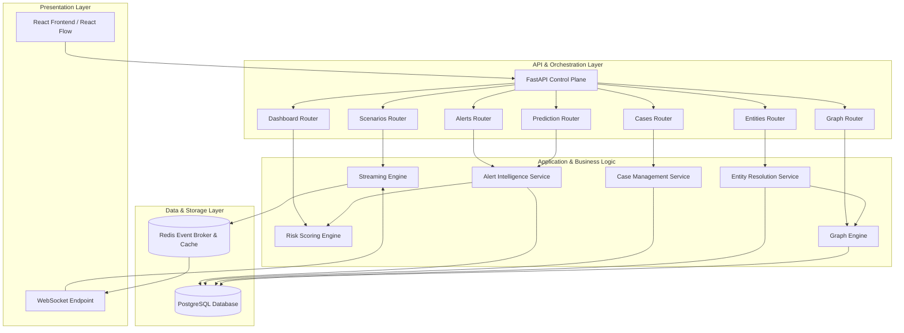
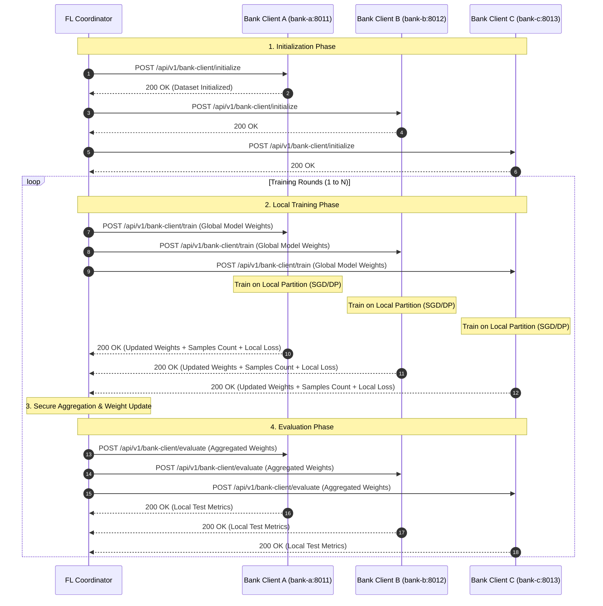
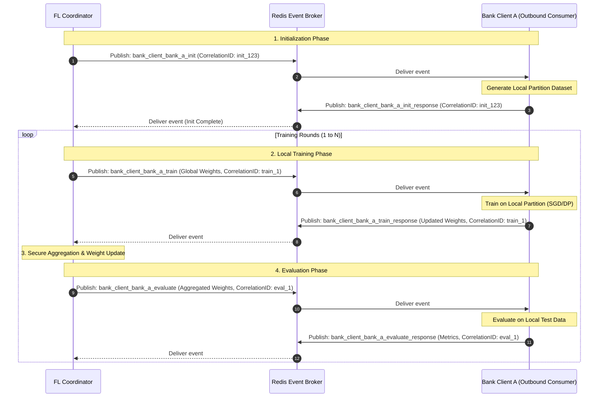
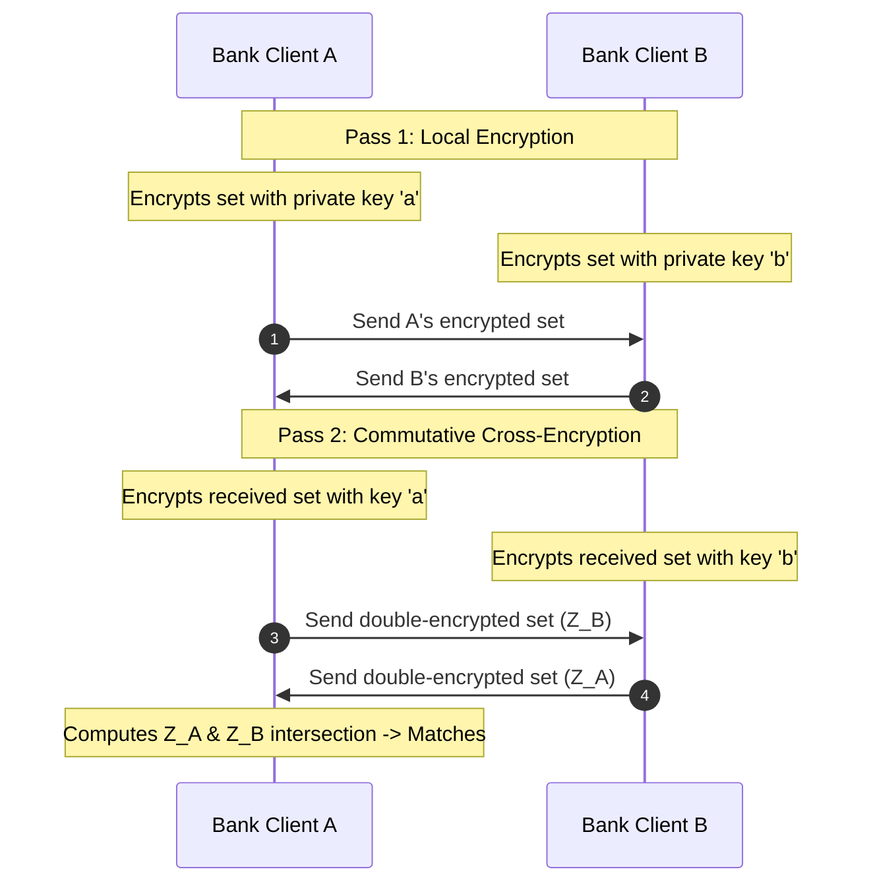
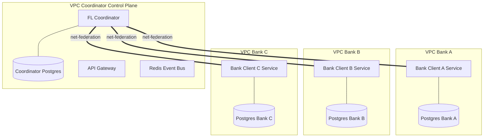
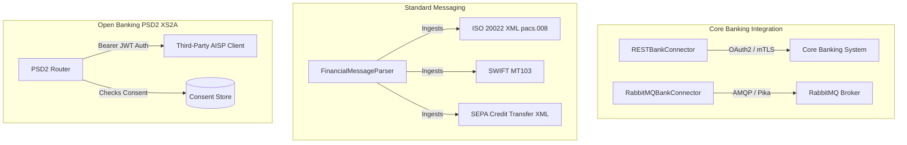
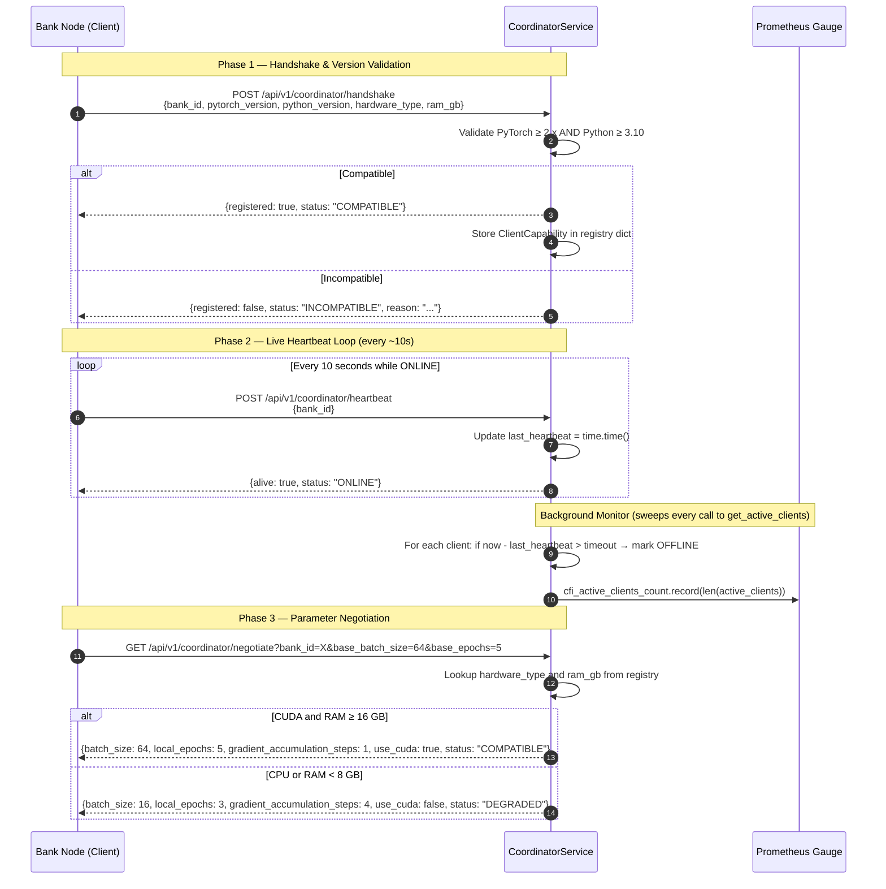

# Architecture & System Design: Phase 2 Collaborative AML Platform

This document describes the architectural additions and data flows introduced in Phase 2.

## Component Overview

Phase 2 builds upon the existing Federated Learning architecture, adding real-time alert processing, case management, entity resolution, and relationship graph analysis.



---

## Data Flow: Real-time Replay and Detection

During scenario replay, events flow through the system as follows:

```
[Scenario Simulator]
        │
        ▼ (Streaming Event)
[Streaming Engine] ────(Pub/Sub)────► [Redis Channel] ────► [WebSocket] ────► [Frontend UI]
        │
        ▼ (Process Transaction)
[Risk Scoring Engine]
   ├── evaluates 9 signals (ML, Velocity, Country, etc.)
   └── returns Composite Risk Score (0-1000)
        │
        ▼ (If Risk Score > Threshold)
[Alert Intelligence Service]
   ├── Generates Alert Entity
   ├── Extracts PrivacyPreservingIdentifiers (HMAC-SHA256)
   └── Publishes SharedIntelligence indicator
        │
        ▼ (Trigger Resolution)
[Entity Resolution Service]
   ├── Maps privacy hashes across banks
   └── Identifies cross-institution overlaps
        │
        ▼ (Update Network Map)
[Graph Engine]
   ├── Registers resolved nodes & edges
   └── Detects suspicious graph clusters (Connected Components)
```

---

## Privacy-Preserving Mechanics

To satisfy strict data protection regulations (e.g., GDPR, CCPA, bank secrecy acts), the architecture enforces the following security boundaries:

1. **Zero Raw PII Transmission**:
   * No raw emails, telephone numbers, card numbers, or transaction IDs leave the bank.
   * All PII is converted to deterministic hashes locally at the bank level before any shared analysis.
2. **HMAC-SHA256 Deterministic Hashing**:
   * Hashes are computed using a secure keyed-hash message authentication code:
     $$\text{Privacy Hash} = \text{HMAC-SHA256}(\text{Shared Key}, \text{Entity Type} \mathbin{\Vert} \text{Raw Value})$$
   * Using a type-specific salt prevents cross-type rainbow table attacks.
   * The resulting hash is truncated to a readable size (16 characters) for display within the simulation.
3. **Federated Learning Alignment**:
   * Model weights are trained using local SGD and aggregated using secure Federated Averaging (FedAvg). This is combined with Phase 2's collaborative intelligence layer to protect transaction integrity at all execution stages.

---

## Design Patterns & Architectural Choices

* **Signal-Combiner Pattern**: The `RiskScoringEngine` decouples independent risk assessment strategies (ML, rules, baseline comparisons). This makes it easy to add or adjust weights without changing the scoring engine skeleton.
* **Separation of Concerns (Clean Architecture)**:
  * **Domain Layer** (dataclasses in `entities_phase2.py` and `value_objects_phase2.py`) is completely independent of frameworks.
  * **Application Layer** (services in `app/application/services`) handles core AML algorithms.
  * **Presentation Layer** (routers in `app/presentation/routers` and schemas in `app/application/schemas`) manages network endpoints and payloads.
* **Pub/Sub Scenario Replay**: Using Redis pub/sub decouples the simulation thread from FastAPI and WebSockets, ensuring smooth, low-latency UI updates during high-speed scenario runs.

---

## Distributed Federated Learning Engine (HTTP Engine)

When the federated learning engine is configured as `distributed` (e.g., `fl_engine_type = "distributed"`), the system transitions from an in-memory simulation to a realistic, distributed system design.

### Node Layout and Networking
* **Coordinator Node**: The central `fl-coordinator` container coordinates training rounds. It maintains global model parameters, schedules execution rounds, and triggers tasks.
* **Bank Client Nodes**: Bank clients (`bank-a`, `bank-b`, `bank-c`) run in their own container environments. They listen on designated HTTP ports (`8011`, `8012`, `8013`) and expose a dedicated client-serving API.



## Event-Driven Federated Learning Engine (Redis Pub/Sub Engine)

When the federated learning engine is configured as `event_driven` (e.g., `fl_engine_type = "event_driven"`), communication shifts from synchronous HTTP/REST to asynchronous event exchanges using a **Redis Pub/Sub Event Broker**.

### Security & Networking Advantages
* **Zero Inbound Port Exposure**: Bank client nodes (`bank-a`, `bank-b`, `bank-c`) do not open any inbound HTTP ports to the network. They connect to the Redis broker as outbound clients. This reflects enterprise financial networks where inbound HTTP traffic is restricted.
* **Loose Coupling**: The central coordinator and client nodes do not require IP/port routing tables or DNS mapping of participants.
* **Robust Correlation**: Transactions across rounds are tracked using unique message identifiers (`correlation_id`).

### Messaging Flow



## Privacy-Preserving Graph Intelligence

Phase 2 introduces **Privacy-Preserving Entity Resolution (PSI)** and **Graph-Based Fraud Detection (Graph Analytics)**. These components operate jointly to match entities securely across banks and propagate threat risks over the transaction graph.

### 1. Diffie-Hellman Private Set Intersection (DH-PSI)

To match customers, cards, or device IDs without disclosing raw identifiers of non-overlapping records, we implement a commutative modular exponentiation protocol (DH-PSI):

1. **Parameters**: A shared 512-bit modular prime $p$ and a generator $g$.
2. **Local Keys**: Bank A generates private scalar key $a$; Bank B generates private scalar key $b$.
3. **Pass 1**:
   - Bank A encrypts its set of hashes $X_A$: $Y_A = \{ x^a \pmod p \mid x \in X_A \}$.
   - Bank B encrypts its set of hashes $X_B$: $Y_B = \{ x^b \pmod p \mid x \in X_B \}$.
   - They exchange their encrypted sets.
4. **Pass 2**:
   - Bank A encrypts Bank B's set: $Z_B = \{ y^a \pmod p \mid y \in Y_B \} = \{ x^{ab} \pmod p \}$.
   - Bank B encrypts Bank A's set: $Z_A = \{ y^b \pmod p \mid y \in Y_A \} = \{ x^{ba} \pmod p \}$.
5. **Intersection**: Since modular exponentiation is commutative ($x^{ab} \equiv x^{ba} \pmod p$), matching elements in $Z_A$ and $Z_B$ reveal the shared entities without exposing any other values.



### 1.1 Fuzzy & Probabilistic Private Entity Resolution (LSH / Fuzzy PSI)

> **Status: ✅ Implemented** — `backend/app/domain/value_objects_phase2.py`, `backend/app/application/services/entity_resolution.py`, `backend/app/application/services/psi_service.py`, `frontend/src/pages/PsiPage.tsx`

Deterministic exact-string matching fails when bank records differ slightly in spelling, accents, or formatting (e.g., "Yusuf Çalışır" vs "Yusuf Calisir"). Phase 2 implements a three-stage privacy-preserving fuzzy entity matching pipeline:

#### Stage 1 — Standardization Pipeline (`standardize_input()`)

`value_objects_phase2.py :: standardize_input(raw_value, entity_type)` applies a pre-hashing normalization pipeline to all entity identifiers before any matching is attempted:

| Entity Type | Transformation Applied |
| :--- | :--- |
| `customer` / `merchant` | Unicode NFC → Turkish character transliteration (`ı→i`, `ş→s`, `ç→c`, `ğ→g`, `ö→o`, `ü→u`, `ß→ss`) → NFD accent stripping → lowercase → strip non-alphanumeric → collapse whitespace |
| `phone` | Extract all digit characters; if original input starts with `+`, preserve `+` prefix (E.164 format) |
| `email` | Strip surrounding whitespace → lowercase |
| `device` / others | Strip → lowercase |

This ensures that `"Yusuf Çalışır"` and `"Yusuf Calisir"` both standardize to `"yusuf calisir"` before any hash is computed.

#### Stage 2 — Locality-Sensitive Hashing (LSH) on Character n-grams (`compute_minhash_signature()`)

`value_objects_phase2.py :: compute_minhash_signature(text, num_hashes=16)` generates a compact probabilistic fingerprint:

1. **3-gram Extraction**: The standardized name is decomposed into a set of overlapping character 3-grams:
   $$S = \{ \text{text}[i:i+3] \mid 0 \le i \le \text{len(text)} - 3 \}$$
   e.g., `"yusuf calisir"` → `{"yus", "usu", "suf", "uf ", ...}`

2. **MinHash Signature**: $H=16$ independent hash seeds $i$ are applied to each shingle $s$ using a deterministic polynomial rolling hash modulo a large prime $M$:
   $$\text{sig}[i] = \min_{s \in S} \left( \left( (a_i \cdot h(s) + b_i) \bmod M \right) \right)$$

3. **Jaccard Approximation**: Similarity between two signatures is estimated as the fraction of matching positions:
   $$\widehat{J}(S_1, S_2) = \frac{|\{ i \mid \text{sig}_1[i] = \text{sig}_2[i] \}|}{H}$$

The 16-dimensional MinHash vector is stored directly in the entity's `attributes["minhash_signature"]` field, eliminating the need for a separate LSH index store.

#### Stage 3 — Multi-Attribute Fuzzy PSI (`PSIService.run_psi(enable_fuzzy=True)`)

`psi_service.py :: run_psi(bank_a_id, bank_b_id, entity_type, enable_fuzzy=True, fuzzy_threshold=3)` executes a threshold-based multi-attribute matching protocol:

1. **Attribute Set**: 5 key PII attributes are evaluated per entity pair: `phone`, `email`, `device_id`, `birthdate`, `surname`.
2. **Independent DH-PSI per Attribute**: Standard Diffie-Hellman commutative exponentiation is executed independently over each attribute's `PrivacyPreservingIdentifier` hash:
   $$Z_a^{(\text{attr})} = \left( H(\text{attr}_a) \right)^{k_b \cdot k_a} \pmod p$$
3. **k-of-n Threshold Gate**: A cross-bank pair is declared a match if:
   $$\left| \text{matched\_attrs} \right| \ge k \quad (\text{default: } k = 3 \text{ of } n = 5)$$
4. **Similarity Score**: The output match record includes a continuous overlap score $= |\text{matched\_attrs}| / n$.

#### Stage 4 — Central LSH Registry (`EntityResolutionService.resolve_fuzzy_entities()`)

`entity_resolution.py :: resolve_fuzzy_entities(query_name, entity_type, threshold=0.70)` provides a direct name-to-entity fuzzy lookup:
- Standardizes and computes the MinHash signature of the query string.
- Iterates all stored entities, reads their `minhash_signature` attribute, and computes Jaccard similarity.
- Returns all entities above the configurable similarity threshold, sorted by descending similarity.
- Exposed to the frontend via `POST /api/v1/entities/fuzzy-resolve`.

#### Frontend Integration (`PsiPage.tsx`)

The `PsiPage` React component provides an interactive three-panel UI:
- **PSI Protocol Control Center**: Configures bank pair, entity type, Intel SGX TEE toggle, fuzzy enable/disable, and threshold slider (k = 1–5).
- **MinHash Spelling Playground**: Local JavaScript implementation of `standardize_input()` and `compute_minhash_signature()` that shows real-time 16-dimensional signature comparison and Jaccard score for any two name inputs without making API calls.
- **Central LSH Registry Query Panel**: Calls `/api/v1/entities/fuzzy-resolve` and displays matched entities with similarity scores, bank, risk level, standardized form, and privacy hash.

#### Test Coverage

`backend/tests/unit/test_fuzzy_psi.py` covers:
- `test_standardization_pipeline`: Validates Turkish/accented names, E.164 phone normalization, and email stripping.
- `test_minhash_lsh`: Asserts identical signatures for identical inputs (sim = 1.0), high similarity for near-typo variants (sim > 0.3), and low similarity for completely different strings (sim < 0.2).
- `test_fuzzy_psi_protocol`: End-to-end test with 3 entities and 2 threshold levels (k=3 matches 1 pair; k=2 matches 2 pairs).


### 2. Graph Analytics & Risk Propagation

Once matches are resolved, a multi-bank transaction graph is constructed. The engine executes three structural graph algorithms:

* **PageRank-Like Risk Propagation**: Starting with known high-risk/critical alerts, risk scores are propagated to neighboring nodes using a decay factor ($\gamma = 0.85$) and weight adjustments based on relationship type (e.g. `SHARES_DEVICE` has higher weight than `SHARES_IP`).
* **Community Analytics**: Connected components are grouped, and community-level statistics (size, average risk, and fraud density) are computed to isolate potential fraud rings.
* **Temporal Velocity Anomalies**: Edges are grouped in sliding time windows (e.g., 5 minutes) to detect high-velocity relationship creation bursts that signal structuring or automated laundering networks.

### 2.5 Dedicated Distributed Graph Database Integration (Neo4j / Memgraph)

To handle massive scales of customer relationships, transactions, and alert linkages at sub-second latency, the Graph Engine supports a dedicated, distributed graph database backend (Neo4j or Memgraph) via the Bolt protocol.

* **Cypher Queries**: Replaces CPU-bound custom Python traversal loops (BFS/DFS) with highly optimized Cypher queries executed directly in the database.
  - *Neighbor Search query*:
    ```cypher
    MATCH (s:Entity {id: $entity_id})-[r]-(n:Entity)
    WHERE ($relationship_types IS NULL OR r.relationship_type IN $relationship_types)
    RETURN DISTINCT n
    ```
  - *Subgraph Extraction query*:
    ```cypher
    MATCH (s:Entity {id: $center_id})
    OPTIONAL MATCH p = (s)-[*1..$radius]-(n:Entity)
    RETURN s, collect(p) as paths
    ```
* **Real-time GNN Serving**: Enables compatibility with real-time Graph Neural Network inference runtimes (e.g. Memgraph GNN modules / DGL) to update node embeddings dynamically as new transaction edges are written.
* **Dual-Storage & Fallback**: Configured via `graph_db_type` in settings (supporting `"redis"`, `"neo4j"`, `"memgraph"`). If the graph database is not reachable or not installed, the engine gracefully falls back to the Redis / in-memory adjacency list to maintain complete backward compatibility in development.

### 2.6 Advanced AI Explainability Portal (Counterfactuals, Decision Replay, GNNExplainer)

To satisfy strict regulatory requirements ("Right to Explanation" under GDPR Art. 22) and provide compliance officers with audit-grade transparency:

1. **Counterfactual Remediation Engine**:
   - Computes actionable feature modifications ($x \to x'$) that lower an alert's risk score below the remediation threshold (e.g. $<350.0$).
   - Formulates human-understandable remediation statements (e.g., *"Reduce amount by $45.00 AND originate transaction from US instead of RU"*).
2. **Deterministic Decision Replay (Inference Audit)**:
   - Reproduces historical risk scoring decisions deterministically ($| \text{score}_{\text{replay}} - \text{score}_{\text{orig}} | < 0.01$).
   - Retrieves model version metadata (`v1.4.2-champion`), feature vector snapshots, 9-signal policy rule outcomes, and graph snapshots at transaction timestamp.
3. **GNNExplainer Subgraph Attribution**:
   - Calculates edge contribution percentages over entity 2-hop neighborhoods via message-passing masking.
   - Highlights specific relationship types (e.g., `SHARES_DEVICE` with known mule account) driving the GraphSAGE risk embedding.

### 2.7 Production Enterprise Security Suite (mTLS, OIDC, Vault, ABAC, Immutable Audit Chain)

To satisfy enterprise banking security standards (ISO 27001, SOC2, PCI-DSS):

1. **Mutual TLS 1.3 (mTLS)**: Enforces TLS 1.3 with client certificate requirement (`CERT_REQUIRED`), HashiCorp Vault PKI Root CA integration, automated zero-downtime certificate rotation (`cert rotation`), Subject Alternative Name (SAN) validation, and CRL revocation checks for all inter-microservice communication.
2. **OIDC / OAuth2 JWT Authentication**: Authenticates users with signed JWT bearer tokens, parsing standard (`sub`, `iss`, `exp`) and custom claims (`bank_id`, `roles`, `clearance_level`, `shift_hours`, `approval_tier`).
3. **Dynamic Attribute-Based Access Control (ABAC)**: Evaluates dynamic policy rules matching user attributes against resource properties:
   - *Tenant Isolation*: Restricts data access strictly to the user's home bank ID unless holding `cross_bank_investigator` or `super_admin` roles.
   - *Shift Hours Restriction*: Enforces access windows (e.g. `08:00-18:00`).
   - *Approval Tier Limit*: Limits high-value operations ($>\$50,000$) to qualified authorization tiers.
   - *Security Clearance*: Restricts classified intelligence by clearance level.
4. **HashiCorp Vault & Live PKI Integration**: Centralizes secrets management via Vault KV v2 secret engine and provisions dynamic X.509 certificates via HashiCorp Vault PKI Secrets Engine (`/v1/pki/issue/cfi-bank-role`), backed by automated bootstrap script (`scripts/init_vault_pki.py`) and environment fallbacks.
5. **Tamper-Proof Cryptographic Audit Chain**: Chains every system event using SHA-256 hash chaining ($H_i = \text{SHA-256}(L_i \mathbin{\Vert} H_{i-1})$) with a 1-click `verify_chain_integrity()` tool to detect retrospective log tampering.

### 2.8 Enterprise Observability, Log Aggregation & Model Drift Engine

To maintain continuous MLOps model quality and infrastructure health:

1. **PLG Log Aggregation Stack**: **Grafana Loki** + **Promtail** scrape container log streams. Backend uses structured `JSONLogFormatter` tagging log entries with `tenant_id`, `bank_id`, and OpenTelemetry `trace_id`.
2. **Prometheus Alertmanager**: Evaluates real-time metric thresholds (`monitoring/prometheus/alert_rules.yml`):
   - *High Gateway Latency*: $p95 \text{ latency} > 100\text{ms}$ for 5m.
   - *High Client Dropout*: $>50\%$ bank client dropout during FL rounds.
   - *Significant Concept Drift*: Concept drift $PSI > 0.20$ for 1m.
   - *Poor Model Calibration*: Brier score $> 0.15$ for 1m.
3. **Statistical Model Drift Engine (`ModelDriftService`)**:
   - *Feature Drift*: Kolmogorov-Smirnov 2-sample test ($p$-value threshold $<0.05$) and Wasserstein distance across incoming features against reference baselines.
   - *Concept Drift*: Population Stability Index (PSI) over transaction risk scores:
     $$PSI = \sum_{i=1}^k (A_i - E_i) \times \ln\left(\frac{A_i}{E_i}\right)$$
4. **Model Calibration Monitoring**: Evaluates probability calibration via Brier score ($\frac{1}{N}\sum (p_i - y_i)^2$), Expected Calibration Error (ECE), and 10-bin reliability curve generation.
5. **Automated Re-training Triggers**: When concept drift $PSI \ge 0.20$, the platform automatically alerts MLOps engineers and triggers a new federated training round (`trigger_auto_retraining()`).

### 2.9 GitOps & Container Orchestration Pipeline (Kubernetes, Helm & ArgoCD)

To ensure high availability, zero-downtime rolling updates, and declarative environment alignment:

1. **Kubernetes Orchestration**: The containerized microservices are migrated from Docker Compose to managed Kubernetes clusters (AWS EKS or Google GKE), leveraging Horizontal Pod Autoscaling (HPA) to scale between 2 and 10 replicas based on CPU demand.
2. **Helm Charts Packaging**: Standardizes packaging across services (`gateway`, `fl-coordinator`, `identity-graph`, `fraud-alert`, `frontend`) under a unified chart (`helm/cfi-platform/`). Parameters for resources, storage classes, ingress hosts, database connectivity, and secrets are dynamically injected via `values.yaml`.
3. **Declarative GitOps (ArgoCD)**: An ArgoCD Application manifest (`argocd/application.yaml`) tracks target repositories and syncs Kubernetes resources automatically whenever changes are pushed to git, maintaining a strict source of truth.
4. **CI Pipeline Linting**: The GitHub Actions pipeline (`ci.yml`) executes `helm lint` validation on all pull requests to verify manifest syntax correctness before build promotion.

### 3. Federated Graph Embedding (FedGNN)


To move beyond heuristic relationship weights, Phase 5 introduces a **Federated GraphSAGE** (Sample and Aggregate) pipeline to learn structural graph embeddings collaboratively:

1. **Local Graph Representation**: Each bank constructs a graph mapping its entities to a 12-dimensional numerical feature representation (entity types, risk levels, alert logs, local degrees, and activity recency).
2. **GraphSAGE Model**: A 2-layer GraphSAGE architecture performs message-passing:
   $$\mathbf{h}_{\mathcal{N}(v)}^{(k)} = \text{AGGREGATE}\left(\{\mathbf{h}_u^{(k-1)}, \forall u \in \mathcal{N}(v)\}\right)$$
   $$\mathbf{h}_v^{(k)} = \sigma\left(\mathbf{W}^{(k)} \cdot \left[\mathbf{h}_v^{(k-1)} \,\|\, \mathbf{h}_{\mathcal{N}(v)}^{(k)}\right]\right)$$
3. **Federated Aggregation**: Only GNN parameters ($\mathbf{W}^{(k)}$ projection weights) are sent to the coordinator. The coordinator aggregates GNN parameters using Krum or FedAvg, then redistributes the global GNN.
4. **Downstream Analytics**:
   - **Embedding-Enhanced Propagation**: Connected node risk transfer weights are calculated dynamically using cosine similarity of GNN embeddings rather than hardcoded heuristics.
   - **Unconnected Clustering**: Nodes are clustered across banks by embedding similarity, isolating coordinated syndicate networks that share a modus operandi without having a direct edge connection in the graph.

---

## Decentralized Infrastructure & Network Isolation (Production Design)

To move away from monolithic or shared environments, the production-grade simulator models a multi-VPC decentralized cloud architecture using distinct networks and database containers.

### 1. Security Boundaries & Network-Level VPC Simulation
The system is divided into four private, isolated security zones and one shared federation channel:
- **Bank Client Private Zones (`net-bank-a`, `net-bank-b`, `net-bank-c`)**: Contains the respective Bank Client microservice and its **isolated database container** (e.g. `postgres-bank-a`). No database port is exposed to other networks or the host, preventing cross-bank data leakage.
- **Coordinator Private Zone (`net-coordinator`)**: Hosts the central control plane, including the Gateway, Federated Learning Coordinator, Identity & Graph Service, Fraud & Alert Engine, Celery Workers, Flower, Redis Event Broker, Jaeger, Prometheus, Grafana, and the coordinator database.
- **Federation Network Channel (`net-federation`)**: A dedicated network bridge restricted to cross-zone communications. Only the `fl-coordinator` and the bank clients (`bank-a`, `bank-b`, `bank-c`) have interfaces on this network.



### 2. Mutual Auth & Cryptographic Payload Signing
To protect the REST communication channel between the `fl-coordinator` and the `bank-client` nodes on `net-federation`, the API implements **end-to-end payload signing**:
1. **Outbound Request Signing**: The coordinator computes an HMAC-SHA256 signature using the shared `PAYLOAD_SIGNING_SECRET`, the current Unix timestamp, and the request body:
   $$\text{Signature} = \text{HMAC-SHA256}(\text{Secret}, \text{Timestamp} \mathbin{\Vert} \text{Payload Bytes})$$
2. **Transmission**: The request is sent with the custom headers `X-Payload-Signature` and `X-Payload-Timestamp`.
3. **Inbound Validation**: The bank client validates that:
   - The timestamp header is present and is within a $\pm 300\text{s}$ tolerance window (mitigating replay attacks).
   - The HMAC computed locally over the received raw request body matches the signature header.
4. **Rejection**: If signature verification fails, the request is rejected with a `401 Unauthorized` response.

---

## Real-Bank Connector Integrations (Phase 6 Production Design)

To support seamless transitions from simulation to production banking architectures, the platform implements standardized, production-ready interfaces for core banking systems (CBS), standard messaging formats, open banking APIs, and message queues.



### 1. Production-Grade CBS Adapters
* **mTLS Integration**: The `RESTBankConnector` checks for configured client certificate files at runtime. If present, it establishes secure HTTPS connections using mutual TLS certificate verification.
* **OAuth2 Authentication**: For systems requiring token-based access, the adapter dynamically requests OAuth2 Client Credentials tokens from the configured authorization server (`oauth_token_url`), caches them locally, and attaches them as Bearer tokens to outbound requests.

### 2. Financial Message Parsers
The `FinancialMessageParser` normalizes real-time and bulk financial messages into transaction entities:
* **ISO 20022 (pacs.008)**: Parses structured XML schemas to extract end-to-end IDs, settlement amounts, currencies, debtor (sender) and creditor (receiver) names, IBANs, and BICs.
* **SWIFT MT103**: Parses flat legacy SWIFT messages by scanning block 4 tags (e.g., `:20:` for reference, `:32A:` for value date/amount, `:50K:`/`:59:` for customer info).
* **SEPA credit transfers**: Standardizes incoming instant and credit transfer pain.001 or pacs.008 messages into the platform's schema.

### 3. Open Banking PSD2 API
The platform exposes standardized endpoints compliant with the PSD2 XS2A (Access to Account) mandate:
* **Consent Management (`/api/v1/psd2/consents`)**: Allows third-party providers (AISPs) to register account access scopes and expiration dates.
* **Account Access (`/api/v1/psd2/accounts`)**: Retrieves details of accounts matching active consents.
* **Transaction Ingestion (`/api/v1/psd2/accounts/{account_id}/transactions`)**: Exposes historical transactions under active AISP consents.
* **Bearer JWT Security**: Endpoints require JWT validation signed with a secure secret, verifying standard claims (`sub`, `scope`, and expiration timestamp).

### 4. Enterprise Message Queues (RabbitMQ)
* **Concrete RabbitMQ Connector**: Implements `BankConnectorInterface` using the `pika` library. It publishes tasks to durable queues (`fl.queue.{bank_id}.train`, etc.) and consumes responses on dynamic, exclusive callback queues using matching correlation IDs.
* **Resilient Failover**: If the RabbitMQ broker is unreachable, the connector falls back to local in-memory nodes (`MockBankConnector`), preventing orchestration failure during local testing.

---

## Item 18: Enterprise Federated Coordinator Suite

### Overview

The `CoordinatorService` transforms the static hardcoded bank topology into a production-grade, self-healing FL network where bank nodes register dynamically, send heartbeats, and receive hardware-aware training parameters.

### Architecture



### Components

| Component | File | Responsibility |
|:---|:---|:---|
| `CoordinatorService` | `app/application/services/coordinator_service.py` | Registry dict, heartbeat monitor, version validator, parameter negotiator |
| `coordinator` Router | `app/presentation/routers/coordinator.py` | REST endpoints: `/handshake`, `/heartbeat`, `/clients`, `/negotiate` |
| `cfi_active_clients_count` | `app/infrastructure/telemetry.py` | Prometheus gauge tracking live online client count |
| `CoordinatorPage` | `frontend/src/pages/CoordinatorPage.tsx` | Live registry UI, heartbeat health indicators, API reference |

### Heartbeat Timeout Logic

The coordinator uses a passive sweep model — there is no background thread. Instead, `get_active_clients()` iterates the registry on every call and marks clients `OFFLINE` whose `last_heartbeat` timestamp exceeds the configurable `heartbeat_timeout_seconds` (default: 15s). This design avoids thread-safety issues and works transparently with FastAPI's async request handlers.

### Parameter Negotiation Strategy

| Hardware Profile | Batch Size | Local Epochs | Gradient Accumulation | CUDA | Status |
|:---|:---|:---|:---|:---|:---|
| CUDA + RAM ≥ 16 GB | Base (e.g. 64) | Base (e.g. 5) | 1 | ✅ | COMPATIBLE |
| CUDA + RAM 8–16 GB | Base × 0.75 | Base − 1 | 2 | ✅ | COMPATIBLE |
| CPU + RAM ≥ 8 GB | 32 | min(base, 3) | 2 | ❌ | DEGRADED |
| CPU + RAM < 8 GB | 16 | min(base, 3) | 4 | ❌ | DEGRADED |
| Unregistered | 16 | min(base, 3) | 4 | ❌ | DEGRADED |

### REST API Endpoints

| Method | Path | Description |
|:---|:---|:---|
| `POST` | `/api/v1/coordinator/handshake` | Register a new bank node with runtime version validation |
| `POST` | `/api/v1/coordinator/heartbeat` | Record a heartbeat ping for a registered bank |
| `GET` | `/api/v1/coordinator/clients` | List all registered clients with status and heartbeat age |
| `GET` | `/api/v1/coordinator/negotiate` | Return negotiated training parameters for a bank's hardware |

---

## Section 19: Advanced Privacy Defense & Attack Benchmarking

To audit and protect aggregated model weights against advanced adversarial attacks, the system integrates the `PrivacyAuditService`, robust Byzantine defenses, and a multi-simulation privacy budget logger.

```
                  ┌──────────────────────────────┐
                  │      FL Server (Server)      │
                  └──────────────┬───────────────┘
                                 │
              Runs aggregate_parameters() (fl_engine.py)
                                 │
         ┌───────────────────────┴───────────────────────┐
         ▼                                               ▼
[Trimmed Mean (coordinate)]                      [Bulyan (nested)]
  - Removes largest/smallest f updates             - Selects closest candidate (Krum)
  - Averages remaining updates                     - Trims coordinate-wise extremes
                                                   - Averages remaining parameters
```

### Components

| Component | File | Responsibility |
|:---|:---|:---|
| `Bulyan` & `Trimmed Mean` | `app/application/services/fl_engine.py` | Byzantine-robust aggregation algorithms to defend against colluding malicious banks |
| `PrivacyAuditService` | `app/application/services/privacy_audit_service.py` | Evaluators for MIA (Attack Success Rate), Model Inversion (Reconstruction Risk Score), and DLG (Pearson Leakage Score) |
| `PrivacyService` | `app/application/services/privacy_service.py` | Multi-simulation $\epsilon$ budget logs summary with exhaustion flags |
| `privacy_defense` Router | `app/presentation/routers/privacy_defense.py` | REST API routes: `/aggregation-methods`, `/audit/mia`, `/audit/model-inversion`, `/audit/dlg`, and `/budget-log` |
| `PrivacyDefensePage` | `frontend/src/pages/PrivacyDefensePage.tsx` | Dashboard displaying Byzantine defenses, active attack simulation buttons, and dynamic privacy budget exhaustion indicators |

### Robust Aggregation Algorithms

#### 1. Coordinate-wise Trimmed Mean
For each parameter coordinate, sort the received weights from $N$ clients. Remove the $f$ lowest and $f$ highest updates, where $f$ represents the estimated number of Byzantine/malicious workers (clamped such that $2f < N$). Compute the mean of the remaining $N - 2f$ values.
$$\text{TrimmedMean}_i = \frac{1}{N - 2f} \sum_{k=f+1}^{N-f} w_{(k), i}$$

#### 2. Bulyan
To defend against colluding attackers that Krum or Median cannot fully mitigate:
1. Runs a selection loop to choose $\theta = N - 2f$ candidate weight vectors using Krum (minimizing multi-client Euclidean distance).
2. For each coordinate $i$, sorts the parameters of the $\theta$ selected updates.
3. Applies a Trimmed Mean on the sorted parameters by discarding the $f'$ largest and $f'$ smallest parameters (where $f' = \theta - 2f$), and averaging the rest.

### REST API Endpoints

| Method | Path | Description |
|:---|:---|:---|
| `GET` | `/api/v1/privacy-defense/aggregation-methods` | List Byzantine robust aggregation methods (Krum, Median, Trimmed Mean, Bulyan) |
| `POST` | `/api/v1/privacy-defense/audit/mia` | Run Membership Inference Attack (MIA) audit based on loss distributions |
| `POST` | `/api/v1/privacy-defense/audit/model-inversion` | Run Model Inversion Audit based on variance of gradient norms |
| `POST` | `/api/v1/privacy-defense/audit/dlg` | Evaluate Deep Leakage from Gradients (DLG) via Pearson correlation |
| `GET` | `/api/v1/privacy-defense/budget-log` | Get sorted multi-simulation privacy budget consumption logs |

---

## Item 20 — Public Dataset Benchmark & Advanced FL Optimization

> **Implemented**: 2026-07

### Overview

Item 20 establishes academic credibility by:
1. Adding **public AML dataset loaders** with mock fallback for local development.
2. Introducing two new **advanced FL aggregation algorithms**: FedYogi and SCAFFOLD.
3. Providing an offline **cross-product benchmark runner** to evaluate all optimizer×dataset×defense combinations.

---

### Public Dataset Loaders (`dataloader.py`)

| Dataset | Source | Feature Dim | Fraud Ratio | Graph? |
|:---|:---|---:|---:|:---:|
| **Elliptic Bitcoin** | Kaggle / EllipticDataset | 166 | ~2 % | ✅ node-edge CSV |
| **AMLSim** | IBM Research | 6 (tabular) | ~1.5 % | — |
| **PaySim / Kaggle CC** | Kaggle Credit Card Fraud | 29 (V1-V28 + Amount) | ~0.17 % | — |

Each loader follows the contract:

```python
data = load_dataset("elliptic", n_mock_nodes=2000)
# Returns: {"X": np.ndarray, "y": np.ndarray, "edges": list, "source": "real"|"mock"}
```

Real CSV files are looked up under `storage/datasets/<name>/`.  
If files are absent, a **synthetic mock** with the same feature dimensions and label ratios is generated automatically, enabling fully offline operation for CI/CD.

---

### FedYogi — Adaptive Server Optimizer

**Reference**: Reddi et al., "Adaptive Federated Optimization" (ICLR 2021)

FedYogi is a server-side adaptive optimizer similar to FedAdam but with a *Yogi* second-moment update that prevents the effective learning rate from decreasing too fast in sparse gradient regimes:

$$v_{t+1} = v_t - (1 - \beta_2) \cdot \text{sign}(v_t - \Delta_t^2) \cdot \Delta_t^2$$
$$m_{t+1} = \beta_1 m_t + (1 - \beta_1) \Delta_t$$
$$w_{t+1} = w_t + \eta \cdot \frac{m_{t+1}}{\sqrt{v_{t+1}} + \tau}$$

Compared to FedAdam, FedYogi **slows variance growth** and maintains larger effective learning rates on coordinates where $v$ already exceeds $\Delta^2$. This is beneficial for imbalanced fraud datasets with sparse positive gradients.

**Server-state lifecycle** (per `simulation_id`):
- `_server_m_by_sim[sim_id]` — first moment, initialised to **0**
- `_server_v_by_sim[sim_id]` — second moment, initialised to **τ²** (Yogi-specific)

---

### SCAFFOLD — Control-Variate Client-Drift Correction

**Reference**: Karimireddy et al., "SCAFFOLD: Stochastic Controlled Averaging for Federated Learning" (ICML 2020)

SCAFFOLD mitigates *client drift* caused by heterogeneous (Non-IID) data distributions by introducing control variates `c` (global) and `c_i` (per-client).

**Client local update** (`model_service.train_local`):

```
g_i ← ∇L_i(w) - c_i + c        # corrected gradient
w_i ← w_i - lr · g_i
```

**Control variate update** (end of local training):

```
c_i+ ← c_i - c + (1/K·lr)·(w_old - w_new)
```

**Server aggregation** (`fl_engine.py`): weighted FedAvg on the received model updates. Full server-side variate aggregation (`c ← c + (1/N)·Σ Δc_i`) is a planned extension requiring per-client delta upload through the connector layer.

**Configuration**: select `aggregation_method = "scaffold"` in the simulation config.

---

### Offline Benchmark Runner (`benchmark_real_data.py`)

Cross-product evaluation over:
- **Datasets**: Elliptic, AMLSim, PaySim
- **Optimizers**: FedAvg, FedProx, SCAFFOLD, MOON, FedYogi
- **Byzantine Defenses**: None, Krum, Bulyan

```bash
# Full run (uses mocks if real data absent, 5 rounds × 2 epochs):
python benchmark_real_data.py

# Smoke test:
python benchmark_real_data.py --mock-only --n-samples 300 --rounds 2 --epochs 1
```

Output: `storage/benchmark_results.md` — a markdown table with F1, ROC-AUC, PR-AUC per combination.

---

### New Aggregation Method Enums

| Enum value | Class | Server state |
|:---|:---|:---|
| `fed_yogi` | `AggregationMethod.FED_YOGI` | per-sim m, v (Yogi) |
| `scaffold` | `AggregationMethod.SCAFFOLD` | none (client-side only) |

---

### Frontend Controls

The **Aggregation Strategy** dropdown in `SimulationControls.tsx` now groups options:

- **Classic**: FedAvg Weighted, FedAvg
- **Adaptive Server Optimizers** ✨: FedAdam, FedAdagrad, **FedYogi** (new)
- **Client-Drift Correction** ✨: **SCAFFOLD** (new)
- **Byzantine-Robust**: Krum, Coordinate-wise Median, Trimmed Mean, Bulyan

The `aggregation_method` union type in `types.ts` has been extended to include `'fed_yogi'` and `'scaffold'`.


