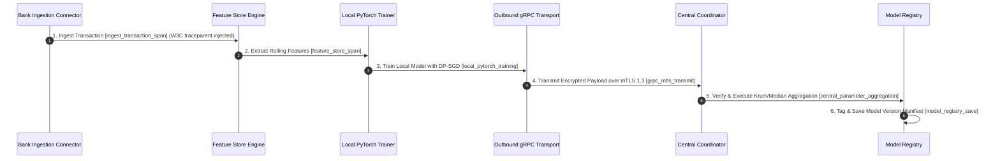

# Collaborative Fraud Intelligence Platform - System Design

## 1. System Requirements & Goals

### 1.1 Functional Requirements
*   **Decentralized Collaboration:** Multiple banks train a collaborative ML model for credit card fraud detection without sharing raw transactions.
*   **Privacy Guarantees:** Support Local Differential Privacy (LDP) with budget composition and Secure Aggregation pairwise masking.
*   **Byzantine Fault Tolerance:** Protect server aggregation from malicious node model/weight poisoning attacks.
*   **Real-time Collaborative AML:** Generate alerts on suspicious activity, hash identity values using HMAC-SHA256, resolve entities across banks, and build network graphs dynamically.
*   **Canary Quality Gate:** Validate newly trained global models on holdout validation data before promoting them to active production.
*   **Drift Monitoring:** Measure and alert on Feature Drift (data shift) and Concept Drift (relationship changes) across bank populations.

### 1.2 Non-Functional Requirements
*   **Stateless Scaling:** All API, graph resolution, and training orchestration services must remain stateless, delegating state to PostgreSQL/Redis.
*   **Fault Tolerance:** Active simulations must handle Celery worker restarts, DB connection drops, and Redis failures gracefully.
*   **Low Latency API Gateway:** Screen transactions with attributions (SHAP) under low latency constraints.

---

## 2. High-Level Architecture

CFI Simulator utilizes 4 decoupled microservices coordinated via Docker Compose:

```
                          [ Client Browser / UI ]
                                    │
                                    ▼ (HTTPS / WSS)
                           [ Gateway Service ]
                                    │
         ┌──────────────────────────┼─────────────────────────┐
         ▼ (Routing)                ▼ (Routing)               ▼ (Routing)
  [ fl-coordinator ]         [ identity-graph ]         [ fraud-alert ]
   (Training & FL)            (Entity & React Flow)      (Risk & Cases)
         │                          │                         │
         └──────────────────────────┼─────────────────────────┘
                                    ▼
                     [ Redis Cache & Event Broker ]
                                    ▼
                      [ PostgreSQL Relational DB ]
```

### 2.1 Microservice Descriptions
1.  **`gateway` (Port 8000):** Acts as the reverse proxy. It implements token rate-limiting, request logs, and path prefix routing to downstream services.
2.  **`fl-coordinator` (Port 8001):** Houses PyTorch training loops, secure aggregation, client dropouts, and the Flower/Ray adapters.
3.  **`identity-graph` (Port 8002):** Manages HMAC hash resolution and parses resolved entities into dynamic React Flow elements.
4.  **`fraud-alert` (Port 8003):** Houses the 9-Signal Risk Scoring Engine, explainability (SHAP), and case resolution.

---

## 3. Core Component Design

### 3.1 Data Flow: Streaming Screening & Explanation
```
[Transaction JSON] ──► [fraud-alert] ──► [Risk Engine] (9 Signals)
                                               │
               ┌───────────────────────────────┴───────────────┐
               ▼ (Risk Score >= 600)                           ▼ (Attributions)
      [Generate Alert]                               [Integrated Gradients]
               │                                               │
               ▼ (HMAC-SHA256)                                 ▼
      [Send Hash Entity]                                [SHAP Attributions]
               │                                               │
               ▼                                               ▼
      [identity-graph] ──► [React Flow Chart]        [Explainability Chart]
```

### 3.2 State Management & Cache Resilience
Services write states to `RedisStore`. If Redis goes offline, `RedisStore` catches the exception and routes reads/writes to a thread-safe, in-memory Python dictionary backend. This ensures the demo interface and local test suites remain stable under transient failures.

### 3.3 Enterprise Model Registry & Governance (SR 11-7 Compliance)
*   **Active Symlinking:** Active models (`global_model.pt`) are symlinked on disk. A rollback request updates the symlink to the targeted historical manifest version atomically.
*   **Lineage Audits:** Each saved model tracks Git commit hashes, dataset hashes, and differential privacy noise configuration to guarantee chain-of-custody.
*   **Dual Sign-off Workflow:** Promotion to Champion or Challenger is gated behind cryptographic approval from both an ML Engineer and a Compliance Officer.
*   **Shadow Routing:** Routes 100% of live traffic to the Challenger model silently, logging performance statistics. A randomized 10% slice of decision-making traffic is exposed to Challenger predictions.
*   **Canary Quality Gate:**
    $$\text{Candidate AUC-ROC} \ge \text{Active AUC-ROC} - 0.005$$
    If a candidate fails this check, it remains registered but is rejected for promotion.
*   **Automated Rollback Engine:** Tracks performance metrics on a sliding window. Automatically rolls back to the last stable version if the active model's:
    - AUC-ROC drops below `0.65`
    - Scoring latency exceeds `200ms`
    - False Positive Rate (FPR) exceeds `5%` (0.05)

### 3.4 Physical Multi-Tenancy & Cryptographic Key Isolation (SOC2 / PCI-DSS)
To guarantee data sovereignty and strict database-level boundaries required by banking regulations (SOC2, PCI-DSS):
*   **Database-per-Tenant:** Instead of logical routing via `bank_id` filters, the platform utilizes database-per-tenant isolation. A task-local context variable (`active_tenant`) selects the corresponding database engine (e.g. `cfi_bank_a.db`) dynamically. Table schemas are automatically initialized when a tenant is first accessed. The central coordinator only queries the coordinator database (`cfi_central.db`) and has zero direct SQL query access to bank vaults.
*   **Isolated Key Management Service (KMS/HSM):** To isolate cryptographic keys, a per-tenant KMS service simulator partitions key material into isolated vaults (`storage/{bank_id}/kms/keys.json`). Per-bank HMAC keys (for entity hashing), DH-PSI private exponents, and secure aggregation seeds are generated lazily inside the bank boundary and are never shared.
*   **Private Model Registry & Vaults:** During local training, intermediate PyTorch model weights and local GNN updates are saved strictly to the bank's local vault directory (`storage/{bank_id}/model_vault/`). Only the aggregated model gradients participating in active rounds are exposed temporarily to the central coordinator.
*   **Tenant-Isolated Log files:** Application logs and transaction audit trails are filtered dynamically based on the active tenant context and written to bank-specific files (`storage/logs/{bank_id}.log`), preventing cross-tenant information leakage in centralized logging backends.

### 3.5 Dynamic Policy & Rule Engine (DSL)
For real-time compliance and transaction control:
*   **JSON AST Compilation:** Employs a recursive parser supporting logical combinators (`and`, `or`, `not`) and comparison operators (`==`, `!=`, `>`, `>=`, `<`, `<=`, `in`, `not in`) over transaction payloads.
*   **Hot-Reloadable Registry:** Allows risk analysts to add, delete, and toggle rule execution states via API endpoints. The engine instantly evaluates new rules without requiring service redeployments.
*   **Gateway Blocking:** When a rule action evaluates to `BLOCK_TRANSACTION`, the transaction endpoint `/predict` overrides default routing parameters to set `policy_action` to blocked status, ensuring immediate threat containment.

### 3.6 Web3 & CBDC Smart Contract Incentive Settlement
For automated economic governance and fair contribution reward distribution across participating banks:
*   **Solidity Smart Contract (`ConsortiumIncentiveSettlement.sol`)**: Deployed on an EVM-compatible consortium network (Sepolia/Hardhat/Local). Features OpenZeppelin `ReentrancyGuard`, 18-decimal wei fixed math, and on-chain node quarantine mapping (`quarantinedNodes`).
*   **Shapley Value & Variance Allocation**: Computes Leave-One-Out (LOO) Shapley contributions ($SV_i$) after each FL round. Nodes with zero update variance or $SV_i \le -0.05$ trigger on-chain quarantine (`setNodeQuarantine()`), freezing their wallet payouts.
*   **Python Web3 Driver (`smart_contract_driver.py`)**: Singleton class managing EVM connections, contract compilation via `py-solc-x`, contract deployment, automated batch payouts (`distributeIncentives()`), and block event listening.
*   **Immutable Audit Ledger Binding**: Settlement transaction hashes (`settlement_tx_hash`) and block numbers (`settlement_block_number`) are immutably linked directly into the cryptographic SHA-256 audit ledger (`immutable_audit_chain.py`).

### 3.7 Standalone Bank Client Daemon & Zero-Inbound Egress Topology
For zero-trust deployment within financial network perimeters:
*   **Standalone Daemon (`cfi-bank-client`)**: Dedicated Python client binary/daemon (`cli.py`, `bank_daemon.py`) that operates inside each bank's internal network perimeter without opening incoming network ports.
*   **Zero-Inbound Port Architecture**: Firewalls strictly prohibit inbound connections to bank networks. The daemon initiates an outbound-only mTLS channel (port 50051) to the `fl-coordinator`, receiving streaming job instructions and streaming local updates back.
*   **Encrypted Local Vault Storage (`local_vault.py`)**: Protects local PyTorch model checkpoints, training datasets, and session tokens on disk using AES-256-GCM with PBKDF2 key derivation (100,000 iterations).
*   **Exponential Backoff Reconnector (`ExponentialBackoffReconnector`)**: Handles network drops gracefully using randomized exponential backoff with full jitter to preserve session context and prevent server connection storms.

### 3.8 Real-Time Streaming Feature Store Engine
For high-frequency sliding-window behavioral aggregations across continuous payment streams:
*   **Ingestion Pipeline Sequence**:
    1. Raw `NormalizedTransaction` received from Bank Connector.
    2. Schema validation via `DataContractValidator` (`backend/app/domain/data_validator.py`).
    3. Transaction deduplication via `BloomFilterDeduplicator` (`backend/app/infrastructure/feature_store/bloom_filter.py`).
    4. Feature extraction & rolling aggregations via `RollingFeatureAggregator` (`backend/app/infrastructure/feature_store/rolling_aggregators.py`).
    5. Persistence to feature vector cache via `StreamingFeatureStore` (`backend/app/infrastructure/feature_store/store.py`).
*   **Calculated Rolling Feature Specifications**:
    - `account_age_days`: Time elapsed since account creation.
    - `merchant_velocity_1h`: Sliding 60-minute window transaction counter grouped by `(account_id, merchant_category_code)`.
    - `device_entropy`: Normalized Shannon diversity index calculated across IP subnets, device fingerprints, and channel types.
    - `country_risk_score`: FATF high-risk jurisdiction mapping weights (e.g., North Korea/Iran = 1.0, Syria = 0.75, US/DE = 0.05).
    - `hour_of_day_cos` & `hour_of_day_sin`: Cyclical time encodings ($\cos(2\pi \cdot \text{hour}/24)$, $\sin(2\pi \cdot \text{hour}/24)$).
    - `rolling_amount_zscore_24h`: Z-score of transaction amount relative to account's 24-hour rolling mean and standard deviation ($Z = (x - \mu) / \sigma$).
    - `previous_alerts_30d`: Count of prior AML SARs (Suspicious Activity Reports) triggered in the last 30 days.

### 3.9 OpenTelemetry Distributed Tracing & Span Lifecycle Architecture

OpenTelemetry (OTel) distributed tracing (`backend/app/infrastructure/telemetry/otel_tracer.py`) instruments end-to-end request flows across distributed bank nodes and central coordinator microservices:



* **W3C Trace Context Propagation**: Propagates `traceparent` (`00-{trace_id}-{span_id}-01`) and `tracestate` headers across HTTP, gRPC, and AMQP channels.
* **OpenTelemetry Exporters**: Exports traces via OTLP/gRPC to Jaeger/Tempo (`:4317`) and Prometheus gauges (`/metrics`).
* **Cloud Orchestration**: Infrastructure is containerized with Helm charts (`helm/cfi-platform/`) and ArgoCD GitOps manifests (`argocd/application.yaml`) for multi-tenant Kubernetes deployment.

---

## 4. Telemetry & Observability

CFI includes a complete observability stack:
*   **OpenTelemetry:** Instruments FastAPI handlers, injecting span contexts into requests.
*   **Jaeger:** Traces transactions and training queries.
*   **Prometheus:** Scrapes `/metrics` from all microservices, tracking API latency, active Celery tasks, and memory budgets.
*   **MLflow:** Logs learning metrics (accuracy, precision, recall, loss, AUC-ROC) to a local server at `http://localhost:5000` for deep comparison.
*   **Grafana:** Pre-built CFI Overview dashboard visualizing platform metrics in real time.
